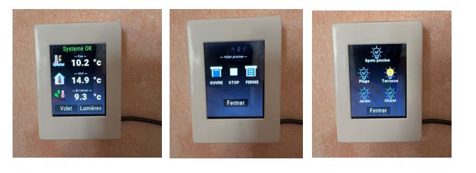
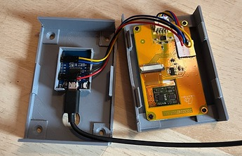
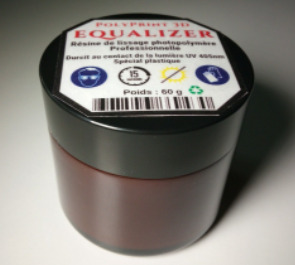
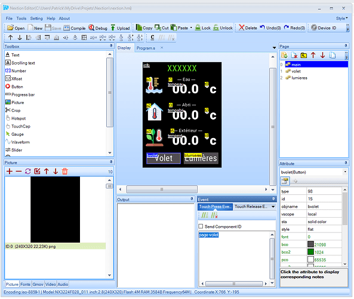

Il peut être très pratique d'installer un petit **afficheur tactile** la ou c'est utile (thermostat, pilotage d'une chaudière, météo, etc). C'est ce que j'ai fait en mettant un afficheur vers la porte d'accès ou jardin pour gérer la piscine et les éclairages extérieurs :

* Affichage des **températures** de l'extérieur, de l'eau et de l'abri (piscine sous abri),
* Affichage d'éventuelles **alertes,**
* Gestion de l'ouverture et fermeture du **volet de la piscine**, allumage des **spots,**
* Gestion des différentes **lumières extérieures,**



Cet article décrit la réalisation d'un afficheur à base d'un **Nextion 2.8 pouces**, pour un coût de l'ordre de 30€. L'implémentation est faite grâce à ESPHome, qui assure la communication avec Home Assistant et permet des mises à jour en ligne. Cela évite des flux complexes type nodered, comme le proposent certains tutos.

L'ensemble du code et des fichiers est partagé ici : 
[Lien GitHub](https://github.com/argonaute199/Nextion28-home-assistant)

## 1. Le matériel

L'afficheur est un **Nextion 2.8 pouces** de référence NX3224F08.
[Aliexpress : nextion 2.8 ](https://fr.aliexpress.com/item/4000593543479.html?aff_fcid=9cf93e5e7784426eaa179db59fd9ac59-1677951327828-06475-_All9bw&aff_fsk=_All9bw&aff_platform=portals-tool&sk=_All9bw&aff_trace_key=9cf93e5e7784426eaa179db59fd9ac59-1677951327828-06475-_All9bw&terminal_id=0268d075afc1426fbbd2e076e1ad8b08&afSmartRedirect=y)

Nous utiliserons un **ESP8266 Wemos D1**.
[Aliexpress : wemos d1 mini](https://s.click.aliexpress.com/deep_link.htm?aff_short_key=_All9bw&dl_target_url=https%3A%2F%2Ffr.aliexpress.com%2Fitem%2F32631693796.html)

> Il est possible d'utiliser un ESP32 avec BLE pour profiter d'un proxy Bluetooth.

Seules les connecteurs de la liaison série (TX et RX) ainsi que le 5v et la terre sont soudés, puis retournés pour ne pas prendre de place. 


La connexion de l'afficheur est simple :

* **Liaison série du wemos sur liaison série du nextion** (entrée de l'un sur l sortie de l'autre : TX afficheur connecté à RX wemos, RX afficheur connecté à TX wemos).
* **Afficheur alimenté par les sorties terre - 5v du wemos**
* **Le wemos est lui alimenté par un câble micro-usb**

Un boitier a été conçu et imprimé avec une imprimante 3d :



Les fichiers d'impression sont partagés sur cult3d
[Cult3d - boitier pour Nextion 2.8](https://cults3d.com/fr/mod%C3%A8le-3d/divers/case-for-nextion-2-8-inches)

Enfin, pour avoir le rendu d'un produit du commerce, une **résine UV de lissage** **PolyPrint** est utilisée. Elle est sans odeur et qui donne de fabuleux résultats.



**La résine peut être appliquée au pinceau**. Puis éclairer 10s chaque surface avec une torche UV et la résine est immédiatement dure. Juste faire un petit ponçage avant et après l'application de la résine. 

Enfin **le boitier a été peint avec une bombe de peinture acrylique blanche** qui peut se trouver dans n'importe quel magasin de bricolage.

**Polyprint** vend un kit avec un pot de lissage, un autre de colmatage et la lampe UV :
[Résine UV lissage Polyprint Equalizer](http://polyprint-3d.com/polyprint.php#!/R%C3%A9sine-U-V-ultra-rapide-de-Lissage-et-de-Colmatage-en-15-s-DUO-60-g-Mini-torche-UV/p/356945204/category=63140647)

## 2. Le design de l'interface

Le design est assez facile : Nextion fournit un éditeur téléchargeable [ici](https://nextion.tech/nextion-editor/).
[Nextion editor](https://nextion.tech/nextion-editor/)



Tous les éléments graphiques (fond, icônes) doivent être téléchargés dans le carré en bas à gauche, rubrique `picture`.
Un fond de **240 x 320 pixels** doit en particulier être chargé au préalable. Vous pouvez réutiliser le fond noir de [GitHub](https://github.com/argonaute199/Nextion28-home-assistant).

Ensuite, il faut créer ou charger les polices que vous utiliserez. Reprendre celle de mon github ou les créer en utilisant le menu `tools` - `font generator.` Les polices disponibles sont dans le carré en bas à gauche, rubrique "Font".

Ensuite, vous pouvez créer les pages de votre application, et y créer les différents éléments. 

Dans les attributs de chaque élément, **quelques astuces** :

* Mettre un `objname` (nom court) pour le référencer dans ESPHome,
* Mettre `vscope` à global pour qu'il soit actif quelle que soit la page affichée,
* Attribut `sta` à `crop image` et préciser dans `pic` le fond utilisé,
* Utiliser le browser pour renseigner les différents id (police, images, pages...),
* Les textes sont saisis en cliquant sur `multiline...` et non directement dans le champ.

Dans le carré `event` à gauche du carré `attributs`, il est possible de mettre du code qui sera exécuté dans le nextion. On mettra par exemple "page volet" pour le bouton volet, pour ouvrir une page dont le nom est "volet".

L'afficheur peut être testé en cliquant dans la barre d'outils sur `debug`. Vous serez averti si un champ obligatoire manque dans les attributs (id d'une police par exemple).

Enfin, il ne reste plus qu'à **charger le fichier (format TFT) sur le Nextion**. Pour cela, cliquer sur `file` / `TFT File Output` et télécharger le fichier sur une carte micro SD (utiliser un adaptateur USB - micro SD). Puis insérer la carte micro SD dans le Nextion et allumer le : le fichier sera alors chargé.
Par la suite, il sera possible de téléverser un nouveau fichier en wifi et nous verrons plus loin comment.

## 3. Paramétrage ESPHome

L'article [premiers pas avec ESPHome](/esphome_installation) vous guidera si besoin dans l'installation de ESPHome, puis dans la création du composant.

Voici les paramètres de base, sans composant connecté.

```yaml
esphome:
  name: esp-nextion

esp8266:
  board: d1

ota:

wifi:
  ssid: !secret wifi_ssid
  password: !secret wifi_password

logger:
  baud_rate: 0

http_request:

uart:
  rx_pin: GPIO3
  tx_pin: GPIO01
  baud_rate: 9600

api:
  services:
    - service: update_tft
      then:
        - lambda: 'id(esp_nextion)->upload_tft();'

display:
  - platform: nextion
    id: esp_nextion
    update_interval: 60s   # Pas de réel besoin de rafraichissement
    touch_sleep_timeout: 180
    wake_up_page: 0
    tft_url: http://192.168.99.99:8123/local/nextion/nextion.tft
    brightness: 70%
```

Le code (`service: update_tft` et paramètre `tft_url`) permet de téléverser le code issu de l'éditeur Nextion dans l'afficheur. Bien renseigner l'adresse de votre machine HA pour le paramètre `tft_url`.
Il faut mettre le fichier dans un répertoire  sous `HA .\config\www\nextion`
Ensuite l'appel du service `ESPHome: esp_nextion_update_tft` lancera le transfert et la mise à jour. Très pratique quand l'afficheur sera dans son boitier et ne sera plus accessible.

`touch_sleep_timeout: 180` permet de mettre en veille l'afficheur s'il n'est pas utilisé pendant plus de 3 minutes. Il suffit alors de le toucher pour le réveiller.

`wake_up_page: 0` permet de revenir à la première page quand l'afficheur est réveillé.

## 4. Programmation de l'affichage des températures

Un champ texte a été défini dans l'outil de création d'interface du Nextion (ici `tempeau` pour la température de l'eau). Une entrée de type "Nextion" est alors créée dans ESPHome pour reprendre la valeur d'une entité sensor, la formater avec 1 décimale et l'envoyer à l'afficheur, dans le champ texte `tempeau`.

Si on a plusieurs pages, on doit préfixer ce nom de champs par le nom de la page (ici `main.tempeau`).

```yaml
sensor:
  - platform: homeassistant
    id: ha_temp_eau
    entity_id: sensor.fibaro_piscine_temperature_eau
    on_value:
      then:
        lambda: |-
          id(esp_nextion).set_component_text_printf("main.tempeau","%.1f",id(ha_temp_eau).state);
```

## 5. Programmation d'un texte d'alerte

Le texte peut être en vert ou rouge suivant si un input_boolean `alert` dans HA est actif ou non. Le texte à afficher est dans un input_texte dans HA.

```yaml
# Texte d'information
text_sensor:
  - platform: homeassistant
    id: ha_info
    entity_id: input_text.nextion_message
    on_value:
      then:
        lambda: |-
          id(esp_nextion).set_component_text("main.info", id(ha_info).state.c_str() );
# Gestion de la couleur
binary_sensor:
  - platform: homeassistant
    id: ha_alerte
    entity_id: input_boolean.nextion_info_alerte
    on_state:
      then:
        lambda: |-
          if (x==1) {
            id(esp_nextion).set_component_font_color("main.info","63488");
          } else {
            id(esp_nextion).set_component_font_color("main.info","24260");
          }
```

## 6. Programmation d'un bouton à un état

L'appui sur le bouton "fermer la piscine" dans l'interface appelle un service dans HA qui ferme la piscine.

```yaml
- platform: nextion
    page_id: 1
    component_id: 7
    id: nx_ouvre_volet_piscine
    on_press:
      then:
        - homeassistant.service:
            service: cover.open_cover
            data:
              entity_id: cover.ipx800_volet_piscine
```

## 7. Programmation d'un bouton à 2 états pour les lumières

On utilise dans l'interface Nextion un `dual state button`. Chaque état a une couleur (orange quand la lumière est allumée, gris autrement).

La lumière peut être activée depuis l'interface du Nextion ou depuis HA.

Il faut alors 2 entrées :

* 1 pour le Nextion qui envoie l'ordre à HA si allumé depuis l'interface Nextion
* 1 pour HA qui envoie l'ordre à l'interface Nextion quand la lumière est allumée depuis HA.

Il est conseillé de préfixer les entrées en fonction de la plateforme : le nom de l'entrée est `ha_lum_plage` pour l'entrée ha et `nx_lum_plage` pour l'entrée Nextion.

Le code C (lambda) se déclenche sur événement de changement d'état.

```yaml
- platform: homeassistant
    id: ha_lum_plage
    entity_id: group.lumieres_plage
    on_state:
      then:
        lambda: |-
          if (id(ha_lum_plage).state) {
            id(esp_nextion).set_component_value("lumieres.bplage",1);
          } else {
            id(esp_nextion).set_component_value("lumieres.bplage",0);
          }

  - platform: nextion
    page_id: 2
    component_id: 10
    id: nx_lum_plage
    on_press:
      then:
        if:
          condition:
            lambda: 'return id(ha_lum_plage).state;'
          then:
            - homeassistant.service:
                service: switch.turn_off
                data:
                  entity_id: switch.ipx800_spots_terrasse
            - homeassistant.service:
                service: switch.turn_off
                data:
                  entity_id: switch.ipx800_lumiere_escalier_plage
          else:
            - homeassistant.service:
                service: switch.turn_on
                data:
                  entity_id: switch.ipx800_spots_terrasse
            - homeassistant.service:
                service: switch.turn_on
                data:
                  entity_id: switch.ipx800_lumiere_escalier_plage
```

## 9. Mise à jour de l'afficheur quand il est réveillé

Le code précédent permet les mises à jour quand le Nextion est actif, mais l'interface n'est pas mise à jour quand le Nextion est en veille. Il faut donc rajouter du code pour la mise à jour quand le Nextion est réveillé.

Certains tutos proposent une mise à jour toutes les 5s, mais ce ne sera pas nécessaire dans notre cas.

```yaml
display:
  - platform: nextion
    id: esp_nextion
    update_interval: 60s   # Pas de réel besoin de raffraichissement
    touch_sleep_timeout: 180
    wake_up_page: 0
    tft_url: http://192.168.5.30:8123/local/nextion/nextion.tft
    brightness: 70%
    on_wake:
      then:
        # Initialisation avec les bonnes valeurs
        lambda: |-
          id(esp_nextion).set_component_text("info", id(ha_info).state.c_str() );
          if (id(ha_alerte).state == 1) {
            id(esp_nextion).set_component_font_color("main.info","63488");
          } else {
            id(esp_nextion).set_component_font_color("main.info","24260");
          }
    
          id(esp_nextion).set_component_text_printf("main.tempeau","%.1f",id(ha_temp_eau).state);
          id(esp_nextion).set_component_text_printf("main.tempabri","%.2f",id(ha_temp_abri).state);
          id(esp_nextion).set_component_text_printf("main.tempext","%.1f",id(ha_temp_ext).state);
    
          if (id(ha_spots_piscine).state) {
            id(esp_nextion).set_component_value("lumieres.bpiscine",1);
          } else {
            id(esp_nextion).set_component_value("lumieres.bpiscine",0);
          }
          if (id(ha_lum_plage).state) {
            id(esp_nextion).set_component_value("lumieres.bplage",1);
          } else {
            id(esp_nextion).set_component_value("lumieres.bplage",0);
          }
....etc....
```

Le code sera adapté suivant vos besoins. Il pourrait aussi être repris pour flasher un afficheur sonoff.

N'hésitez pas à proposer des évolutions ou partager vos propres implémentations.