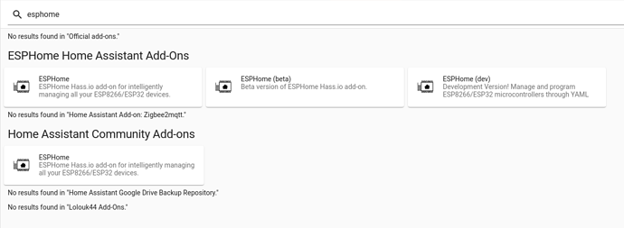
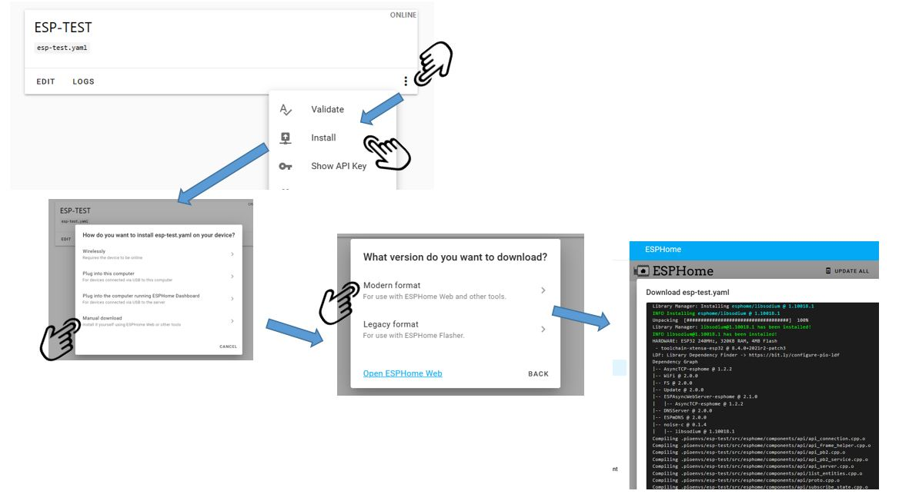
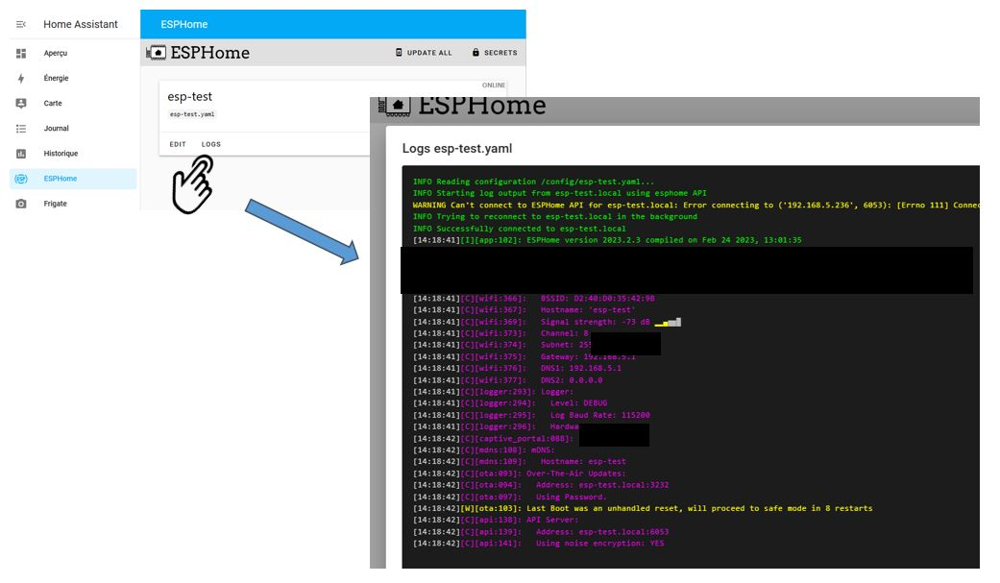
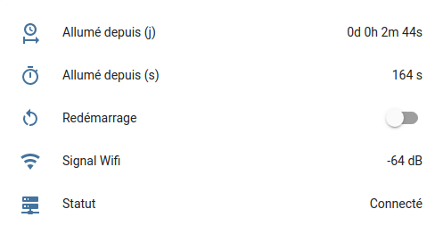

## 1. Introduction à ESPHome

**[ESPHome](https://esphome.io/index.html)** est un système permettant d'intégrer à **Home Assistant** les périphériques à base de micro-contrôleurs ESP (ESP32 ou ESP8266). Il permet aussi de modifier ou "flasher" des objets de certaines marques comme **SonOff** ou encore **BlitzWolf** mais aussi de communiquer avec des marques comme Xiaomi sans passer par le Cloud.

ESPHome était à l'origine un projet open source indépendant initié par [Otto Winter](https://github.com/ottowinter), et a été [racheté en mars 2021 par **Nabu Casa**](https://www.home-assistant.io/blog/2021/03/18/nabu-casa-has-acquired-esphome/), l'éditeur de Home Assistant.

### 1.1 Les micro-contrôleurs ESP

Les **ESP** sont de petits modules électroniques à base de MCU (Micro Controller Unit) de la société **[Expressif Systems](https://www.espressif.com/en/products/socs/esp32)**. Il s'agit des **ESP8266** ou leurs grands frères les **ESP32**.

Bien que leur fonctionnement soit identique, l'ESP32 est **plus puissant** que l'ESP8266 (un dual core 160Mhz min contre single core 80Mhz), il peut prendre en charge le Bluetooth, il a **plus de port** et trois liaisons série à la place d'une.


Ces modules sont livrés sur une petite carte électronique qui expose les **ports** sur des pins, comme c'est le cas pour les Arduino ou les Raspberry. 

Les ESP disposent des entrées-sorties suivantes :

* Entrées-sorties numériques (**GPIO**),
* Convertisseurs analogiques (**ADC / DAC**),
* Ports séries (**UART** ou **SPI**),
* Différents bus : **I2S** (connexion d'une caméra par ex) ou **CAN Bus,**
* Sortie **5v** et **3.3v**
* D'un module FTDI intégré (permet de les flasher sans autre module) pour la plupart.

Les différents ports permettent d'y connecter une multitude de **capteurs** et **périphériques**. Ainsi, vous pouvez créer votre propre objet connecté **DIY** (Do It Yourself). 

Pour vous faire une idée des innombrables capteurs supportés, rendez-vous sur la page : <https://esphome.io/#sensor-components>.

Les ESP sont alimentés en **5v** ou **3.3V** et disposent, en général (mais pas toujours), d'une connexion **micro-usb** ou **usb-c.** Ils sont capables de se mettre en vieille profonde (**[deep sleep](https://esphome.io/components/deep_sleep.html)**) pour consommer très peu d'énergie. Cela permet une utilisation sur **pile** ou **batterie**, et, cerise sur le gâteau, ils communiquent à la fois en **Wifi, Bluetooth**, voire, parfois une connexion IP filaire.

**Et le prix ?** Ces petites cartes ne coûtent que **quelques euros** et sont facilement disponibles, que ce soit sur Amazon ou Aliexpress.

> **Les ESP sont donc une référence pour toute personne souhaitant créer ses propres objets connectés (IOT).**
>
> Si vous ne voulez pas souder, vous pouvez relier facilement vos ESP et ses périphériques avec des fils de prototypage type "**Dupont**" que l'on trouve facilement en nappe. Certains fabricants fournissent des modules contenant à la fois un ESP et un ou des périphériques (capteurs...) intégrés sur la carte.

### 1.2 Principe de ESPHome

Normalement, les ESP se programment en C++ avec l'environnement NodeMCU, une plateforme IoT open source. Mais cela demande des connaissances de développement. ESPHome va masquer cette complexité, mais n'enlève pas le codage comparé à ces concurrents Tasmota et ESPEasy, par contre il ajoute la possibilité de faire des automatisations directement dans l'ESP.

Le principe de ESPHome est d'écrire (en YAML) :

* Ce qui est **connecté** à l'ESP,
* Les **traitements** à faire sur l'ESP,
* Les **entités et les services** à créer sur Home Assistant pour lire et envoyer des données sur l'ESP.

Le YAML est **compilé** par ESPHome pour créer un **firmware** (un code binaire) qui est téléversé sur l'ESP. 

En parallèle, ESPHome va créer dans Home Assistant un composant avec les entités et les services qui vont bien.

Le firmware est chargé soit via le **câble USB** (au moins pour le premier chargement), en **Wi-Fi** ("Over The Air") ou via la liaison série (FTDI) si l'ESP n'a pas de port USB.

### 1.3 Alternatives à ESPHome

Il y a d’autres concurrents à ESPHome, comme [EasyESP](https://www.letscontrolit.com/wiki/index.php/ESPEasy), [Tasmota](https://tasmota.github.io/docs/). Mais ESPHome est le mieux intégré à Home Assistant.

## 2. Installation de ESPHome

ESPHome est un **Add-on** (module complémentaire) officiel de Home Assistant.

### 2.1 Installation sous HA OS

Si vous avez une installation clé en main HA OS, rendez-vous sous `Paramètres` -> `Modules complémentaires.`

* Cliquer sur `Boutique de Modules Complémentaires,`
* Recherchez ESPHome et cliquer sur `Installer,`
* Enfin, une fois installé, cocher `Afficher dans la barre latérale` et laisser coché (ou pas a vous de voir) `Lancer au démarrag,`
* Éteignez et redémarrez votre machine.

Vous avez alors dans le menu de gauche de Home Assistant l'accès à ESPHome et vous êtes prêt à créer un nouveau composant.



### 2.2 Installation sous HA container (docker)

Si vous avez une installation de type **HA Container**, et que Home Assistant est installé sous **docker**, vous devrez installer ESPHome dans un nouveau conteneur.

Ci-dessous le fichier compose. Je recommande l'utilisation de **Portainer** et la création de **stacks**. Voici alors un fichier **compose** pour créer un conteneur ESPHome.

```yaml
version: '3'
services:
  esphome:
    container_name: esphome
    image: esphome/esphome
    volumes:
      - /path/to/esphome/config:/config
      - /etc/localtime:/etc/localtime:ro
    restart: unless-stopped
    privileged: true
    network_mode: host
```

Enfin, pour avoir accès à ESPHome dans le menu de gauche, ajouter ce code dans votre fichier `configuration.yaml` (préciser l'adresse IP de votre machine ou localhost).

```yaml
panel_iframe:
  esphome:
    title: 'ESPHome'
    url: 'http://192.168.xx.xx:6052/'
    icon: mdi:car-esp
```

## 3. Nouveau module ESP

Pour la première utilisation, nous avons choisi une ESP-Wroom-32, qui est très courant.

> Choisissez toujours si possible un ESP avec une prise USB : cela permet à la fois de l'alimenter plus facilement et surtout de charger le firmware initial sans avoir à refaire un câblage.  

### 3.1 Créer le composant sous ESPHome

* Ouvrir ESPHome (depuis le menu de gauche),
* Cliquer sur `New device` en bas à droite. Une fenêtre s'affiche. Cliquer sur continue.
* Renseigner le nom du composant (esp-test par exemple),
* Renseigner éventuellement les données de votre réseau wifi,
* Choisir le type de ESP (ESP32 dans notre exemple),
* Cliquer sur skip.

Votre premier composant est créé et il apparait dans la fenêtre ESPHome.

**Éditer maintenant le code YAML de votre composant.** 

Cliquer sur `Edit` pour accéder le code YAML automatiquement généré et que vous pouvez compléter si besoin.

 La documentation ESPHome est bien faite et vous donne pour chaque périphérique des exemples de code à recopier et à adapter : voir [ESPHome sensor composants](https://esphome.io/#sensor-components)

Éditer le fichier `secret.yaml` (3 points en haut à droite sous ESPHome) et vérifier que vous n’avez qu’une entrée wifi et que les identifiants sont corrects. Rectifier si besoin.

> A noter que ce fichier n'est pas celui de Home Assistant, mais est dédié à ESPHome. Vous pouvez y mettre d'autres entrées concernant des données sensibles.


### 3.2 Flasher l'ESP (première fois)

Il est temps à présent de créer un firmware et de l'installer sur votre ESP. 

**Compiler le micro-code et téléchargez le.**

* Connecter l'ESP à votre ordinateur via un câble USB,
* Cliquer sur les 3 points, puis `install`, `manual download`, `modern format`. La compilation démarre.
* Une fois la procédure terminée, vous pouvez vérifier que vous avez bien le micro-code dans le répertoire de téléchargement de votre navigateur (fichier `esp-test.bin`).



**Installer le micro-code sur l’ESP via ESPHome Web**

> Cette méthode ne marche que avec les navigateurs Chrome et Edge.

* Cliquer sur les 3 point en bas à droite du composant, `install`, `manual download`,
* Cliquer sur `Open ESPHome Web` pour ouvrir l'utilitaire de chargement
* Cliquer sur `install`, puis `connect`.
* Sélectionner le port USB qui devrait être reconnu.
* Dans la boite de dialogue qui apparait, sélectionner le fichier de micro-code généré précédemment, puis cliquer sur `INSTALL`.
* Après 1 à 2 mn, l’ESP devrait afficher configuration OK.


**Tester la connexion avec votre ESP**

* Débrancher et rebrancher l’ESP pour forcer son redémarrage

Retourner sur ESPHome, 

* Cliquer sur le bouton `LOGS` du composant, 
* Vérifier que vous avez accès aux logs et que l’ESP fonctionne,
* ESPHome essaie de se connecter en wifi à l'ESP et devrait confirmer la bonne connexion.

> Sachez qu**'il y a plusieurs méthodes pour télécharger initialement le firmware sur l'ESP**.
>
> Vous pouvez en particulier choisir de connecter l'ESP en USB non pas sur votre PC, mais directement sur la machine hébergeant Home Assistant.
>
> Historiquement, le code était chargé grâce à un programme exécutable à télécharger sur son PC : [flasher.exe](https://github.com/esphome/esphome-flasher). Il est encore possible de l'utiliser si vous rencontrez des difficultés avec ESPHome Web. Le binaire sera alors à compiler en Legacy Format et non en Modern Format.



## 4. Mise à jour en wifi (OTA)

Votre ESP est flashé avec un firmware ESPHome, il est donc capable de communiquer avec ESPHome en wifi. Il vous est maintenant possible de faire les prochaines mises à jour en OTA ("Over The Air"), et de ce fait, sans le connecter en USB.

**La procédure de mise à jour est très simple** : vous cliquez sur les trois points sur le composant, puis `install` et `wirelessly`. La compilation lance le chargement sur l'ESP.

Pour vérifier que tout s'est bien passé, cliquer sur le bouton `LOG` de votre composant.

## 5. Modification du code ESP

Il est à présent temps de vous intéresser à la programmation de votre ESP. Vous n'avez pas forcément de périphériques connectés à votre ESP, et nous vous proposons de rajouter des entités génériques accessibles depuis HA, et qui pourront vous être utiles dans toutes vos futures implémentations :

* Un bouton pour **redémarrer** votre module
* Un capteur pour indiquer le **statut de votre ESP**
* Un capteur qui afficher la **quantité du signal**
* Un capteur pour afficher **depuis quand l'ESP est démarré** (au format jour - heure - minute - seconde).

La programmation se fait en YAML. 

> Il est possible de rajouter du code C++ appelé **lambda** pour des calculs et des appels à des procédures internes.

**Modification du YAML** 

Cliquer sur le bouton `EDIT` de votre composant, et ajouter le code ci-dessous.

```yaml
binary_sensor:
    # statut
      - platform: status
        name: "Statut"

    sensor:
    # Qualité du signal
      - platform: wifi_signal
        name: "Signal Wifi"
        update_interval: 60s
    # Temps de fonctionnement
      - platform: uptime
        name: "Allumé depuis (s)"
        id: uptime_sec
       
    switch:
    # Bouton de redémarrage
      - platform: restart
        name: "Redémarrage"

    # Transformation des secondes en jours
    text_sensor:
      - platform: template
        name: "Allumé depuis (j)"
        lambda: |-
          int seconds = (id(uptime_sec).state);
          int days = seconds / (24 * 3600);
          seconds = seconds % (24 * 3600); 
          int hours = seconds / 3600;
          seconds = seconds % 3600;
          int minutes = seconds /  60;
          seconds = seconds % 60;
          return { (String(days) +"d " + String(hours) +"h " + String(minutes) +"m "+ String(seconds) +"s").c_str() };
        icon: mdi:clock-start
        update_interval: 60s
```

**Vérifiez si votre code est correct** 

Cliquer sur les 3 points du composant, puis `Validate` 

Vous devriez avoir en deuxième ligne le message "*INFO Configuration is valid!*"

**Mettre à jour votre ESP en OTA**

Depuis l'écran d'accueil de ESPHome, cliquez sur les trois points sur le composant, puis `install` et `wirelessly`.

La compilation commence puis charge le firmware sur l'ESP. Il faut attendre quelques minutes pour que la procédure se termine. Vous devriez avoir le message "*INFO OTA successful*"

Vérifier en cliquant sur le bouton `LOG` que tout fonctionne bien.

## 6. Affichage dans le dashboard HA

Il vous faut maintenant **rendre visible votre ESP dans Home Assistant**. 

Par défaut, votre ESP communique de manière chiffrée avec Home Assistant.

> Dans la dernière version de ESPHome et de Home Assistant (2023.2) il n'est plus nécessaire de saisir la clé de cryptage, elle devrait même être dépréciée.

Aller sous `Paramètres`, `Appareils et Services`, votre module ESP devrait être découvert automatiquement

Votre ESP est prêt à être utilisé dans Home Assistant et est visible dans la liste de vos appareils.

En cliquant sous `1 Appareil` dans l'appareil créé, vous avez accès aux différentes entités.


Il ne vous reste plus qu'à les intégrer dans votre dashboard Home Assistant.



## Conclusion

Nous espérons que cet article vous donnera envie de vous lancer dans la **création d'objets connectés fait maison**. C'est juste **passionnant** !!

ESPHome est **facile à appréhender** et ne demande pas de connaissances en électronique ou en développement. Vous trouverez beaucoup de code YAML dans la documentation ESPHome ou sur les forums.

La suite logique pour créer vos projets est d'**imprimer vos boitiers en 3D**. Il existe une multitude de modèles sur des sites comme [Thingiverse](https://www.thingiverse.com/).

N’hésitez pas à nous faire part de vos réalisations.

## Sources

Cet article est une fusion et réécriture des articles initialement proposés par @McFly et @Argonaute sur le forum HACF.