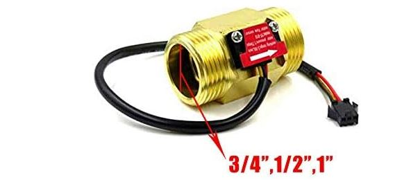

Beaucoup d'entre nous mesurent les consommations d'électricité, que ce soit par la connection de son compteur par la prise téléinformation, des prises ou modules connectées ou tout être dispositif.

Mais **maîtriser sa consommation d'eau** est bien autant essentiel, d'autant dans le contexte de pénurie actuel et d'augmentation du prix de l'eau. Et les conséquences d'une fuite, ou même un simple chasse d'est qui coule des jours, peut d'avérer très génant.

Cet article explore les solutions pour mettre en place un compteur connecté. Nous détaillerons une solution avec un compteur à impulsion **Gianola** et un **ESP32**. Enfin, nous verrons comment afficher les consommations et les coûts associés, et **détecter les éventuelles fuites**.

L'interface qui est implémentée permet de voir :

- Le débit d'eau instantanné
- Le pourcentage d'usage sur la dernière heure (100% si l'eau coule en permanence)
- Les consommations et coûts par jours / mois / année
- La consommation la nuit dernière
- La valeur totale du compteur (remis à 0 en début d'année)
- L'historique des 50 derniers tirages d'eau effectué


## Connecter son compteur

La solution sera différente suivant si vous être propriétaire ou locataire, suivant ou se situe le compteur de votre fournisseur, quel est son type, et ou arrive la conduite d'eau.

### Installer un compteur connecté

Dans mon cas, le compteur de la maison est à l'extérieur, très peu accessible. J'ai donc opté pour l'installation d'un nouveau compteur à l'intérieur de la maison, en aval de celui du fournisseur d'eau.

On ne plaisante pas avec l'eau, donc j'ai préféré une marque italienne reconnue : Gianola. Il a l'avantage d'avoir un affichage de la consommation, et une sortie contact sec pour mesurer les impulsions : 1 impulsion tous les  0.25l dans mon cas (mais il existe aussi en 1l / impulsion).

> `C'est la solution que j'ai testée et que je recommande.`


Vous pouvez trouver ce compteur chez des fournisseurs comme Domadoo :

[GIOANOLA - Compteur d'eau avec sortie contact sec pour comptage d'impulsion (1 imp/litre) - 3/4p](https://www.domotique-store.fr/domotique/modules-domotiques/detecteurs-capteurs-mesure/mesure-de-consommation-d-eau/434-gioanola-compteur-d-eau-avec-sortie-contact-sec-pour-comptage-d-impulsion-34p-1-implitre.html)

Il y a assez peu de compteurs connectés sur le marché. Une alternative assez courante est d'utiliser un compteur à effet hall. Lui aura besoin d'être alimenté en 5v par contre, ce qui n'est pas forcément un problème. N'ayant pas moi même testé cette solution, je ne peux conseiller un modèle, mais évitez un modèle premier prix non CE acheté en Chine.



### Se connecteur à un compteur existant

Beaucoup ne pourront ou voudrons un nouveau compteur. Voici quelques solutions et références de personnes qui les ont implémentées :

- Installer un capteur effet hall de type LJ18A3 au dessus de la petite roue qui tourne.
- Capter les impultions radios pour certains type de compteurs, proposé par @journaldeThomas : [Suivre sa consommation d'eau sous Home Assistant avec une simple clé USB FM TV !](https://www.youtube.com/watch?v=m5R6sfsGmvE)
- Mettre une caméra ESPCam avec de l'IA pour lire le compteur, proposé par GammaTronniques : [Suivre sa consommation d'eau avec Home Assistant](https://www.youtube.com/watch?v=1uwoAWvP6f8)

## Intégration avec ESPHome

Le compteur fourni des impulsions (1 tous les 0.25 litres dans notre cas), et il faut maintenant les traiter. Pour cela, nous utilisons un ESP32 alimenté par sa prise USB.

Le raccordement est simple :

- GPIO25 connecté à une entrée du compteur
- GND connecté à l'autre entrée

En prérequis, il faut avoir installé ESPHome et télécharger le code qui suit. Pour cela, je vous renvoie à l'article sur ESPHome : [Vos premiers pas avec ESPHome](https://hacf.fr/blog/esphome-introduction/).

Ensuite téléverser le code suivant :

```
esphome:
  name: esp-eau
  friendly_name: esp-eau

esp32:
  board: esp32dev
  framework:
    type: arduino

# Enable logging
logger:
  level: debug

wifi:
  ssid: !secret wifi_ssid
  password: !secret wifi_password

switch:
  - platform: restart
    name: "esp_eau_reboot"

sensor:

# Débit d'eau instantané (0 après 10s)
  - platform: pulse_meter
    name: "Debit eau froide"
    pin:
      number: GPIO25
      inverted: true
      mode:
        input: true
        pullup: true
    internal_filter: 50ms
    icon: mdi:water
    timeout: 4s
    unit_of_measurement: 'l/mn'
    filters:
      - multiply: 0.25
# Consommation Totale d'Eau depuis démarrage
    total:
      name: "Consommation eau froide"
      icon: mdi:water
      device_class: water   
      state_class: total_increasing
      unit_of_measurement: 'm³'
      accuracy_decimals: 5
      filters:
        - multiply: 0.00025
```


