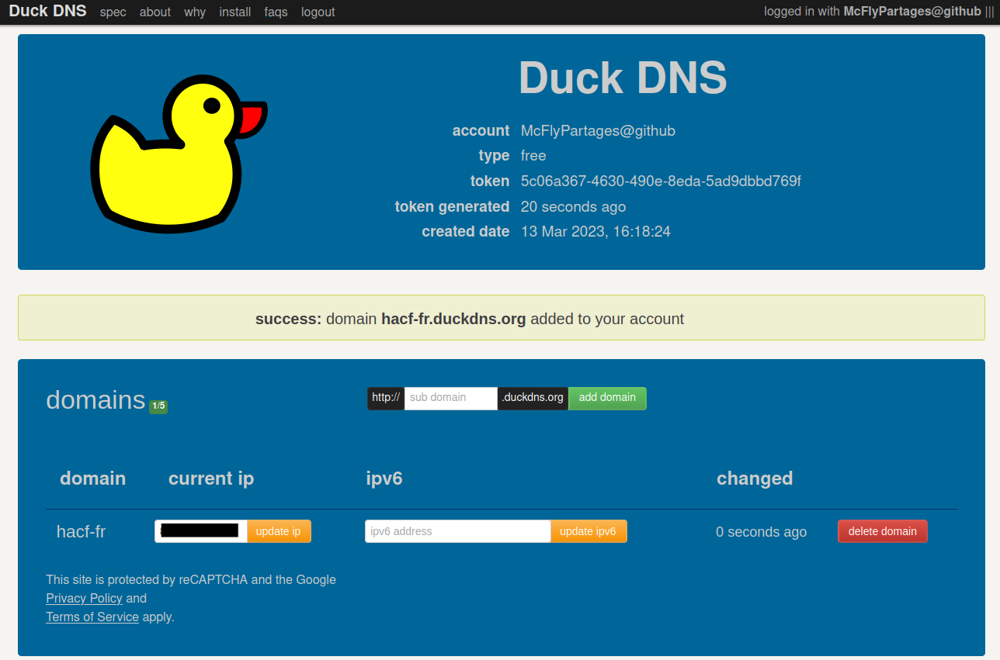
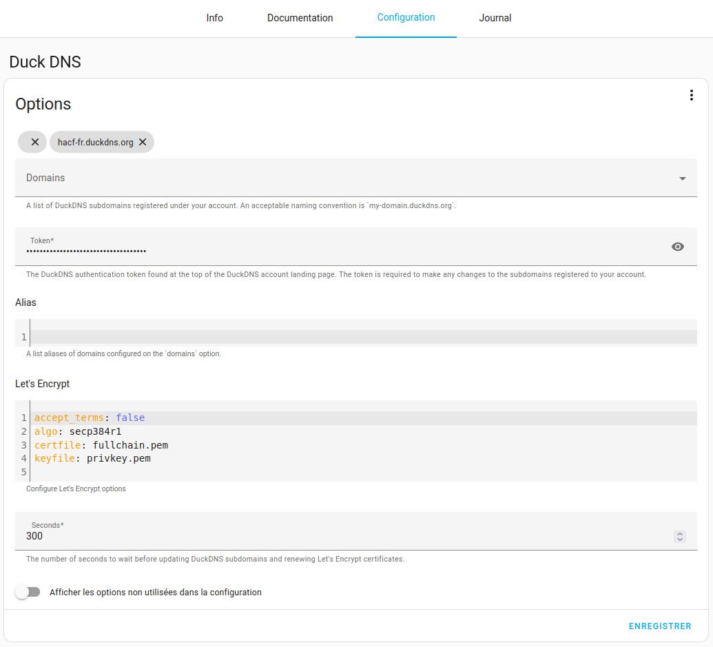
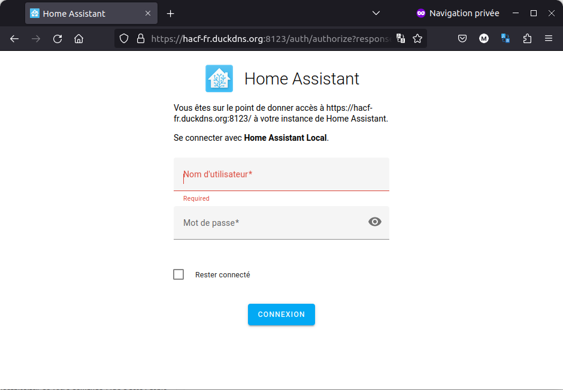
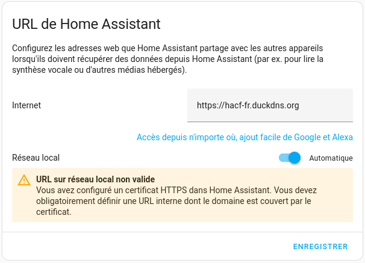

Vous venez d'installer Home Assistant et **vous souhaitez y avoir accès depuis l'extérieur**. Comme expliqué dans [Home Assistant : commencer avec des bases solides](/blog/ha_commencer_base_solide/), il existe plusieurs possibilités, et voici l'une d'entre elles.

Nous allons voir comment accéder à votre système domotique gratuitement depuis l'extérieur avec [DuckDNS ](https://www.duckdns.org/)via la méthode de l'add-on.
Ce n'est pas la méthode le plus sécurisé, car elle nécessite l'ouverture du port 8123 de votre routeur/box.

*Article réalisé avec Home Assistant OS 2023.3.3 et add-on DuckDNS 1.15.0*

**prérequis :**

* Avoir un compte [DuckDNS](https://www.duckdns.org/),
* Avoir créé un domaine sur [hacf-fr.duckdns.org](hacf-fr.duckdns.org),
* Récupérer son token,
* Avoir ouvert et redirigé le port 8123 de votre box vers le 8123 de votre Home Assistant.

> Il semblerait que seul le 8123 doit être ouvert.
>
> 

## Via l'add-on DuckDNS.

Maintenant que vous avez les prérequis :

* Installer l'add-on DuckDNS (je passe sur l'étape d'installation d'un add-on disponible [ici](/blog/ha_addon_installation/)),
* Une fois installé un petit tour par la documentation,
* Rendez-vous ensuite dans l'onglet `Configuration`,
* * Ajouter votre domaine,
* * Ajouter votre token,
* * Remplacer `false` par `true` dans la ligne `terms`
* * Enregistrer.

> S'il vous met un messag d'erreur, verifier que vous n'avez pas de domaine vide en haut ou alors basculer en version yaml en cliquant sur les ... en hut a droite.
>
> 

* Lancer l'add-on.

Voici le résultat du Journal.

```
s6-rc: info: service s6rc-oneshot-runner: starting
s6-rc: info: service s6rc-oneshot-runner successfully started
s6-rc: info: service fix-attrs: starting
s6-rc: info: service fix-attrs successfully started
s6-rc: info: service legacy-cont-init: starting
s6-rc: info: service legacy-cont-init successfully started
s6-rc: info: service legacy-services: starting
s6-rc: info: service legacy-services successfully started
# INFO: Using main config file /data/workdir/config
+ Generating account key...
+ Registering account key with ACME server...
+ Fetching account URL...
+ Done!
[17:56:37] INFO: OK
XXX.XXX.XXX.XXX
NOCHANGE
[17:56:37] INFO: Renew certificate for domains: hacf-fr.duckdns.org and aliases:
# INFO: Using main config file /data/workdir/config
+ Creating chain cache directory /data/workdir/chains
Processing hacf-fr.duckdns.org
+ Creating new directory /data/letsencrypt/hacf-fr.duckdns.org ...
+ Signing domains...
+ Generating private key...
+ Generating signing request...
+ Requesting new certificate order from CA...
+ Received 1 authorizations URLs from the CA
+ Handling authorization for hacf-fr.duckdns.org
+ 1 pending challenge(s)
+ Deploying challenge tokens...OK 
+ Responding to challenge for hacf-fr.duckdns.org authorization...
+ Challenge is valid!
+ Cleaning challenge tokens...OK 
+ Requesting certificate...
+ Checking certificate...
+ Done!
+ Creating fullchain.pem...
+ Done!
```

Ajouter cette configuration dans le fichier `configuration.yaml`

```
http:
ssl_certificate: /ssl/fullchain.pem
ssl_key: /ssl/privkey.pem
```

Puis redémarrer.

Il vous suffit maintenant d'essayer de vous connecter avec votre adresse `https://hacf-fr.duckdns.org:8123` et vous devriez accéder à votre système domotique préfère.



> si vous n'avez pas acces votre instance Home Assistant, essayer en local avec `votre_ip:8123` ou `https://votre_ip:8123`.

Une dernière étape consiste à ajouter votre nouvelle URL dans la configuration de Home Assistant, pour ca direction `Paramètres` -> `Système` -> `Réseaux`.



### Conclusion.

Vous avez désormais accès à votre système domotique depuis l'extérieur.
Comme dit plus haut ce n'est pas la méthode le plus sécurisé, car elle nécessite l'ouverture du port 8123 de votre routeur.

Il faut aussi signaler, qu'actuellement, il y a quelque petit problème de connexion des serveurs de DuckDNS, il faut donc prendre tout cela en considération.

C'est une bonne méthode pour essayer ou donner l'accès à une machine test, mais peut-être pas pour une utilisation orientée sécurité de votre système domotique.