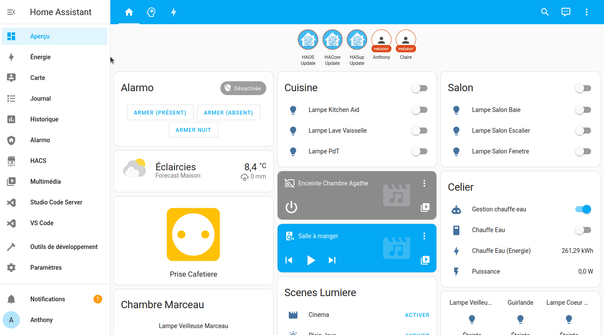

Les add-ons (ou "modules complémentaires" en français) permettent d'ajouter des services reconnus et très populaires (comme "Node-Red", "Grafana", "InfluxDB", "DuckDNS", etc.) déjà quasi configurés pour communiquer simplement avec votre système domotique.

Les add-ons sont des **"programmes"** complémentaires à Home Assistant, et qui tournent en parallèle du cœur de Home Assistant (dans un processus dédié).

> **IMPORTANT**
>
> 1. L'installation d'un add-on dans Home Assistant nécessite d'avoir installé le **superviseur**, donc d'avoir fait une installation de type **HA OS** ou **HA Supervised**.
> 2. Il ne faut surtout pas les confondre les **intégrations**, qui sont des bibliothèques de code ajoutées à Home Assistant, et les add-on (ou "modules complémentaires") qui sont des programmes à part entière.

Il existe 2 types d'add-on :

* **Les officiels :** Disponibles sur les modules complémentaires,
* **Les non-officiels** : Installable depuis les modules complémentaires, mais nécessitant l'ajout manuel du dépôt GitHub en manuel.

L'installation des add-ons étant toujours la même, voici les différentes méthodes.

**Système utilisé** *: Home Assistant OS 2023.3*

## Installation d'un Add-on Officiel.

Pour installer un Add-on officiel, il n'y a rien de compliqué.
Dans Home Assistant, cliquer sur `Paramètres` -> `Modules complémentaires` -> `Boutique des modules complémentaires`.

* Rechercher l'add-on,
* Cliquer dessus,
* Puis `INSTALLER`

### Description d'un add-on.

Les add-ons sont quasiment tous fait pareil.

Une fois installé, vous avez quatre onglets en haut.

* **Info** : Permet de contrôler l'add-on et donne une description, il permet aussi de voir les ressources utilisées par ce dernier,
* **Documentation** : Explique son fonctionnement et les réglages possibles (si besoin),
* **Configuration** : Permet de configurer l'add-on,
* **Journal** : Vous donne les logs sur le lancement et le fonctionnement de ce dernier.

Un exemple en image avec l'add-on DuckDNS.

> **NOTA :** Il y a certains `Add-ons`  qui n’ont pas besoin de fonctionner en permanence, par exemple `ESPHome`, mais d’autres doivent être démarrés dès le lancement, comme `Mosquitto Boker` sinon vos appareils MQTT ne seront pas disponibles.
>
> **NOTA 2 :**  Plus il y a d’add-ons installés, plus votre système sera sollicité.

## Installation d'un Add-on Non Officiel.

Les add-ons non officiels permettent aux développeurs de mettre à disposition leur travail sans forcément attendre une validation officielle de Home Assistant.

> **ATTENTION :** Ces add-ons ne sont pas officiellement supportés, cela veut dire que vous les installés en connaissance de cause.
>
> Home Assistant a simplifié les choses en mettant à disposition des développeurs un script générant un bouton qui, d'un simple clique, fait les actions à votre place. Cela nécessite simplement de saisir l'adresse de votre instance.

Pour ajouter un add-on non officiel, **il va falloir ajouter un dépôt** dans la boutique des modules complémentaires.

Dans Home Assistant, cliquer sur `Paramètres` -> `Modules complémentaires` -> `Boutique des modules complémentaires` -> `...` (en haut à droite) -> `Dépôts`.

* Coller le lien du dépôt,
* Puis `AJOUTER`,
* Rafraichir la page via `F5` ou via `Rechercher des mises a jour` dans les `...` en haut à droite.
* Chercher maintenant l'add-on et `INSTALLER`.

> Le fonctionnement est identique à un add-on officiel.

## Conclusion.

Nous venons de voir comment compléter à notre système domotique avec des programmes tiers, via le mécanisme d'add-on. Cette possibilité permet de démultiplier les capacités de votre système.

Vous pouvez trouver une liste non exhaustive d'[add-ons indispensables ici](https://dev.hacf.fr/blog/ha_commencer_base_solide/#quels-sont-les-add-ons-indispensables-).