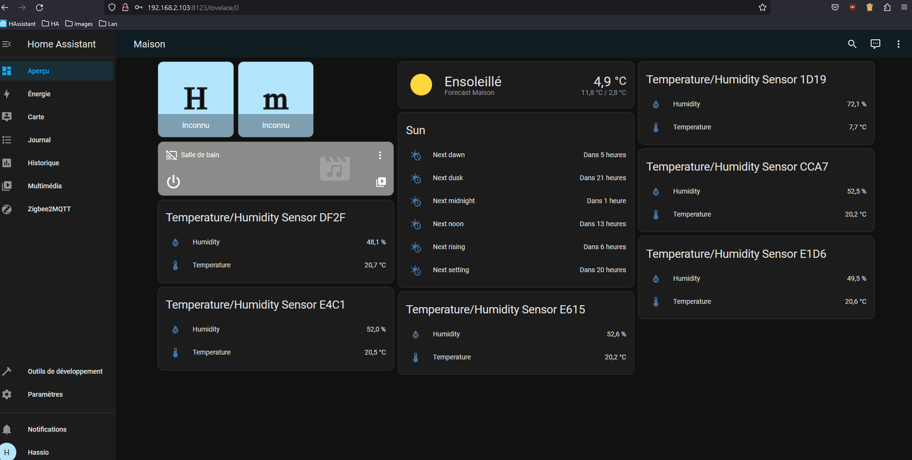

Suite à de nombreuses questions, sur le forum, sur l'installation de Zigbee2MQTT, nous avons profité de l'occasion pour publier cet article.

Cet article s'adresse aux personnes ayant une installation Home Assistant OS ou HA Supervised. Autrement, l'installation de Zigbee2MQTT et du broker Mosquitto doit se faire de manière externe à Home Assistant

## Le protocole Zigbee

Zigbee est un protocole quasi omniprésent dans toutes les domotiques, supplantant Zwave et autres. Une large gamme d'appareils sont disponibles dans ce protocole.

Zigbee (version 3.0 maintenant) est un protocole qui se devait universel, mais qui a vu arriver une incompatibilité entre les constructeurs nous obligeant à avoir une passerelle (gateway) par constructeur. Mais ce problème est désormais résolu grâces aux passerelles universelles.

### Les passerelles

Voici les plus connues :

* Clés à base Texas Instruments CC2652/CC1352 (Recommandés). Les plus réputées sont les [Sonoff]((https://sonoff.tech/product/gateway-and-sensors/sonoff-zigbee-3-0-usb-dongle-plus-e/)) disponibles sur [Amazon](https://www.amazon.fr/SONOFF-EFR32MG21-Coordinator-Universelle-Passerelle/dp/B0B6P22YJC),
* [Conbee II](https://www.amazon.fr/Dresden-ConBee-Electronique-II/dp/B07PZ7ZHG5), très populaire,
* [Zigate (FR)](https://zigate.fr/),
* Clés à base Texas Instruments CC2531/2530,

[Liste des clés compatibles avec Zigbee2MQTT](https://www.zigbee2mqtt.io/guide/adapters/#recommended)

Les premières, a base de CC2652, sont les plus utilisées et compatibles avec Zigbee2MQTT et ZHA.
La Zigate, marche très bien sur les autres plateformes domotique, mais n'est pas la plus fonctionnelle, malgré une compatibilité Zigbee2MQTT et ZHA.
La Conbee II (environ 30 euros), très utilisée sous Home Assistant, elle est compatible Zigbee2MQTT, ZHA et deCONZ.

La dernière (CC2531/CC2530) est toujours compatible, mais entame son transfert vers les archives. Même si elle suffit à la plupart des devices, elle ne supporte pas « officiellement » le Zigbee 3.

Home Assistant propose également une clé compatible Zigbee et **Matter** également très intéressante appelée [SkyConnect](https://www.home-assistant.io/skyconnect/). Elle permet de préparer l'arrivée du protocole Matter, même si cela peut prendre quelques années.

\###Les add-ons / Intégrations dans Home Assistant
Il existe plusieurs façons de communiquer avec vos clés universelles dans Home Assistant, chacune ayant ses avantages et inconvénients, mais aussi une quantité d'appareils (devices) compatibles.

> [Base de données des compatibilités des appareils et des intégrations](https://zigbee.blakadder.com/)

*[ZHA](https://www.home-assistant.io/integrations/zha/) :* C'est l'intégration **native** de Home Assistant pour les clés universelles Zigbee. ZHA utilise une bibliothèque Python open-source implémentant une pile Zigbee indépendante du matériel appelée zigpy. Tous les coordinateurs compatibles avec zigpy peuvent être utilisés avec ZHA. ZHA est simple à utiliser, mais à ce jour plus limité par rapport à Zigbee2MQTT.

*[deCONZ](https://www.home-assistant.io/integrations/deconz/) :* est le logiciel propriétaire de Dresden elektronik qui communique uniquement avec les passerelles Zigbee ConBee/RaspBee de la marque. Pas forcément beaucoup d'avantages à notre avis et interface vieillotte.

*[Zigbee2MQTT](https://www.zigbee2mqtt.io/) :* Open-source et supportant plusieurs adaptateurs Zigbee ainsi qu'**un très grand nombre d'appareils**. Zigbee2MQTT est utilisé par d'autres solutions domotique et est l'application supportant le plus grand nombre d'appareils à date. Elle offre également plus d'outils de gestion Zigbee (cartographie, mise à jour OTA des devices zigbee, mais pas que), et une documentation très complète. Enfin l'interface avec MQTT pourra séduire certains utilisateurs avancés, en particulier ceux utilisant Node-Red.

Nous allons voir comment installer **Zigbee2MQTT** et le **broker MQTT Mosquitto** (indispensable à son fonctionnement) sur Home Assistant.

## Création d'un utilisateur Home Assistant (facultatif)

> **Cette étape est facultative, car elle se fait automatiquement maintenant.**

Si vous souhaitez le créer par vous-même.

* Rendez-vous dans `paramètre`, `Personnes` puis `Ajouter une personne`,
* Basculer le bouton `Autoriser à se connecter`,
* Donner un nom à votre utilisateur et un mot de passe,
* Basculer le bouton `Ne peut se connecter qu'à partir du réseau local` et `Administrateur,`
* Valider en cliquant sur `Créer`.


## Installer Zigbee2MQTT.

Zigbee2MQTT est un add-on qui n'est pas directement disponible dans les modules complémentaires, il faut ajouter une source externe. Je vous laisse regarder l'[article sur l'installation d'un add-on](/ha_addon).

Le lien à ajouter est le suivant

```
https://github.com/zigbee2mqtt/hassio-zigbee2mqtt
```

**Passer à l'étape suivante avant de lancer l'add-on Zigbee2MQTT.**


## Installation du Broker Mosquitto.

Installer le depuis les modules complémentaires.



Démarré le.

Vous pouvez maintenant lancer Zigbee2MQTT.

Au premier lancement de Z2M, il va automatiquement créer un utilisateur pour MQTT et ajouter l'adresse du broker.

Le résultat du fichier `configuration.yaml` après le premier lancement doit ressembler à cela.

```
mqtt:
  server: mqtt://core-mosquitto:1883
  user: addons
  password: Thee8ahGhahpe4oKoe4xxxxxxxxxxxxxxxxxxxxxxxxxxxxxxxxxxxxxxxxxxxx
```

### Configuration de votre clé USB.

Dans la partie `Sérial`, de la configuration de l'add-on Zigbee2MQTT, saisir le chemin de votre clé Zigbee

> ATTENTION : La configuration est différente selon la clé utilisée.

Exemple :

 Pour la clé Sonoff Dongle Plus

```
port: >-
  /dev/serial/by-id/usb-Silicon_Labs_Sonoff_Zigbee_3.0_USB_Dongle_Plus_0001-if00-port0
```

D'autres exemples :
**Conbee II**

```
serial:
  port: >-
    /dev/serial/by-id/usb-dresden_elektronik_ingenieurtechnik_GmbH_ConBee_II_DE2234130-if00
  adapter: deconz
```

**Sonoff Version E** (Remplacer 20XXXXXXXX-if00 par le numéro de votre propre clé).

```
serial:
  port: >-
    /dev/serial/by-id/usb-ITEAD_SONOFF_Zigbee_3.0_USB_Dongle_Plus_V2_20XXXXXXXXX-if00
  adapter: ezsp
```


Si tout se passe bien, Home Assistant devrait détecter le broker Mosquitto, sinon il peut être ajouté en ajoutant une intégration et rechercher Mosquitto.

## Divers

### Configuration (facultatif).

> **ATTENTION : SEULEMENT si vous avez créé vous-même votre utilisateur**

Nous devons passer à la configuration de Mosquitto et de Zigbee2MQTT.

#### Configuration de Mosquitto Broker.

Aller dans la configuration de l'add-on Mosquitto Broker et ajouter les informations de l'utilisateur, créé plus haut, dans la partie login.

```
  - username: usermqtt
    password: passwordmqtt
```

Cliquer sur enregistrer, la configuration est finie.


#### Configuration de Zigbee2MQTT.

Aller dans sa configuration de l'add-on.

Dans la partie MQTT :

```
base_topic: zigbee2mqtt
server: mqtt://core-mosquitto
user: usermqtt
password: passwordmqtt
```


## Conclusion.

Vous pouvez connecter une multitude d'appareils Zigbee avec **une seule** passerelle, envoyer les informations d'autres appareils (aspirateur sous Valetudo ou shelly) via MQTT et connecter d'autres solutions (exemple Node-Red) a votre broker MQTT pour accéder aux différents appareils de votre installation.

Je vous conseille l'[article sur la gestion des indisponibilités](/zigbee2mqtt-availability) de vos appareils sous Zigbee2MQTT.