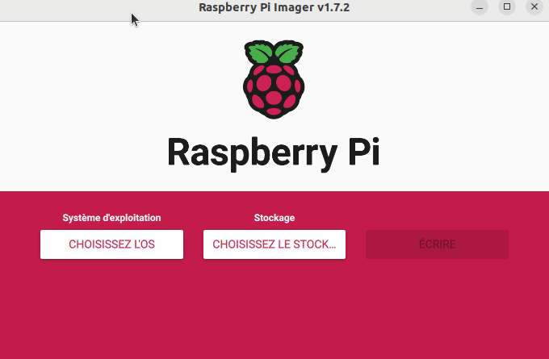

Vous souhaitez commencer l'aventure Home Assistant et votre choix s'est porté sur l'installation de **Home Assistant OS**. Vous faites le choix de vous concentrer sur votre domotique plutôt que sur la gestion annexe.

Que votre matériel soit un NUC, une Raspberry, une Tinkerboard ou un Odroid, ce guide est fait pour vous.

***Matériels utilisés :*** *Raspberry Pi et Home Assistant OS 8.5.*

### Prérequis.

* [Balena Etcher](https://www.balena.io/etcher/) *(Linux, Windows, Mac)* ou
* [Raspberry Pi OS](https://www.raspberrypi.com/software/) *(Linux, Windows, MacOS)*
* [L'image pour votre système](https://github.com/home-assistant/operating-system/releases) *(Facultatif)*

**Installation sur Raspberry Pi : Pourquoi il utilise une carte Micro SD alors que, sur le net, tout le monde parle de problèmes avec les cartes SD ?** Parce que [Home Assistant le recommande](https://www.home-assistant.io/common-tasks/os/#using-external-data-disk).([Voir ici](/blog/ha_installation_premier_lancement/#déplacer-les-données-utilisateurs-facultatif))

## Préparation avec Balena Etcher.

Récupérer la [version de Balena Etcher](https://www.balena.io/etcher/) pour votre système d'exploitation.

**Avec l'image déjà récupérée :**

* Lancer Balena Etcher,
* Cliquer sur `Flash from File`,
* Sélectionner votre [image](https://github.com/home-assistant/operating-system/releases),
* Sélectionner votre MicroSD dans `Select target`,
* Cliquez sur `Flash`.

**Avec récupération de l'image en ligne :**

* Lancer Balena Etcher,
* Cliquer sur `Flash from URL`,
* Rentrer l'[URL](https://www.home-assistant.io/installation/raspberrypi#write-the-image-to-your-boot-media) correspondante à votre matériel,
* Sélectionner votre MicroSD dans `Select target`,
* Cliquez sur `Flash`.

## Préparation avec Raspberry Pi OS.

Récupérer et installer [Raspberry Pi OS](https://www.raspberrypi.com/software/) pour votre système d'exploitation.

* Lancer Raspberry Pi OS,

**Si vous n'avez pas récupéré l'image de Home Assistant OS.**

* Dans `CHOISISSEZ L'OS`, `Other specifique-purpose OS`, `Home assistants and home automation`, `Home Assistant` puis `Home Assistant OS 9.3 (TPi4/400)` (au moment où j'écris),
* Dans `CHOISISSEZ LE STOCKAGE`, sélectionner votre Carte SD,
* Et cliquer sur écrire.

Une fois la copie terminée et vérifiée, passez à la suite.

**Si vous avez récupéré l'[image de Home Assistant OS](https://github.com/home-assistant/operating-system/releases).**

* Dans `CHOISISSEZ L'OS`, `Utiliser image personnalisée` et sélectionner votre image sur votre disque,
* Dans `CHOISISSEZ LE STOCKAGE`, sélectionner votre Carte SD,
* Et cliquer sur écrire.

## Premier Lancement.

Une fois votre image transférée par la méthode de votre choix, insérer votre carte MicroSD, votre câble Ethernet (recommandé), l'alimentation puis allumer votre matériel.

Rendez-vous, depuis votre navigateur, sur `[homeassistant.local:8123](http://homeassistant.local:8123)` ou sur `ipdevotremateriel:8123`

> Il peut falloir attendre 2-3 minutes avant que cette page s'affiche.

Il faut maintenant patienter quelques minutes, plus ou moins longues, en fonction de votre connexion internet avant de pouvoir lancer la [première configuration](/ha_installation_premier_lancement) qui est commune à toutes les installations et bénéficie, donc, de son propre article.

## Connexion en Wi-Fi.

J'ai volontairement recommandé la connexion par câble Ethernet au lieu du Wifi. Ce n'est pas un oubli, mais un système domotique efficace ne repose pas sur du Wi-Fi. De plus, Home Assistant ne le recommande pas, mais sachez qu'il est possible de le configurer facilement, surtout si vous passez par Raspberry Pi OS.

### Sources.

* [Home Assistant Installation](https://www.home-assistant.io/hassio/installation/)
* [Home Assistant OS images](https://github.com/home-assistant/operating-system/releases)
* [Etcher](https://www.balena.io/etcher/)