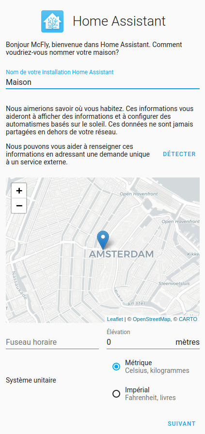
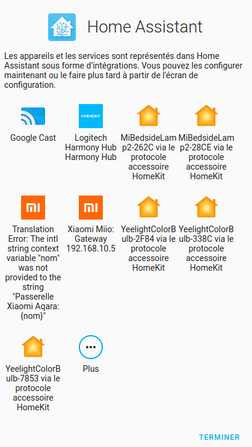
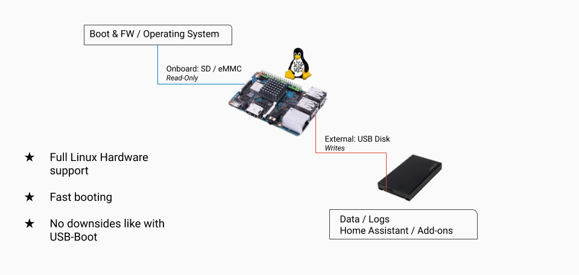

Vous venez d'installer Home Assistant et vous êtes rendu sur votre instance via `http://homeassistant:8123` ou `http://homeassistant.local:8123`. 

Vous arrivez sur une page vous disant d'attendre. Cela peut prendre jusqu'à 20 minutes selon votre connexion internet.

Une fois sa préparation terminée, il va vous demander quelques paramétrages :
Sur la première page.

* Un nom pour votre utilisateur,
* Un nom d'utilisateur,
* Un mot de passe et sa confirmation.

> Cet utilisateur sera l'utilisateur avec tous les droits, alors ne pas hésiter à mettre un bon mot de passe.

La seconde page concerne votre domicile.

* Donner un nom votre installation,
* Définir la localisation de votre domicile,
* Choisir le fuseau horaire,
* Rentrer l'[altitude de son domicile](https://www.calcmaps.com/fr/map-elevation/)
* Choisir le système métrique.

La suivante vous permet d'accepter de partager anonymement certaines données, pour aider Home Assistant à améliorer le système.

La dernière concerne les matériels détectés automatiquement par Home Assistant déjà disponibles.

> Vous pouvez passer cette étape, on y reviendra plus tard. Ils peuvent être retrouvés dans `Paramètres` -> `Appareils et Services`

Vous voilà enfin sur l'interface de Home Assistant.

## Activer les paramètres avancés.

Le mode avancé vous permet d'avoir plus de contrôle sur votre serveur.
Cliquer sur votre utilisateur (dans le menu) puis activer `Mode avancé`

## Déplacer les données utilisateurs (facultatif).

Le système d'exploitation Home Assistant permet de stocker la plupart des données sur un support de stockage externe (par exemple, un SSD ou un disque dur connecté par USB). Ce disque de données contient non seulement les données de l'utilisateur, mais aussi la plupart des services de Home Assistant (Core, Supervisor, etc.). Cela signifie qu'un disque de données rapide rendra le système global beaucoup plus rapide.

>Si vous utilisez une MicroSD pour votre système et dans le but de la conserver en bon état le plus longtemps possible ou si la taille de votre mémoire interne devient trop juste, il est intéressant d'utiliser cette fonctionnalité.

>La fonction de disque de données peut être utilisée sur une installation existante sans perdre de données. Toutefois, il est recommandé de [créer et de télécharger une sauvegarde](https://www.home-assistant.io/common-tasks/os/#backups) complète avant de procéder !

>Si vous installez Home Assistant sur un autre Raspberry et que le disque externe est branché, il récupère automatiquement vos données

###Comment effectuer cette manipulation.
>Il est conseillé de faire une sauvegarde avant d'effectuer cette manipulation, même s'il ne devrait pas avoir de problème.

* Dans `Paramètres`, `Système`, `Stockage`,
* En haut à droite, cliquer sur `...` puis appuyer sur `Déplacer le disque de données`,
* Sélectionner le disque,
* Cliquer sur `Déplacer`.

Après avoir redémarré, vos données seront sur le disque dur et les écritures ne viendront plus abimer votre carte Micro SD.

> Pour une installation sur Raspberry avec Micro SD, cette méthode permet d'éviter les problèmes de détection du disque dur lié à USB3 et ceux de la carte MicroSD corrompue. Il permet aussi au système de profiter d'un démarrage rapide.

>En cas de Carte MicroSD corrompue (ce qui ne devrait plus arriver avec cette methode), il vous suffit de reinstaller Home Assistant OS sur une nouvelle carte MicroSD Classe 2, de brancher le disque dur et relancer votre Raspberry Pi. Votre solution domotique se relance comme s'il ne c'etait rien passé.

## Conclusion
Vous avez maintenant une installation de Home Assistant toute fraîche. 
Vous pouvez à présent vous lancer dans [vos premiers projets](/ha_premiers_projets) ou dans l'[installation d'add-ons](/ha_addon_installation).