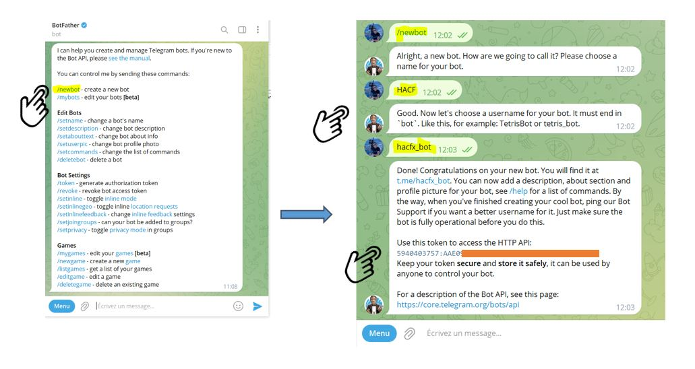
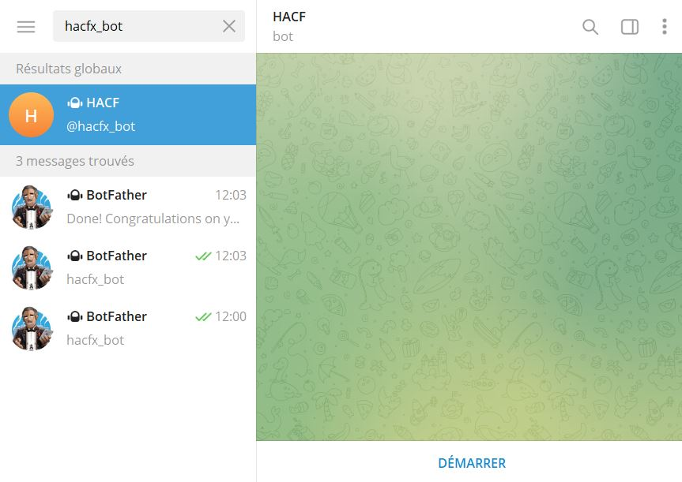
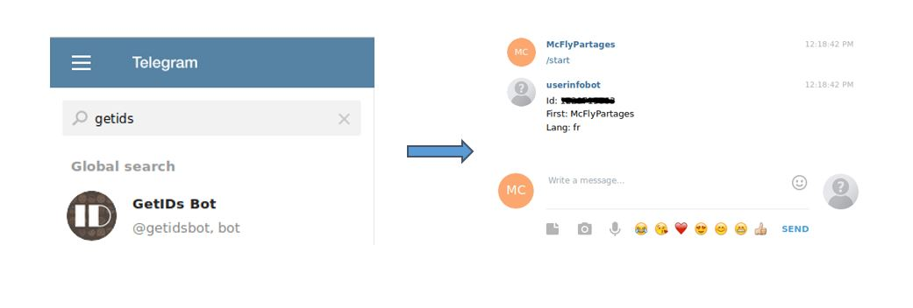
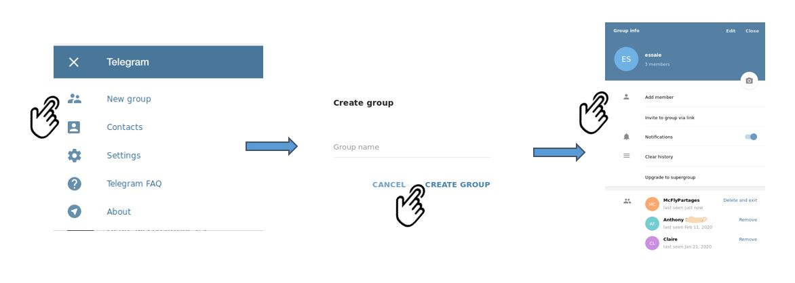
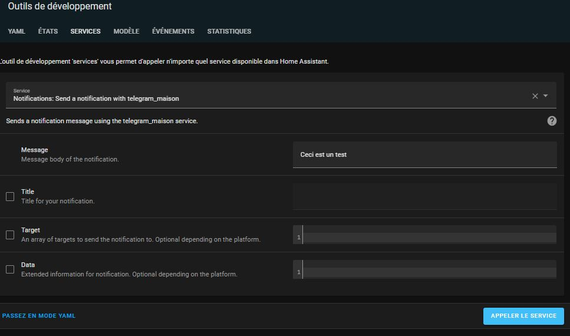
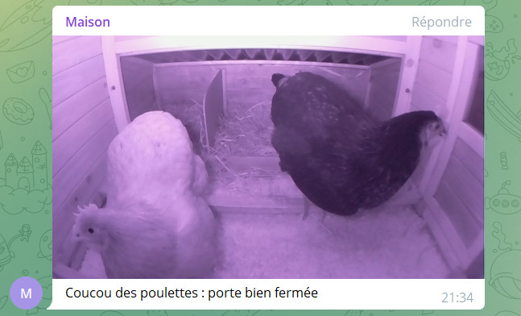

**L'utilisation de notifications est primordiale** pour un système domotique efficient.

Exemple de notifications :

* "Vous partez alors que la fenêtre du salon est restée ouverte"
* "Le taux de CO2 est trop fort et il faut aérer le salon"
* "Une consommation anormale d'eau a été détectée cette nuit"
* "La température du congélateur est trop élevée."
* "Pas de consommation électrique de la pompe de la piscine. Vérifier son bon fonctionnement"
* ....

Home Assistant intègre un système de notification, mais qui a ses limites. Il est souvent préférable de le réserver aux notifications techniques, comme les demandes mises à jour.

**Telegram** est alors une **solution de choix** pour permettre à toute la famille de recevoir des notifications sur la maison.

Il est également très intéressant de pouvoir **répondre à ces notifications** pour déclencher une ou des actions via des boutons sous le message. L'exemple ci-dessous est la demande de fermeture du volet de la piscine quant l'air est plus froid que l'eau (cela permet de garder l'eau chaude et éviter l'évaporation).


Nous vous proposons ici un tutoriel complet pour implémenter simplement **Telegram** avec les **automatisations** de Home Assistant.

Les étapes suivantes seront détaillées :

* Créer un bot Telegram et obtenir un token et un ID,
* Connecter Telegram a Home Assistant via l'**intégration Telegram**,
* Créer une **notification** que l'on utilisera de manière standard dans nos automatisations et nos scripts.

## 1. Installer un bot Telegram

### 1.1 Création du bot

Il va falloir vous créer un bot pour que ce soit lui qui vous envoie des messages.

Rendez-vous sur [Telegram sur votre Navigateur](https://web.telegram.org/) ou via votre application mobile.

1. Rechercher `@botfather` dans le champ de recherche des contacts puis cliquer dessus.
2. Lancer le BotFather Telegram et cliquer sur `Démarrer` (ou start si en anglais).


3. Une liste d’options vous sont proposées. Cliquer sur `/newbot`
4. Choisir un nom pour votre bot et un nom d’utilisateur (HACF_bot dans l'exemple)).



Votre token apparaît, **gardez le bien précieusement**.

Vous avez maintenant votre Bot Telegram.

5. **Reste enfin à l'activer.** Retrouver votre bot dans la recherche (@HACFx_bot par exemple), cliquer dessus, puis dans le fil de discussion, cliquer sur `Démarrer` (ou /start). Sans cette dernière opération, votre bot ne sera pas actif.



> A tout moment vous pouvez retourner sur BotFather, lancer /mybots puis cliquer votre bot pour le gèrer, le supprimer, voir son token, etc.

L'étape suivante est de **retrouver l'ID du fil de discussion** ou envoyer les messages : soit seulement vous (voir 1.2) ou alors un groupe (voir 1.3).

### 1.2 Récupérer votre ID pour VOUS envoyer des messages

Cette partie permet de retrouver **votre ID**, si **vous choisissez de n'envoyer des messages qu'à vous** (et pas à un groupe de personnes).

Pour récupérer l’`ID` de votre `USER`, rechercher `@getids bot` dans le champ de recherche des contacts puis cliquer sur `Démarrer`.

> Notez bien cet ID référençant le bot qui **émettra** les messages.



### 1.3 Récupérer l'ID pour les envois à un GROUPE

La création d’un groupe vous permettra d’**envoyer des messages aux utilisateurs de ce groupe**. Vous pouvez par exemple créer un groupe appelé Maison, et y ajouter les membres de votre famille.

Voici comment en récupérer l'ID.

1. Cliquer sur le menu de Telegram puis `Nouveau groupe`

Donnez-lui un nom puis `CREATE GROUP`.

2. Sélectionner les utilisateurs devant appartenir au groupe ainsi que votre bot.

Cliquer sur votre Groupe en haut puis `Ajouter des membres`. **Important : n'oubliez pas d'ajouter votre bot** (autrement, il ne pourra pas envoyer de messages dans le groupe).\*\*



3. Récupérer votre ID du groupe en invitant `@getids bot` à votre groupe. Une fois ajouté, vous pouvez voir votre ID qui s'affiche dans le fil de discussion.

   > Notez bien cet ID référençant le groupe qui **recevra** les messages.

Une fois l'ID noté, vous pouvez éjecter `GetIds Bot` du groupe en cliquant sur les 3 points en haut à droite, puis `Gérer le groupe`.


## 2. Configuration du bot dans Home Assistant

Dans `configuration.yaml`, ajoutez le code qui suit pour référencer le token de votre bot émetteur et l'id du destinataire : ce peut être vous (voir 3.2), ou un groupe (voir 3.3).

L'exemple ci-dessous fait référence à un groupe Telegram qui s'appellerait Maison, et référencé dans Home Assistant sous le nom telegram*maison. L'envoie via Home Assistant d'une notification dans telegram_maison enverra un message dans le groupe telegram _Maison*.

```yaml
# Configuration Telegram
telegram_bot:
  - platform: polling
    api_key: !secret telegram_token
    allowed_chat_ids:
      - !secret id_telegram_maison

# Configuration notification
notify:
  - name: telegram_maison
    platform: telegram
    chat_id: !secret id_telegram_maison
```

> Il peut être pertinent à terme de déplacer ce code dans un package notification.yaml qui est ensuite inclut dans le fichier configuration.

ID et token fournis par Telegram sont à mettre dans le fichier `secret.yaml`et pas directement dans `configuration.yaml`.

```yaml
# Telegram
telegram_token: 999999999999999999999999999
id_telegram_maison: 999999999999999999
```

### Tester le bon fonctionnement.

Pour vérifier que tout fonctionne bien, rendez-vous dans `Outils de développement`, puis `services` et saisir les informations suivantes :

* **Service** : `notify.telegram_maison` (ou votre user)
* **Message** : `message: votre message`

Cliquez sur `Appeler le service`. Vous devriez voir sur votre application Telegram le message arriver.



## 3. Utilisation des notifications

L'utilisation se fait juste en appelant le service `notify.telegram_maison` dans vos scripts et automatisations.

Il ne faut pas hésiter à transmettre des données dans vos messages, par exemple ici la température de l'eau de l'air.

```yaml
trigger: []
condition: []
action:
  - service: notify.message_warning_groupe
    data:
      message: >-
        Merci de fermer le volet.
        Température eau : {{states('sensor.fibaro_piscine_temperature_eau')}} °C
        Température abri : {{states('sensor.fibaro_piscine_temperature_abri')}} °C
```

Il est aussi possible de **rajouter une image**, typiquement issue d'une capture ("snap") d'une de vos caméras. Par exemple ici l'intérieur du poulailler pour vérifier que nos poules sont bien couchées quand la porte se ferme (ma femme adore cette fonction :slight_smile: ).



```yaml
trigger: []
condition: []
action:
  service: notify.telegram_maison
  data:
    message: Coucou des poulettes : porte bien fermée
    data:
      photo:
        - file: /media/poules/snap.jpg
```

Vous trouverez dans la doc plus d'informations sur la gestion des images : [Setting up local media sources](https://www.home-assistant.io/more-info/local-media/setup-media/)

Vous pouvez par exemple créer un sous-répertoire `/poules` dans `config/www` qui est par défaut un répertoire avec des accès ouverts.

Puis déclarer ce répertoire dans votre fichier de configuration `config.yaml `pour qu'il soit accessible sous le nom "poules" depuis le répertoire multimédia ainsi que votre code YAML.

```yaml
homeassistant:
  media_dirs:
    poules: /config/www/poules/
```


## 4. Rajout de boutons d'action après le message

Reprenons notre exemple du début de l'article :


Pour afficher les boutons, c'est très simple : il suffit de rajouter dans la section data du message la section `inline_board` avec `libellé:/event` à déclencher. Dans notre cas, les événements `piscine_ferme` et `piscine_ignore_ferme` seront déclenchés si respectivement un des boutons est pressé.

```yaml
trigger: []
condition: []
action:
  - service: notify.message_warning_groupe
    data:
      message: >-
        Merci de fermer le volet....
      data:
        inline_keyboard:
          - Ignore:/piscine_ignore_ferme, Ferme volet:/piscine_ferme
```

## 5. Traitement des actions des boutons

Il faut créer deux automatisations qui se déclenchent pour chaque événement `piscine_ferme` ou `piscine_ignore_ferme` et exécute une action en conséquence.

Par exemple, voici l'automatisation pour traiter l'événement de demande de fermeture :

```yaml
alias: 'Piscine : fermeture par telegram'
description: Traite la réponse de demande de fermeture du volet par telegram
trigger:
  - platform: event
    event_type: telegram_callback
    event_data:
      command: /piscine_ferme
action:
  - service: cover.close_cover
    target:
      entity_id: cover.ipx800_volet_piscine
    data: {}
```

## 6. Confirmation que l'action a été bien effectuée

Une fois le bouton cliqué, il ne reste plus qu'à supprimer la barre de boutons, et confirmer à l'utilisateur que la demande d'action a été bien prise en compte.


Pour cela, on rajoute à l'automatisation précédente quelques lignes :

```yaml
alias: 'Piscine : fermeture par telegram'
description: Traite la réponse de demande de fermeture du volet par telegram
trigger:
  - platform: event
    event_type: telegram_callback
    event_data:
      command: /piscine_ferme
action:
  - service: cover.close_cover
    target:
      entity_id: cover.ipx800_volet_piscine
    data: {}
  - service: telegram_bot.edit_replymarkup
    data:
      message_id: last
      chat_id: '{{ trigger.event.data.chat_id }}'
      inline_keyboard: null
  - service: notify.message_warning_groupe
    data:
      message: Volet piscine fermé.
initial_state: true
mode: single
```

Pour l'événement `cancel`, On répond juste `ok` et on demande la suppression de la ligne de boutons qui s'affichait dans Telegram.

```yaml
alias: 'Piscine : ignorer demande fermeture telegram'
description: Enlève bouton et réactive l'alerte sur fermeture
trigger:
  - platform: event
    event_type: telegram_callback
    event_data:
      command: /piscine_ignore_ferme
action:
  - service: input_boolean.turn_on
    target:
      entity_id: input_boolean.piscine_flag_fermeture_volet_actif
    data: {}
  - service: telegram_bot.answer_callback_query
    data:
      callback_query_id: '{{ trigger.event.data.id }}'
      message: Ok
  - service: telegram_bot.edit_replymarkup
    data:
      message_id: last
      chat_id: '{{ trigger.event.data.chat_id }}'
      inline_keyboard: null
mode: single
```

> Il est intéressant de personnaliser votre bot dans Telegram, en particulier :
>
> * Modifier le logo par défaut et mettre celui de Home Assistant.
> * Paramétrer une purge des messages de plus de 8 jours. Pour cela, depuis l'écran du fil de discussion, cliquer sur le logo de votre bot, en haut à droite, puis cliquer sur `modifier`.

## Conclusion

Voilà, vous pouvez maintenant "**dialoguer**" avec votre maison via **Telegram**, en intégrant potentiellement des données et des photos.

N'hésitez pas à partager sur le forum les choses originales ou amusantes que vous auriez automatisées.

## Source

Cet article est une fusion et réécriture des articles initialement proposés par *@McFly* et *@Argonaute* sur le forum HACF.