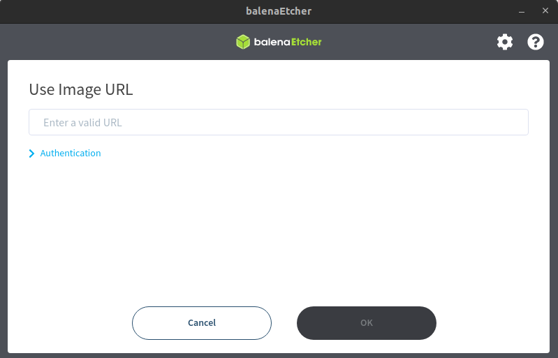
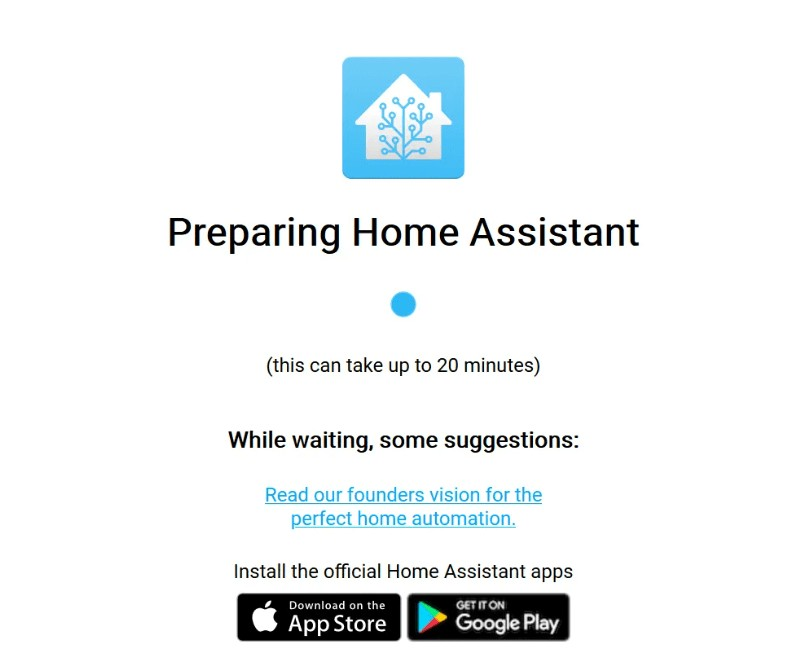

Vous souhaitez commencer l'aventure Home Assistant et votre choix s'est porté sur l'installation de Home Assistant OS sur un matériel dédié ? Vous avez fait le choix de vous concentrer sur votre domotique plutôt que sur la gestion annexe.

Que votre matériel soit une Raspberry, une Tinkerboard ou un Odroid, ce guide est fait pour vous.

Nous allons voir comment installer Home Assistant OS sur l'un de ces SBC (single Board Computer)

***Matériels utilisés :*** *Raspberry Pi et Home Assistant OS 8.5.*

### Prérequis.

* [Balena Etcher](https://www.balena.io/etcher/) *(Linux, Windows, Mac)* ou
* [Raspberry Pi OS](https://www.raspberrypi.com/software/) *(Linux, Windows, MacOS)*
* [L'image pour votre système](https://github.com/home-assistant/operating-system/releases) *(Facultatif)*

**Installation sur Raspberry Pi : Pourquoi il utilise une carte Micro SD alors que, sur le net, tout le monde parle de problèmes avec les cartes SD ?** Parce que [Home Assistant le recommande](https://www.home-assistant.io/common-tasks/os/#using-external-data-disk).

> Dans ce type d'installation, toutes les actions provoquant des écritures à répétitions sur le support SD sont déplacées vers le disque dur. Fini les cartes SD corrompues tout en conservant un démarrage rapide de votre système et éviter les problèmes de disque non reconnu.

Le système d'exploitation Home Assistant permet de stocker la plupart des données sur un support de stockage externe (par exemple, un SSD ou un disque dur connecté par USB). Ce disque de données contient non seulement les données de l'utilisateur, mais aussi la plupart des services de Home Assistant (Core, Supervisor, etc.). Cela signifie qu'un disque de données rapide rendra le système global beaucoup plus rapide.

La fonction de disque de données peut être utilisée sur une installation existante sans perdre de données : Le système déplacera automatiquement les données existantes vers le disque de données externe. Toutefois, il est recommandé de [créer et de télécharger une sauvegarde](https://www.home-assistant.io/common-tasks/os/#backups) complète avant de procéder !

> Je tourne avec cette solution et je n'ai aucun problème, si vous installez Home Assistant sur un autre Raspberry et que le disque externe est branché, il récupère automatiquement vos données

## Préparation avec Balena Etcher.

Récupérer la [version de Balena Etcher](https://www.balena.io/etcher/) pour votre système d'exploitation.

**Avec l'image déjà récupérée :**

* Lancer Balena Etcher,
* Cliquer sur `Flash from File`,
* Sélectionner votre [image](https://github.com/home-assistant/operating-system/releases),
* Sélectionner votre MicroSD dans `Select target`,
* Cliquez sur `Flash`.

**Avec récupération de l'image en ligne :**

* Lancer Balena Etcher,
* Cliquer sur `Flash from URL`,
* Rentrer l'[URL](https://www.home-assistant.io/installation/raspberrypi#write-the-image-to-your-boot-media) correspondante à votre matériel,
* Sélectionner votre MicroSD dans `Select target`,
* Cliquez sur `Flash`.

## Préparation avec Raspberry Pi OS.

Récupérer et installer [Rapsberry Pi OS](https://www.raspberrypi.com/software/) pour votre système d'exploitation.

* Lancer Raspberry Pi OS,
* Dans `CHOISISSEZ L'OS`, `Other specifique-purpose OS`, `Home assistants and home automation`, `Home Assistant` puis `Home Assistant OS 9.3 (TPi4/400)` (au moment où j'écris),
* Dans `CHOISISSEZ LE STOCKAGE`, sélectionner votre Carte SD,
* Puis cliquer sur écrire.

Une fois la copie terminée et vérifiée, passez à la suite.

## Premier Lancement.

Une fois votre image transférée par la méthode de votre choix, insérer votre carte MicroSD, votre câble Ethernet (recommandé), l'alimentation puis allumer votre matériel.

Rendez-vous, depuis votre navigateur, sur `[homeassistant.local:8123](http://homeassistant.local:8123)` ou sur `ipdevotremateriel:8123`

> Il peut falloir attendre 2-3 minutes avant que cette page s'affiche.

Il faut maintenant patienter quelques minutes, plus ou moins longues, en fonction de votre connexion internet avant de pouvoir lancer la [première configuration](/blog/premier-lancement-et-configuration-de-home-assistant) qui est commune à toutes les installations et bénéficie, donc, de son propre article.

## Déplacer les données utilisateurs (facultatif).

Pour préserver la carte Micro SD, tout en gardant un système rapide ou si la taille de votre mémoire interne devient trop juste, Home Assistant permet de déplacer les données utilisateurs sur un support externe (il peut être interne avec un boitier adapté).

Nous allons en conséquence voir comment effectuer cette manipulation.

> Il est conseillé de faire une sauvegarde avant d'effectuer cette manipulation, même s'il ne devrait pas avoir de problème.

* Dans `Paramètres`, `Système`, `Stockage`,
* En haut à droite, cliquer sur `...` puis appuyer sur `Déplacer le disque de données`,
* Sélectionner le disque,
* Cliquer sur `Déplacer`.

Après avoir redémarré, vos données seront sur le disque dur et les écritures ne viendront plus abimer votre carte Micro SD.

> Pour une installation sur Raspberry avec Micro SD, cette méthode permet d'éviter les problèmes de détection du disque dur lié à USB3 et ceux de la carte MicroSD corrompue. Il permet aussi au système de profiter d'un démarrage rapide.
>
> En cas de Carte MicroSD corrompue (ce qui ne devrait plus arriver avec cette methode), il vous suffit de reinstaller Home Assistant OS sur une nouvelle carte MicroSD Classe 2 et relancer votre Raspberry Pi. Votre solution domotique se relance comme s'il ne c'etait rien passé.

## Connexion en Wi-Fi.

J'ai volontairement recommandé la connexion par câble Ethernet au lieu du Wifi. Ce n'est pas un oubli, mais un système domotique efficace ne repose pas sur du Wi-Fi. De plus, Home Assistant ne le recommande pas, mais sachez qu'il est possible de le configurer facilement, surtout si vous passez par Raspberry Pi OS.

### Sources.

* [Home Assistant Installation](https://www.home-assistant.io/hassio/installation/)
* [Home Assistant OS images](https://github.com/home-assistant/operating-system/releases)
* [Etcher](https://www.balena.io/etcher/)
* [External Drive Off](https://www.home-assistant.io/common-tasks/os/#using-external-data-disk)