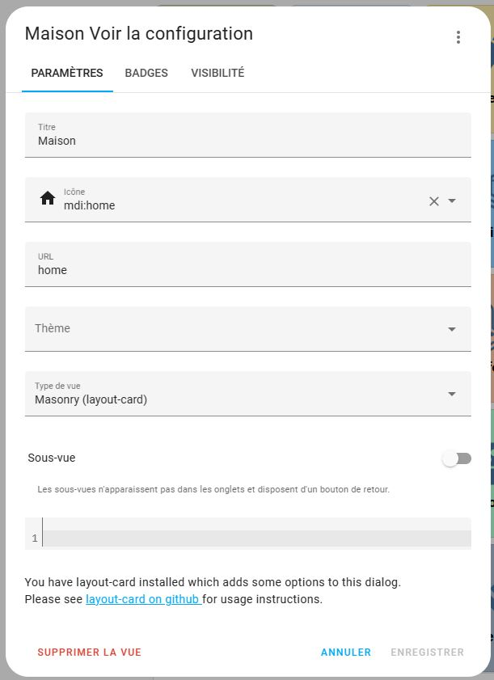
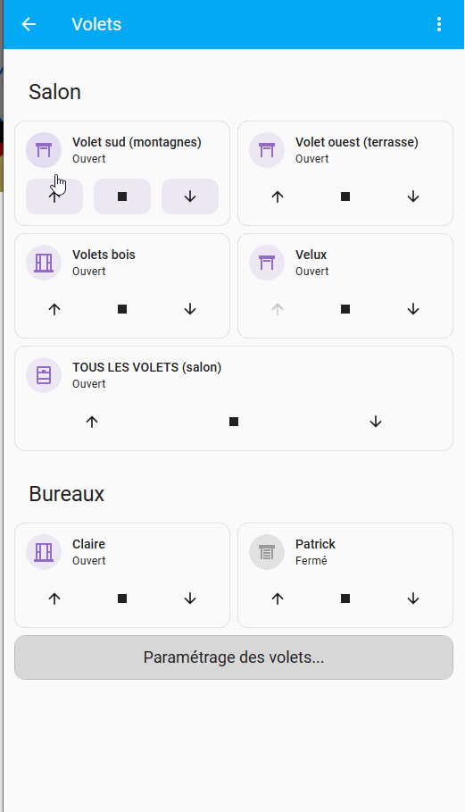

Cet article propose comment réaliser une interface conviviale pour mobile (iPhone, Android).

L'idée est d'avoir une page d'accueil avec un menu en tuiles, donnant accès aux différentes fonctions de son système domotique. Chaque groupe de fonctions est regroupé dans une sous-vue dédiée. Le menu du haut par défaut sera supprimé, la navigation étant assurée par la page principale en tuile. Chaque sous-vue a un bouton de retour vers la vue initiale.

## Quelques considérations d'UX Design

UX signifie Expérience utilisateur (User eXperience). L'idée est de réfléchir comment créer un système **convivial** et **intuitif** pour toute la famille. Il s'agit de répondre par exemple au fameux WAF (Wife Acceptance Factor), mais bon, perso, je trouve cette considération plutôt sexiste.

> Remarque : UX design ne doit pas être confondu avec UI design (User Interface) qui ne traite que de l'interface, les couleurs, les formes, etc.

Donc en réfléchissant UX Design, on réfléchira à tous les moyens d'interagir simplement avec sa domotique, et pas que via une interface graphique. Voici quelques éléments de réflexion qui nous conduiront naturellement à l'usage mobile.

Tout d'abord, un bon système domotique **doit se faire oublier**, et on doit privilégier les **automatisations** qui rendent "intelligente" notre maison : les caméras se mettent à surveiller si on met l'alarme, le chauffage se déclenche quand on rentre ou aux bonnes heures, etc

Je reste aussi persuadé que la maison doit pouvoir interagir avec les utilisateurs, en **envoyant des messages**, éventuellement avec des images,mais aussi en **proposant des commandes contextuelles**. Cela peut être réalisé avec Telegram (voir [Dialogue avec Telegram](/blog/ha_integration_telegram/)). Les notifications Home Assistant seront à réserver, à mon sens, pour des usages techniques.

De même, les **assistants vocaux** sont aussi un bon moyen d'interagir avec sa domotique, d'autant qu'il est maintenant possible de se passer des GAFAM avec [Assist](https://www.home-assistant.io/voice_control/).

On peut aussi mettre une **tablette** au centre de la maison avec une interface WAOU. J'adore ce que propose @griz ([mon dashboard](https://forum.hacf.fr/t/mon-dashboard-griz/4544)). Tiens, je crois me rappeler que c'est un UX designer d'ailleurs .…

Rien n'empêche aussi de mettre des **petits afficheurs dédiés** type Nextion ou Sonoff là où c'est utile (voir [Ecran tactile Nextion avec ESPHome](/blog/esphome-ecran-tactile-nextion/)).

Mais dans tous les cas, **le mobile est LA "zappette" de votre système domotique**, y compris en déplacement. C'est lui qui permet d'interagir avec votre maison, et l'interface doit être traitée avec le plus grand soin. La taille de l'écran fait que l'interface dédiée à une tablette ou un ordinateur n'est pas appropriée, et il est préférable d'en recréer une spécifique. C'est le sujet de cet article.

Dans une démarche **UX Design** basique, on va s'intéresser aux personnes qui utilisent le système (votre femme, les enfants, vous) et aux cas d'usage de chacun ("use case").

**Cachez la tuyauterie !** Les éléments techniques (niveau des piles, monitoring du CPU, etc) ou réglages seront déportés et cachés dans des sous-vues de niveau 2, accessibles depuis les différentes sous-vues fonctionnelles.

**Priorisez** et mettez ce qui est le plus important / utilisé en premier.

> Les pires interfaces sont les tableaux de bord de 747, comme on en voit trop souvent, ou tout est mélangé. Bannissez cela. A moins que votre conjoint(e) soit pilote de ligne, cachez ce qui n'est pas d'un usage courant.

**Faites des tests** avec vos utilisateurs  : tout ce qui n'est pas ou mal compris, mal utilisé doit être modifié.

Utiliser des **termes et des icônes** compréhensibles par la famille (taxonomie) et de préférence, toujours les mêmes.

Faites un choix clair : **regroupement géographique** ou **regroupement par cas d'usage** (grande fonction). Je pense que pour un mobile avec un petit écran, on doit structurer par fonction.

## Le menu en tuiles

Pour l'interface mobile, on va structurer les interfaces par grandes fonctions. Ayant pas mal d'éléments à traiter, j'ai préféré les séparer en 15 rubriques : caméras, météo, Lumières, etc en respectant les cas d'usage de la famille. Quinze vues ou groupes fonctionnels est, probablement, le maximum pour rester lisible.

Ensuite, dans chaque sous-vue accessible par le menu en tuiles, il est préférable d'afficher en premier ce qui est le plus utilisé.

Voici à quoi ressemble le menu d'accueil.


Pour le créer, on va utiliser une grille avec des boutons. Ci-dessous le code avec les premiers éléments...

```yaml
type: grid
cards:
  - type: button
    tap_action:
      action: navigate
      navigation_path: /lovelace/cameras
    name: Caméras
    icon: argo:camera
    style: |
      ha-card {
        color: var(--text-menu-color);
        background: var(--camera-color);
        font-weight: bold;
      }
  - type: button
    icon: argo:meteo
    tap_action:
      action: navigate
      navigation_path: /lovelace/meteo
    name: Météo
    style: |
      ha-card {
        color: var(--text-menu-color);
        background: var(--meteo-color);
        font-weight: bold;
      }
  ......
```

Les **couleurs** ont été déportées dans un thème, mais vous pouvez mettre les codes couleur directement dans la grille.

Ci-dessous différentes couleurs qui m'ont été proposées par un graphiste pour leur cohérence.

```yaml
camera-color: '#CDC2EE'
meteo-color: '#BAE0F1'
lumieres-color: '#FDF4B7'
poules-color: '#EED7BD'
jardin-color: '#CDF0C1'
piscine-color: '#C9FFF3'
chauffage-color: '#FCCFDA'
volets-color: '#F1FFFA'
confort-color: '#FFDFAF'
solaire-color: '#FCFFAD'
robots-color: '#AFFFBE'
securite-color: '#FFB8B8'
medias-color: '#E8D7FF'
consos-color: '#C9FFE1'
system-color: '#D9FFFB'
```

Pour les **icônes**, vous pouvez utiliser des icônes _Material Design_ (MDI) par défaut. Mais je vous conseille de créer vos propres icônes, ou récupérer des icônes toutes faites, en suivant l'excellent tuto de @clemalex ([Ajouter ou créer des icônes](https://forum.hacf.fr/t/ajouter-creer-des-icones/4190)).

## Créer les sous-vues

Voici en animation l'utilisation du menu et des différentes sous-vues fonctionnelles.


Pour cela, on va créer autant de vues que l'on a de boutons (15 vues dans mon cas). Pour cela, modifier le tableau de bord, et dans la barre de menu appuyer sur `+` pour créer une nouvelle vue.

Renseigner le nom de la vue, mettez une icône, mais surtout :

- Renseigner une URL (ci-dessous) : elle sera à utiliser dans le menu tuile pour le bouton qui appelle la vue
- Activer "sous-vue". Aussi, vous aurez en haut à gauche une flèche de retour permettant de revenir en arrière (vers le menu tuile).


Reste plus qu'à aller dans le menu tuile et renseigner l'URL dans le code du bouton associé, puis tester :

```yaml
  - type: button
    icon: argo:meteo
    tap_action:
      action: navigate
      navigation_path: /lovelace/meteo
    name: Météo
    style: |
      ha-card {
        color: var(--text-menu-color);
        background: var(--meteo-color);
        font-weight: bold;
      }
```

Pour information, Lovelace est le nom de mon dashboard (nom historique....). Vous pouvez utiliser une autre nom de dashboard.

Forcément avec plus de 15 vues, vous ne voudrez pas laisser les icônes de la barre de menu. La navigation se fera maintenant par le menu tuile. **Vous pouvez juste laisser "Maison" dans la barre du haut.** Cela sera automatiquement fait en définissant toutes les vues, à part le menu tuile, comme sous-vues.

## Maîtriser l'ordre des cartes dans les vues

Pour votre dashboard "mobile", vous voudrez avoir sur votre ordinateur les cartes dans l'ordre dans lequel elles s'affichent sur les mobiles, et en colonne.

Pour cela, vous allez charger dans HACS / partie interface la [Layout Card](https://community.home-assistant.io/t/layout-card-take-control-of-where-your-cards-end-up/147805) : elle vous permet d'indiquer comment gérer vos cartes dans une vue.

Une fois installée, vous avez deux nouveaux champs dans la configuration des vues : "Type de vue" et "Nombre de colonnes".


Mettre les sous-vues en **mode "Vertical"** et **max_cols à 1** comme indiqué dans l'image précédente.

> Le layout du menu en tuile peut aussi être modifié pour le rendre plus performant : en spécifiant son mode  Masonry.



## Cacher les paramétrages dans des sous-vues niveau 2

Les sous-vues accessibles depuis le menu ne doivent contenir que des informations et des fonctions **essentielles pour votre famille**.

Aussi, si vous avez des informations secondaires ou utilisées que par vous : paramétrage des heures de fermeture ou ouverture des volets, niveaux des piles,  etc, je vous conseille de créer un bouton dans votre sous-vue qui accède à une autre **sous-vue niveau 2** dédiée aux informations secondaires. Cela rendra l'interface plus claire.

Illustration en image :



## Utiliser des cartes conditionnelles

Enfin, si une carte doit contenir beaucoup d'informations, vous pouvez mettre en entête des boutons avec un affichage conditionnel des différentes cartes en fonction du bouton sélectionné. Attention, la sélection sera valable pour tous les utilisateurs.

Illustration avec la sélection d'une caméra dans une maison de rêve (pas la mienne, c'est juste un exemple, dommage...).


Je n'irai pas dans le détail dans ce tuto et je donne un rapide aperçu du fonctionnement :

On va créer un `input_text` qui contient le nom de la caméra à afficher (plage, garage, piscine).

Les boutons mettent la bonne valeur dans l'`input_text` quand ils sont sélectionnés. La couleur change également. Voici le code des boutons (basé sur des [custom:button-card](https://github.com/custom-cards/button-card), intégration disponible sur HACS).

```yaml
type: grid
cards:
  - type: custom:button-card
    name: Plage
    entity: input_text.selection_camera
    show_icon: true
    color_type: card
    icon: mdi:beach
    color: var(--bouton-gris)
    state:
      - value: Plage
        color: var(--bouton-orange)
    tap_action:
      action: call-service
      service: script.selectionne_camera
      service_data:
        camera: Plage
  - type: custom:button-card
    name: Garage
    entity: input_text.selection_camera
    show_icon: true
    color_type: card
    icon: mdi:car
    color: var(--bouton-gris)
    state:
      - value: Garage
        color: var(--bouton-orange)
    tap_action:
      action: call-service
      service: script.selectionne_camera
      service_data:
        camera: Garage
  - type: custom:button-card
    name: Piscine
    entity: input_text.selection_camera
    show_icon: true
    icon: mdi:pool
    color_type: card
    color: var(--bouton-gris)
    state:
      - value: Piscine
        color: var(--bouton-orange)
    tap_action:
      action: call-service
      service: script.selectionne_camera
      service_data:
        camera: Piscine
columns: 3
square: false
```

Et enfin, on va créer trois cartes (une par caméra) avec un affichage conditionnel en fonction du contenu de l'`input_text`, et donc du bouton appuyé.

Voici le code d'une carte qui s'affiche si on clique sur "Plage" :

```yaml
type: conditional
conditions:
  - entity: input_text.selection_camera
    state: Plage
card:
  type: picture
  image: >-
    https://www.dreamingofmaldives.com/blog-des-maldives/wp-content/uploads/plage-de-reve-maldives.jpg
  hold_action:
    action: none
```

## Un dashboard pour mobile et un autre pour tablette.

Vous pouvez facilement créer un dashboard dédié à votre tablette et un dashboard dédié aux mobiles comme celui présenté ici.

Pour cela, vous devez créer un utilisateur "Tablette", puis un utilisateur par personne de la famille.

Dans l'application "compagnon", rendez-vous dans les paramètres de l'utilisateur : vous pouvez choisir le dashboard utilisé pour l'utilisateur connecté (tablette ou mobile).

## Conclusion

Cette présentation n'est qu'une proposition d'implémentation, et chacun peut prendre ce qui l'arrange. Il est possible par exemple d'utiliser des éléments entités (dont je ne suis pas fan).

Elle est le fruit de deux ans d'usage familial et de corrections.

Bien entendu, les immenses possibilités de Home Assistant font qu'il y aura autant de type d'interface que d'utilisateurs. N'hésitez pas à proposer vos implémentations et faire vos retours.
