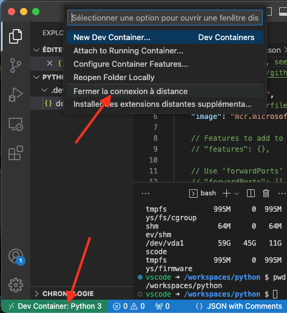
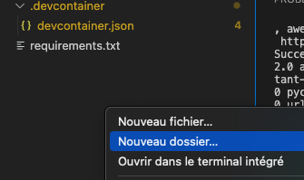
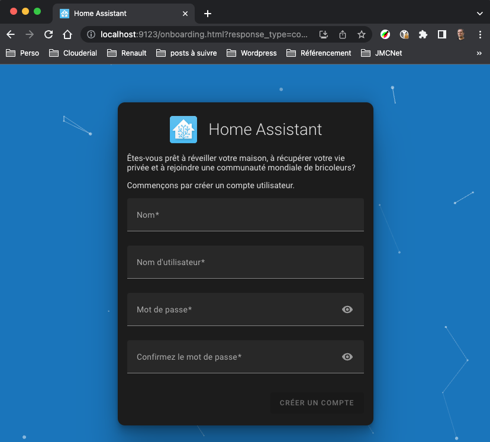

Histoire de bien comprendre ce qui est fait, cet article détaille toutes les étapes de l'installation de votre environnement de développement.

Dans une majorité de cas, il sera plutôt conseillé de cloner un environnement tout prêt. Mais dans le cadre de ce tutoriel, il est plus intéressant de tout faire "à la main" pour retrouver les différents éléments, savoir à quoi ils servent et comment les modifier plus tard.

## Les outils à installer

Les outils nécessaires pour bien démarrer sont les suivants :

1. ***Docker*** : permet la manipulation de conteneurs ("container" en anglais). Un "container" peut être vu comme **un espace isolé à l'intérieur de votre PC** dans lequel vous faites tourner des applications. Dans notre cas, **tout notre environnement de développement va tourner dans un container** qui sera créé automatiquement au démarrage.
   Cela permet de ne pas "pourrir" sa machine avec des installations qui ne servent qu'au développement, de reproduire le même environnement sur une autre machine, d'isoler l'environnement et d'être indépendant de l'OS sur lequel ça tourne.
   Pour installer Docker ça se passe ici : <https://docs.docker.com/desktop/install/mac-install/>
2. ***Visual Studio Code* (VSC)** : VSC est ce qu'on appelle un IDE (Environnement de développement intégré). Avec lui, on va pouvoir taper notre code, le tester, l'exécuter, le débugger, le sauvegarder dans Github, gérer les versions de nos applications (git), ... tout ça sans quitter l'IDE. C'est devenu un des IDE les plus complets grâce à la myriade de plugins disponible. Pour installer VSC c'est ici : https://code.visualstudio.com/download

Ces deux logiciels sont suffisants pour démarrer votre projet.

## Configuration de VSC

### Démarrer dans un répertoire

Crées un répertoire sur ton disque dur qui va contenir tes fichiers sources (`/Projects/home-assistant/hacs-tuto` par exemple) et lances VSC.

Si c'est la première fois que tu le démarres, tu vas avoir une fenêtre qui ressemble à ça :


Cliques sur


puis va chercher le répertoire créé ci-dessus


et valide avec le bouton


> Les copies d'écran sont pour Mac, tu dois adapter à ton OS (Windows, Linux...).

### Installer quelques plugins

Si tu as bien suivi les instructions ci-dessus, tu arrives sur une fenêtre qui ressemble à ça :


Tu peux fermer la fenêtre de bienvenue en cliquant sur la croix.

Ça se présente comme ça :


On va ajouter quelques plugins pour faciliter notre développement. Pour cela, il faut se mettre sur la vue Extensions en cliquant sur l'icône suivant de la barre d'outils tout à gauche.


Ajouter les extensions suivantes :

\=> Nous allons programmer en **Python**, donc il va nous falloir


... et celle-là pour nous aider à organiser nos imports :

\=> Nous allons utiliser des **containers** pour développer donc il nous faut :


* celle-là va nous aider à coder en nous faisant des suggestions :


\=> celle-là pour aider à faire du **yaml** :


\=> et celles-là pour avoir une **interface en français** et quelques **aides sur Git** :


Une fois toutes les extensions installées, vous devriez les voir la liste des extensions installées :


> Voilà, **Visual Studio Code est prêt !** Passons à l'installation et à la préparation du container.

## Démarrage et configuration du container

Comme dit plus haut, nous allons développer dans un **container** grâce au plugin `Dev-container` installé au-dessus.
On va maintenant **basculer dans ce mode et le configurer**.

1. Clique en bas à gauche sur le bouton vert


2. et sélectionne l'option "New Dev Container",

**Note** : le message suivant indique que Docker n'est pas démarré. Il faut qu'il soit lancé **AVANT** de pouvoir basculer dans le container (forcément) :


Sur Mac, `F4`, `Docker - ouvrir`, attendez un peu et vous devriez pouvoir ouvrir la console Docker et voir quelque-chose qui ressemble à ça :


### Basculer dans le container

Refais *"clic sur le bouton vert*" + *"New Dev Container"* au besoin et tu dois arriver sur quelque-chose qui ressemble à ça :


Certes, cela peut faire peur, mais on te demande de **choisir l'image de base** dans lequel va tourner ton environnement de dev.

> **Rappelle-toi**, un container, c'est un **espace isolé** dans ta machine qui fait tourner un OS. Cet OS, il faut le choisir et c'est à cette étape que ça se passe : on va **faire tourner une machine Linux** sur ton Windows ou Mac avec cette méthode.
>
> Le gros avantage c'est que si tu changes de machines (tu passes sur Mac par exemple), l'OS du container sera le même. Donc **ton environnement de dev sera portable** sur toutes les machines, car indépendant de celle-ci.

Donc, à ce stade, l'idée est de prendre une **image de base du container** qui va contenir tout ce qu'on veut : **un OS Linux** et tant qu'à faire **un environnement Python pré-installé** et ce dans la bonne version. Ainsi, on n'aura pas à le faire manuellement. Microsoft nous donne une flopée d'images de base prête à l'emploi.

Nous allons choisir celle que l'on trouve en tapant `python 3` dans le champ de recherche :


Cliques sur la première ligne et choisis `Create Dev Container` :


Patiente un peu que l'image se télécharge, que VSC redémarre, que VSC initialise le container. VSC redémarre, mais cette fois dans le container.

Tu devrais voir quelque-chose comme ça :


En bas à gauche, je vois que je suis dans `Dev Container: Python 3` (ainsi je suis bien en mode **container**) et il m'a créé quelques fichiers de configuration de `Dev-Containe`r pour mémoriser mes choix.

Ouvre le répertoire `.devcontainer` et tu dois voir cela :


On peut voir l'image qui a été utilisé pour notre container : `mcr.microsoft.com/vscode/devcontainers/python:0-3.11`

On ira plus tard ajouter des options dans le fichier `devcontainer.json`.

### Une dernière chose

Ouvrez le terminal (`Command +` sur Mac) et explore un peu la machine sur laquelle tu es avec les quelques commandes de base (`pwd`, `ls`, `df -h`) :


Tu devrais constater qu'apparemment, tu n'es plus sur ton PC (ou Mac). Les répertoires ne sont plus les mêmes, tu ne vois plus tes fichiers, mais que ceux qui sont dans Visual Studio Code (VSC)...

C'est clair, tu n'es plus tout à fait sur ton PC, mais **dans un container**.

### Quitter le container et revenir en local

Pour quitter le container, il faut cliquer sur le bouton vert en bas à gauche et choisir l'option `Fermer la connexion à distance` :



>  Après un redémarrage de VSC, tu vas revenir comme avant, en mode "dit" **local** (donc pas dans le container qui est dit mode **distant** ; même si il tourne sur ton PC en local). Ca peut être perturbant au début.

 D'autres options sont possibles à partir de menu, on en verra quelques-unes plus tard.

## Résumé à ce stade

> A ce stade, on a :
>
> * **installé** les outils nécessaires **Docker et Visual Studio Code**,
> * **configuré Visual Studio Code**,
> * **créé et démarré** notre **container de dev**.
>
> Il va nous falloir **installer Home Assistant** dans ce container et le démarrer pour pouvoir commencer à développer.
>
> **Tant tout n'est pas correctement installé, ce n'est pas la peine d'aller plus loin. N'hésites pas à supprimer ton répertoire et recommencer si tout n'est pas nickel.**

## Installer Home Assistant

Bon là, ça devient sérieux, on va **installer un Home Assistant de développement ce qui va permettre de faire tourner notre code**.

Pour installer Home Assistant de dev, les étapes sont les suivantes :

1. ajouter quelques options pour devcontainer dans le fichier `devcontainer.json` créé ci-dessus,
2. installer le package Python qui contient HA,
3. configurer HA et le démarrer.

> Encore une fois, pour le tuto, toutes les étapes sont détaillées. Dans la "vraie vie", on démarre rarement de zéro. On préfère "forker" un repo Github existant de repartir de là. C'est bien plus rapide mais on hérite d'un environnement prêt à l'emploie, même si on ne le comprend pas forcément.

### Ajout d'options dans Dev-Container

#### Extensions

On va ajouter les extensions vscode suivantes :

* `ms-python.python` : on va faire du Python,
* `ms-python.vscode-pylance` : une extension très riche sur Python qui simplifie le développement.
* `github.vscode-pull-request-github` :  si on veut faire des "pull request" dans Github (pas nécessaire pour le tuto, mais ça évitera d'y revenir ensuite),
* `ryanluker.vscode-coverage-gutters` : pour mesurer ce qu'on appelle la couverture du code "code coverage" par les tests. On cherche à trouver les parties de notre code qui ne sont pas testées afin d'améliorer nos tests et d'être sûr qu'on n'en a pas oublié. On s'en servira dans le chapitre sur les tests,

Pour ajouter ces extensions, on ajoute simplement le bloc suivant dans le fichier `devcontainer.json` sous `customisations/vscode`:

```"extensions":
    "ms-python.python",
    "github.vscode-pull-request-github",
    "ryanluker.vscode-coverage-gutters",
    "ms-python.vscode-pylance"
]
```

#### Options

Les options suivantes permettent de personnaliser l'environnement Dev Containers. Bien que pas indispensable, ils ont fortement recommandé pour le développement sous HA afin d'uniformiser tous les développements.

* `file.eol` : on utilise la forme Linux des sauts de ligne \n,
* `editor.tabSize` : taille d'une tabulation,
* `terminal..`. : le shell à utiliser dans le terminal. À adapter selon vos préférences au besoin,
* `python.pythonPath` : le chemin de l'exécutable Python,
* `python.linting.pylintEnabled` : on autorise l'analyseur de code 'lint',
* `python.linting.enabled` : on autorise le lint (analyse syntaxique du code),
* `python.formatting.provider` : le code est formaté en utilisant ce formateur,
* `editor.formatOnPaste` : est-ce qu'on formate le code lors d'un copy/paste,
* `editor.formatOnSave` : est-ce qu'on formate avant sauvegarde,
* `editor.formatOnType` : est-ce qu'on formate lors de la frappe du texte,
* `files.trimTrailingWhitespace` : est-ce qu'on supprime les blancs en trop.

La plupart des **options sont nécessaires pour pouvoir prétendre pousser du code à l'équipe Core Home Assistant** qui ne le regardera même pas si le code n'est pas propre. Donc le mieux, c'est de les utiliser tout de suite et de s'y habituer. A l'usage, les valeurs par défaut proposées sont agréables et utiles.

Pour les ajouter, il faut ajouter le bloc suivant dans le fichier `devcontainer.json` sous `customizations/vscode`:

```json
"settings": {
    "files.eol": "\n",
    "editor.tabSize": 4,
    "terminal.integrated.profiles.linux": {
        "Bash Profile": {
            "path": "bash",
            "args": []
        }
    },
    "terminal.integrated.defaultProfile.linux": "Bash Profile",
    "python.pythonPath": "/usr/bin/python3",
    "python.analysis.autoSearchPaths": true,
    "python.linting.pylintEnabled": true,
    "python.linting.enabled": true,
    "python.formatting.provider": "black",
    "editor.formatOnPaste": false,
    "editor.formatOnSave": true,
    "editor.formatOnType": true,
    "files.trimTrailingWhitespace": true
}
```

Profitez-en pour donner un nom à votre container dans le champ `name`.

#### Exposer le port de Home Assistant

La version Home assistant de dev utilise le même port que la version usuelle : 8123. On va devoir se connecter dessus pour tester notre intégration. Pour éviter la confusion avec votre éventuel "vrai" HA, j'utilise le port 9123.

Ainsi, on va indiquer à Dev Container d'exposer le port 9123 et de le router sur le port 8123 du container.

Cela se fait en ajoutant la ligne suivante dans le fichier `devcontainer.json` :

```
"appPort": [
    "9123:8123"
]
```

#### Le fichier devcontainer.json complet

À ce stade, tu devrais avoir un fichier `devcontainer.json` qui ressemble à ça (sans les commentaires) :

```json
{
	"name": "Tuto dev hacs",
	"image": "mcr.microsoft.com/devcontainers/python:0-3.11",

	"appPort": [
		"9123:8123"
	],

	"customizations": {
		"vscode": {
			"extensions": [
				"ms-python.python",
				"github.vscode-pull-request-github",
				"ryanluker.vscode-coverage-gutters",
				"ms-python.vscode-pylance"
			],
			"settings": {
				"files.eol": "\n",
				"editor.tabSize": 4,
				"terminal.integrated.profiles.linux": {
					"Bash Profile": {
						"path": "bash",
						"args": []
					}
				},
				"terminal.integrated.defaultProfile.linux": "Bash Profile",
				"python.pythonPath": "/usr/bin/python3",
				"python.analysis.autoSearchPaths": true,
				"python.linting.pylintEnabled": true,
				"python.linting.enabled": true,
				"python.formatting.provider": "black",
				"editor.formatOnPaste": false,
				"editor.formatOnSave": true,
				"editor.formatOnType": true,
				"files.trimTrailingWhitespace": true
			}
		}
	}
}
```

Lorsque tu sauvegardes le fichier (`Command + S` sur Mac), Dev Container propose de "rebuilder" le container avec le message suivant :


Appuies sur `Rebuild`et VSC va redémarrer avec un container mis à jour avec ces options.
À chaque réouverture ou installation sur un nouveau PC de container, ces options seront rechargées.

> En cas de soucis, si le container ne démarre pas ou si des erreurs apparaissent, tu peux afficher la console Dev Container pour voir ce qui ne va pas :


> Si ca arrive, corriges l'erreur dans le fichier `devcontainer.json` et redémarre.

### Installer le package Home Assistant

Le package Home Assistant s'installe comme tous les packages Python avec un fichier `requirements.txt` qui contient tous les packages à installer. Ce fichier doit être **créé à la racine de votre répertoire** et doit contenir la ligne suivante :

```
homeassistant
```

Il est installé via le terminal avec la commande suivante :

```
$ pip install -r requirements.txt
```

> **Note** - tu dois être dans le container pour taper cette commande. Sinon tu vas installer Home Assistant en local ce qui n'est pas ce qu'on veut faire.

Si tu ne l'as pas déjà fait, tu dois ouvrir un terminal en cliquant ici :


> **Note** - en choisissant `Bash profile (default)` (selon la config de terminal que tu as mis dans le fichier `devcontainer.json`)
> comme on ne précise pas la version de Home Assistant qu'on installe, il va prendre la dernière disponible.

Le déroulement de la commande `pip install`est globalement le suivant :

```bash
vscode ➜ /workspaces/python $ pip install -r requirements.txt 
Defaulting to user installation because normal site-packages is not writeable
Collecting homeassistant
  Downloading homeassistant-2023.4.1-py3-none-any.whl (23.1 MB)
     ━━━━━━━━━━━━━━━━━━━━━━━━━━━━━━━━━━━━━━━━ 23.1/23.1 MB 10.8 MB/s eta 0:00:00
Collecting aiohttp==3.8.4
...

Building wheels for collected packages: ...
...

Successfully installed ...
```

Les messages de type "notice" indiquant qu'une nouvelle version de pip est disponible peuvent être ignorés sans danger. De temps en temps, fais la mise à jour comme indiqué.

> Voilà **Home Assistant est installé**, on va pouvoir le configurer et le démarrer.

### Démarrer Home Assistant

Une fois la package installé, les commandes suivantes permettent de terminer l'installation et la configuration de Home Assistant.

Ces commandes sont à taper dans le terminal du container toujours :

```bash
## Donne la version couramment installée
$ hass --version 
2023.4.1

## Démarre Home Assistant pour finir l'installation avec le répertoire config comme répertoire contenant toute la configuration
$ hass -c ./config
Unable to find configuration. Creating default one in /workspaces/python/config         <--- uniquement la première fois
2023-04-08 15:03:12.246 WARNING (MainThread) [homeassistant.bootstrap] Waiting on integrations to complete setup: default_config
...
...
```

> **Note** - le message, `Fatal Error: Specified configuration directory /workspaces/python/config does not exist` indique que le répertoire `config` n'existe pas. Il faut le créer à la racine du projet avec clic droit dans le navigateur de fichiers comme indiqué ci-dessous.



 "Nouveau dossier", puis donnes lui le nom `config`.

> **Notes** 
>
> * La commande `hass -c ./config`ne rend pas la main. C'est normal, Home Assistant tourne dans ce processus.
> * Arrêter le processus (ctrl+c) stoppe Home Assistant.

Pour vérifier que Home Assistant tourne bien, connecte-toi avec un navigateur l'adresse suivante : `http://localhost:9123` et la page d'accueil de Home Assistant doit s'afficher :



Saisis alors un premier compte et attend la fin de l'installation.

**Conseil** : normalement les réseaux sont séparés et cette instance Home Assistant de dev ne devrait pas trouver tes équipements. S'il les trouve (ça peut dépendre de ta configuration réseau), ne les ajoute pas. Ça pourrait les perturber.

> **En cas de pépin :**
>
> * si le navigateur ne trouve rien sur http://localhost:9123, vérifie les choses suivantes :
> * dans l'onglet Port à coté de Terminal, tu dois voir ton port 9123 ouvert


> * si ce n'est pas le cas, soit le port n'est pas le bon et vérifie ta config dans le fichier `devcontainer.json`, soit Home Assistant est arrêté et vérifie dans le terminal où il a été lancé si il est toujours actif.

Quand tout se passe bien, on arrive sur le dashboard par défaut suivant :


Si tel n'est pas le cas, n'hésites pas à revoir les étapes précédentes et à demander de l'aide dans le forum (un sujet est disponible pour ça).

On peut voir aussi que le répertoire `config` a été initialisé avec du contenu bien connu : le fichier `configuration.yaml`, le `home-assistant.log`, ...

### Stopper Home Assistant

Pour stopper Home Assistant, comme il a été démarré en mode Terminal, il faut aller dans le Terminal en question et taper Ctrl+C.

On va apprendre juste en dessous, une méthode un peu plus pratique.

### Configurer l'installation automatique au démarrage

A chaque démarrage de VSC, le container est reconstruit. Donc toutes les installations qu'on a pu faire à la main `pip install ...` sont perdues. Pour éviter cela, on va ajouter la commande d'installation dans notre `devcontainer.json` :

`"postCreateCommand": "pip install -r requirements.txt"`

Un arrêt / relance complet de VSC te permettra de vérifier que l'installation de Home Assistant résiste maintenant à un arrêt/relance.

### Ajouter des tâches Dev-Container

Arrêter et démarrer Home Assistant en mode ligne de commande dans le Terminal n'est pas très pratique. On va maintenant configurer des tâches Dev-Containers pour faire ça.


Cela se passe en ouvrant le menu des taches `"Command+Shitf+P"` (Mac). Ça ouvre un menu qui ressemble à ça :


Choisis "Exécuter la tâche", puis "Configurer une tâche", puis "Créer le fichier tasks.json à partir d'un modèle", puis


Ça vous ouvre un fichier `tasks.json` dans le répertoire `.vscode` à la racine de ton projet. Mets les lignes suivantes :

```json
{
    "version": "2.0.0",
    "tasks": [
        {
            "label": "Run Home Assistant on port 9123",
            "type": "shell",
            "command": "hass -c ./config",
            "problemMatcher": []
        },
        {
            "label": "Restart Home Assistant on port 9123",
            "type": "shell",
            "command": "pkill hass ; hass -c ./config",
            "problemMatcher": []
        }
    ]
}
```

Sauvegardes le fichier, et tu as maintenant accès à ces tâches dans le menu tâches accessibles via `Command+Shift+P` (Mac). Vérifies que ça marche, en tapant "Command+Shift+P", puis "Tâches: Exécuter une tâche".

Tu dois voir les 2 tâches que l'on a créées juste au-dessus :


Teste les 2 options pour vérifier qu'elles fonctionnent comme prévu.

Une fois lancé en mode tâche, tu as accès à la tâche directement dans VSC en bas à droite avec possibilité d'arrêter directement en cliquant sur la poubelle. :


## Conclusion

En synthèse, à travers cet article, tu as appris à **installer un environnement de développement complet**, à **le configurer** et **à démarrer Home Assistant** dans cet environnement.

On en a profité pour faire un tour rapide des **fonctionnalités de Visual Studio Code** et du **plugin Dev-Containers** qui est au cœur du développement pour Home Assistant.

Comme sur un environnement classique Home Assistant, tu peux modifier le fichier `configuration.yaml`, installer des `intégrations`, ou des intégrations custom dans `config/custom-components`.

C'est ce que l'on fera dans le prochain article : **Créer une intégration et une entité simple**.