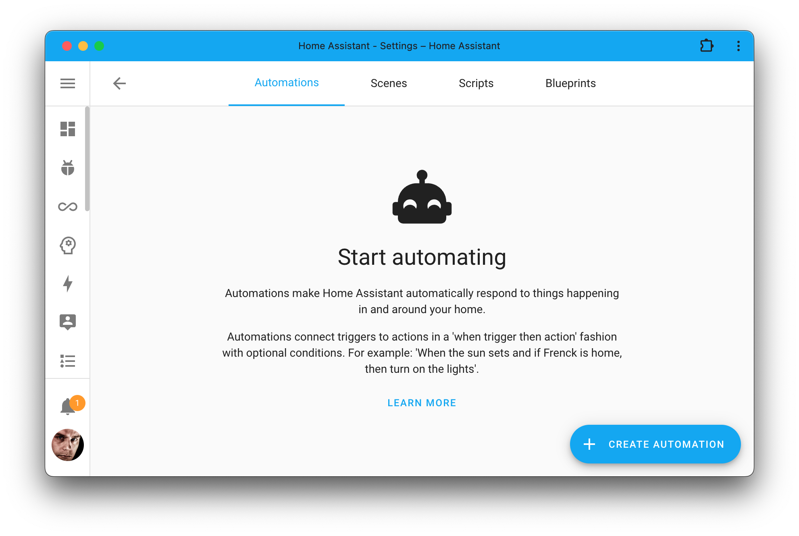
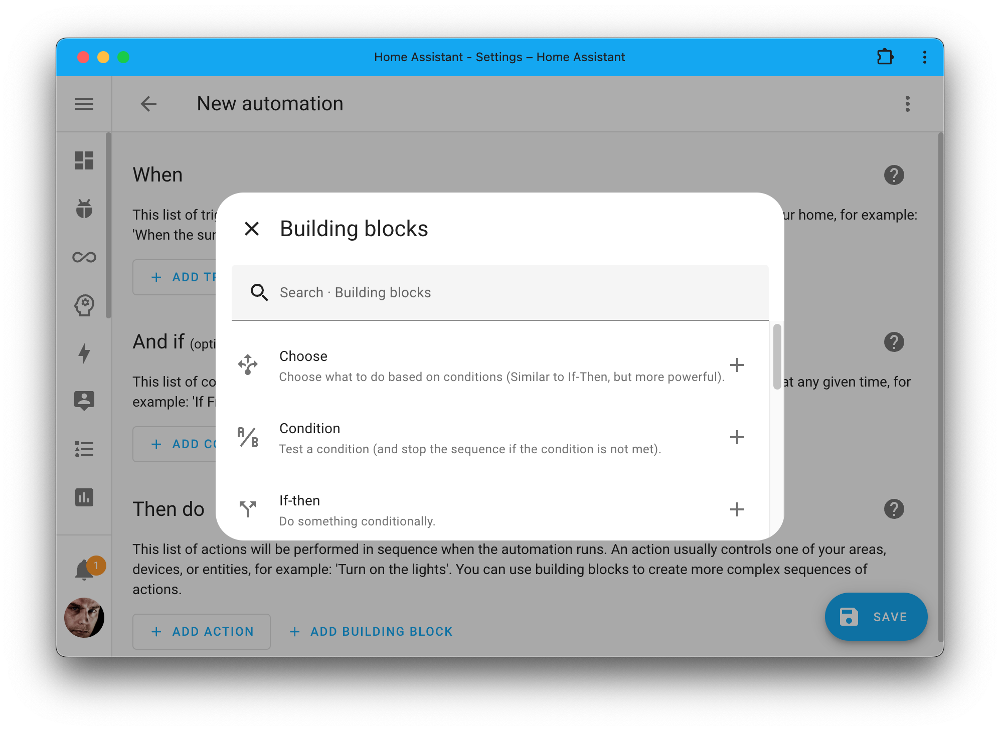
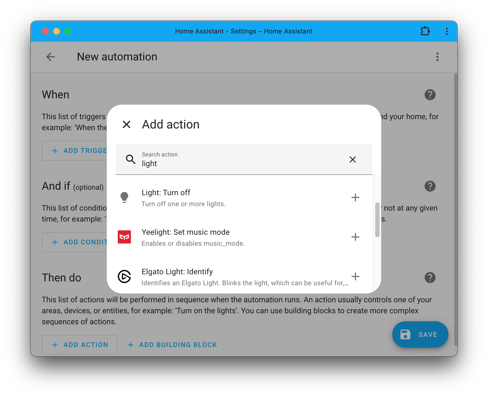
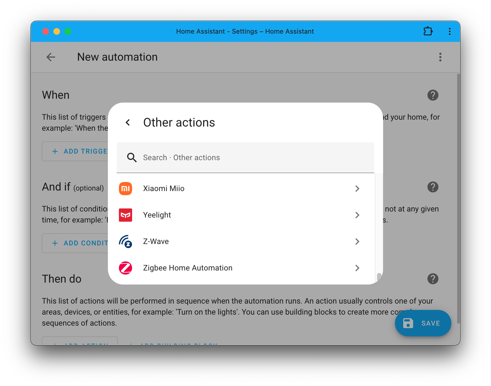
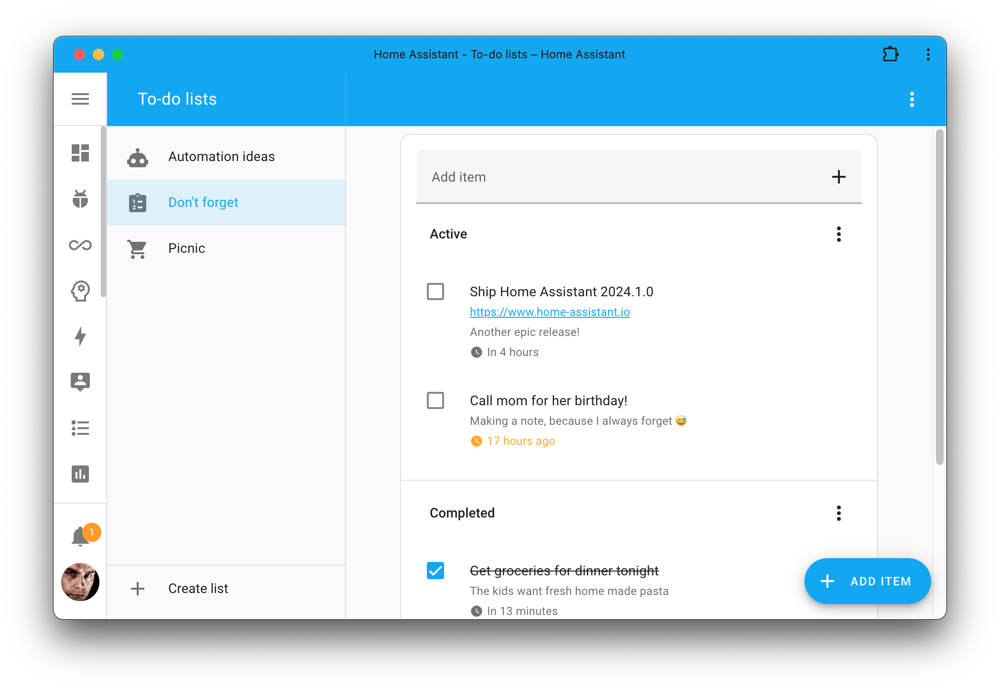
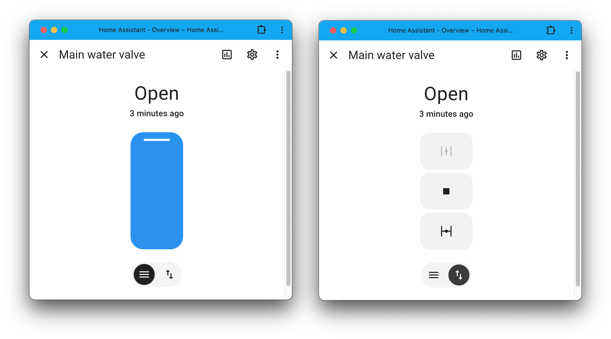
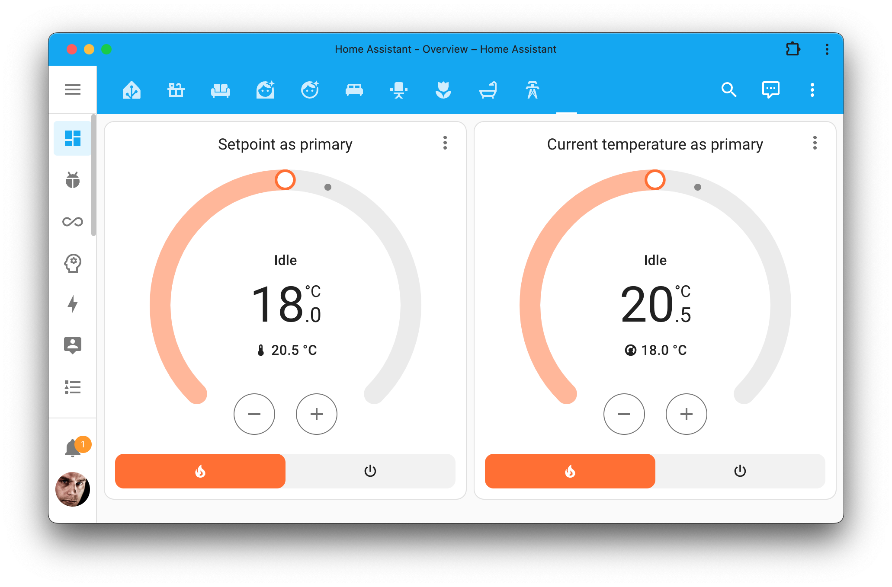
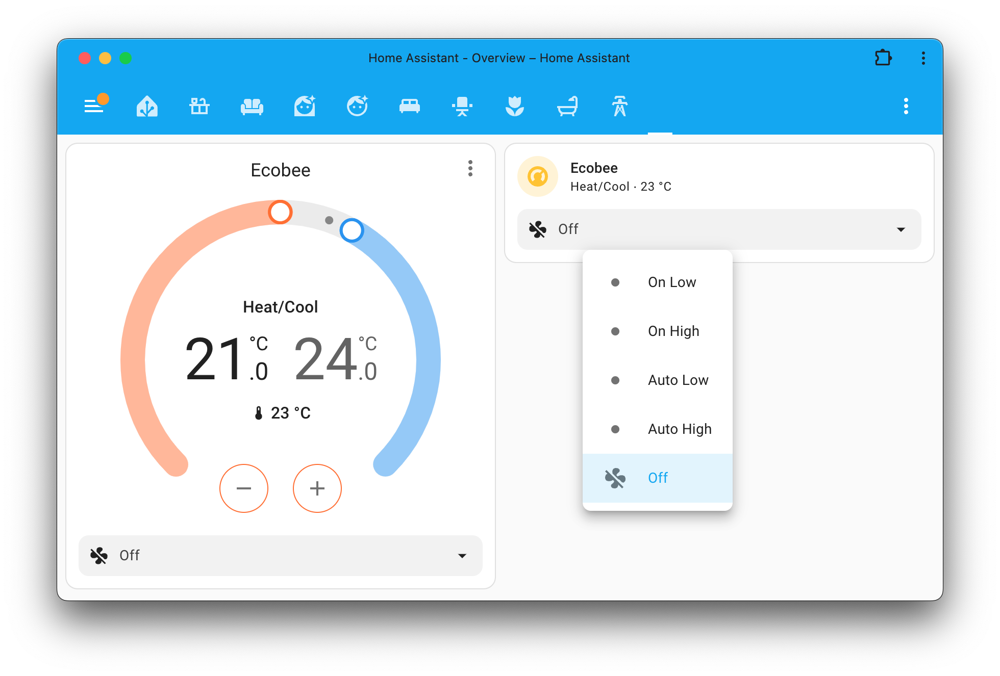
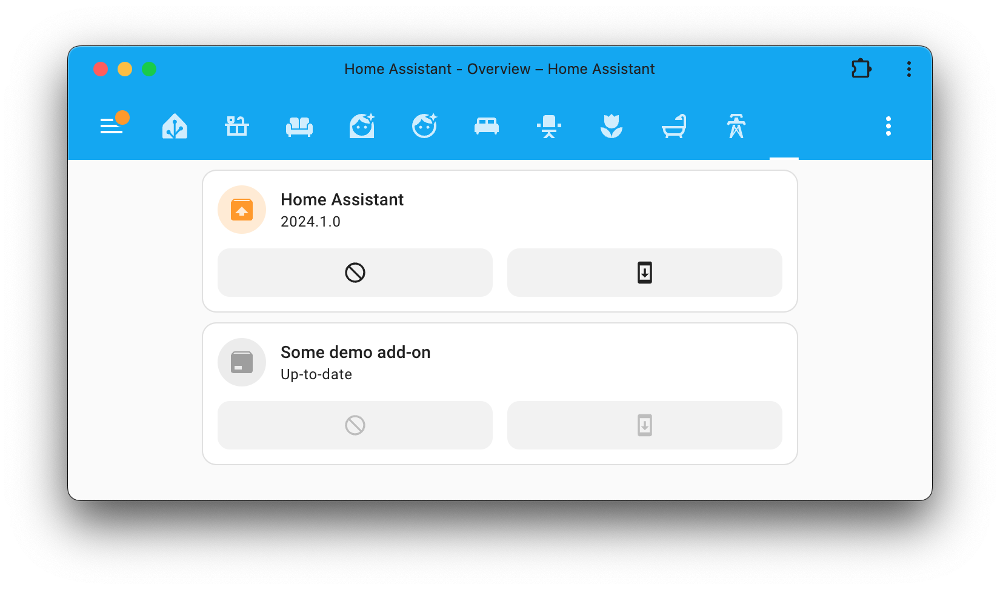

> Cet article est une traduction de [2024.1: Happy automating!](https://www.home-assistant.io/blog/2024/01/03/release-20241/) publié sur le site de Home Assistant.

_Bonne année ! 🍾_

_Nous vous souhaitons, ainsi qu'à tous les proches qui vous entourent, le meilleur pour 2024 ! 🥂_

_Je ne peux pas imaginer une meilleure façon de commencer la nouvelle année : Home Assistant Core 2024.1 ! 🎉_

_Cette version est assez petite, comme attendu ; nous sortons tout juste de la période des fêtes de fin d'année. Cependant, elle contient quelques améliorations et fonctionnalités agréables pour être enthousiasmé et un total stupéfiant de 13 nouvelles intégrations !_

_Mon préféré : les changements de l'éditeur d'automatisation. Il y a eu pas mal d'améliorations de l'interface utilisateur. La plupart d'entre elles visent à rendre l'interface plus conviviale et plus facile à utiliser pour les nouveaux utilisateurs et les utilisateurs de longue date, en rendant plus rapide la recherche du bon déclencheur, de la bonne condition ou de la bonne action._

_J'aime beaucoup cette expérience améliorée, et j'espère que vous l'apprécierez aussi !_

_Bonne lecture !_

_../Frenck_

## Améliorations de l'éditeur d'automatisation

L'éditeur d'automatisation a reçu un peu d'amour pour cette version, avec de nombreuses petites améliorations pour le rendre plus facile pour les nouveaux utilisateurs et les utilisateurs de longue date.

Comme il y a beaucoup de petites améliorations, nous allons les passer en revue individuellement.

PS : Une petite note : tous les changements sont des changements d'interface utilisateur, ce qui signifie que ces changements n'affectent pas la configuration sous-jacente de l'automatisation. Tous vos automatismes existants continueront à fonctionner comme avant.

## Amélioration du tableau de bord des automatismes vide

Si vous démarrez avec Home Assistant, la visite du tableau de bord des automatismes aboutissait à une page vide. Ce n'est pas très utile si vous le voyez pour la première fois. Nous avons donc amélioré cela !

Vous êtes maintenant accueilli par le petit robot d'automatisation qui explique ce qu'est une automatisation et les références à la documentation qui peut vous aider à démarrer.

 Nouveau tableau de bord des automatisations vide, avec un explicatif

Une amélioration petite mais efficace pour aider les nouveaux utilisateurs à démarrer. Nous avons également appliqué cette même amélioration aux tableaux de bord des scripts et des scènes.

## Conseils pour la création d'une nouvelle automatisation

Lorsque vous démarrez un nouvel automatisme à partir de zéro, vous avez l'habitude d'être accueilli par une terminologie peut-être nouvelle et presque une page blanche avec quelques boutons pour ajouter des déclencheurs, des conditions ou des actions. En tant que nouvel utilisateur, cela impose immédiatement un défi : que dois-je faire ?

Vous l'avez deviné : Nous avons légèrement amélioré la situation. Nous avons modifié les grands en-têtes pour qu'ils soient plus descriptifs et moins techniques. Nous avons également ajouté un texte d'aide pour expliquer chaque section, y compris des exemples d'utilisation.

 Nouvelles descriptions de chaque section dans une automatisation

Ne vous inquiétez pas, nous masquerons l'explication une fois que vous aurez ajouté des éléments aux sections, afin que la vue d'ensemble des automatismes existants reste aussi claire que possible.

## Blocs de construction

Vous avez peut-être remarqué dans les captures d'écran ci-dessus que les conditions et les actions sont accompagnées d'un nouveau bouton : + Ajouter un bloc de construction.

La sélection de ces nouveaux boutons vous permet d'ajouter des éléments logiques à votre automatisation ou à vos scripts, comme Et, Ou, Si-alors, Choisir, etc.

Ces éléments étaient auparavant mélangés avec les conditions et les actions, mais ils ont maintenant leur propre bouton dédié. Cela permet de les trouver plus facilement et d'alléger la liste des conditions et des actions.

Vous remarquez qu'une boîte de dialogue s'ouvre maintenant ? Une boîte de dialogue nous donne plus d'espace pour décrire ce que chaque bloc de construction fait et de la place pour une boîte de recherche pour trouver celui dont vous avez besoin.

## Boutons de déclenchement, de condition et d'action améliorés

Le changement le plus important se trouve dans les boutons permettant d'ajouter un déclencheur, des conditions ou des actions à votre automatisation. Ce changement ne s'adresse pas seulement aux nouveaux utilisateurs, mais aussi aux utilisateurs de longue date.

Tous ces boutons sont utilisés pour donner une liste déroulante qui vous permet de sélectionner le type de déclencheur, de condition ou d'action que vous souhaitez ajouter. Cette liste déroulante a été remplacée par une nouvelle boîte de dialogue similaire à celle que nous venons de voir pour les blocs de construction.

Comme pour les blocs de construction, elle décrit le rôle de chaque déclencheur, condition ou action. Ces descriptions sont importantes, car elles vous aident à comprendre ce qu'ils font.

Si vous ajoutez un élément, nous vous montrerons d'abord les déclencheurs/conditions/actions les plus utilisés par notre communauté. Tous les autres sont maintenant regroupés de manière claire. Pour les actions, nous sommes allés plus loin en les unifiant avec les appels de service.

## Actions unifiées

Si vous utilisez Home Assistant depuis un certain temps, vous êtes probablement familier avec l'action "appel de service" que vous pouvez ajouter à votre automatisation. Mais, honnêtement, qu'est-ce qu'un "appel de service" ? Il s'agit d'un terme un peu technique qui est particulièrement déroutant pour les nouveaux utilisateurs. Vous voulez juste allumer une lumière, n'est-ce pas ?

Cette version unifie ces "appels de service" avec toutes les autres actions, ce qui signifie qu'il n'y a plus d'"appel de service" ; cette couche a été supprimée de l'interface utilisateur. Au lieu de cela, vous ajoutez une action et sélectionnez l'action que vous voulez entreprendre, par exemple, allumer une lumière.

Cela signifie que si vous ajoutez une action, vous verrez toutes les actions (y compris tous les appels de service), classées par catégorie, avec une description et pouvant faire l'objet d'une recherche ! Le fait de pouvoir effectuer une recherche parmi toutes les actions disponibles constitue une amélioration considérable.

Par défaut, comme pour les déclencheurs et les conditions, nous vous montrons d'abord les actions les plus utilisées et les actions pour les entités que vous avez sur votre système. Toutes les autres actions sont regroupées par intégration dans la section Autres actions.

## Prise en charge de la description et de la date d'échéance pour les éléments de la liste de tâches

L'intégration de la liste des tâches ne cesse de s'améliorer. Cette version ajoute la prise en charge des descriptions et des dates d'échéance !

Si l'intégration que vous utilisez le permet, vous pouvez désormais ajouter des descriptions à chaque tâche de votre liste. Le balisage Markdown est entièrement pris en charge pour ajouter des liens, du texte en gras, etc. Si les dates d'échéance (ou date d'échéance + heure) sont prises en charge, vous pouvez les définir.

Comme le montre la capture d'écran ci-dessus, il existe une toute nouvelle boîte de dialogue pour ajuster votre tâche. Mais ce n'est pas le seul changement. La liste elle-même a été améliorée.

Le tableau de bord est beaucoup plus propre, les grandes zones de texte ont disparu et chaque élément est joliment formaté, avec un extrait de la description et la date d'échéance. Si la date d'échéance est dépassée, elle est mise en évidence.

## Nouveau type d'entité : Valve

Un tout nouveau type d'entité a été ajouté à Home Assistant : Valve !

Les intégrations peuvent utiliser ce type d'entité pour exposer des vannes, telles qu'une vanne sur un radiateur, une piscine, un système d'arrosage, une conduite principale de gaz ou d'eau.

Actuellement, l'[intégration de Shelly](https://www.home-assistant.io/integrations/shelly) la prend en charge et fournit une entité de vanne `valve` pour l'addon Valve pour Shelly Gas. En outre, la prise en charge a été ajoutée à [MQTT](https://www.home-assistant.io/blog/2024/01/03/release-20241/integrations/valve.mqtt), et les entités de vanne fonctionnent également avec Amazon Alexa et Google Assistant.

Astuce : Vous avez une entité interrupteur qui contrôle une vanne ? Vous pouvez désormais changer le type d'entité en vanne dans les paramètres de l'entité.

## Échanger la cible / la température actuelle sur les cartes de thermostat et d'humidificateur

À la demande de nombreux utilisateurs, les cartes de thermostat et d'humidificateur permettent désormais de définir la température et l'humidité actuelles comme informations principales à afficher sur la carte.

Vous pouvez activer l'option "Afficher la température actuelle comme information principale" dans la carte, ce qui aura pour effet de remplacer la température cible par la température actuelle dans la carte.

 Les 2 dispositions possibles pour les températures cibles / de la pièce

## Nouvelles caractéristiques des cartes

L'année dernière, nous avons vu de nombreuses nouvelles fonctionnalités ajoutées aux cartes, alors commençons la nouvelle année avec d'autres !

[@Quentame](https://github.com/Quentame) a ajouté à la carte le mode ventilateur climatique. Cette fonctionnalité peut être utilisée à la fois avec la carte thermostat et la carte tuile :

Autre nouveauté, la carte des actions de mise à jour. Cet ajout de [@piitaya](https://github.com/piitaya) vous permet d'ajouter des boutons à une carte pour déclencher des actions de mise à jour lorsqu'ils sont pressés

## Autres changements notables

Il y a beaucoup plus d’améliorations dans cette version ; voici quelques-uns des autres changements notables dans cette version :

- Deux nouvelles [fonctions de template](https://www.home-assistant.io/docs/configuration/templating/#numeric-functions-and-filters) ont été ajoutées dans cette version : `median` (NDT : médiane) et `statistical_mode` (NDT : mode statistique). Merci, [@TheFes](https://github.com/TheFes) !
- 

[@bieniu](https://github.com/bieniu) a ajouté la prise en charge des tout nouveaux appareils Shelly de 3ème génération à l'intégration [Shelly](https://www.home-assistant.io/integrations/shelly). Bien joué !

- Un bug de longue date concernant l'arrêt a été corrigé : vous pouvez maintenant exécuter des automatisations déclenchées lorsque Home Assistant s'éteint. Cela pourrait, par exemple, être utilisé pour vous envoyer une notification lorsque cela se produit. Merci, [@tetele](https://github.com/tetele) !
- Vous avez créé votre propre contrôleur de ventilateur avec [ESPHome](https://www.home-assistant.io/integrations/esphome) ? Vous pouvez désormais y ajouter des modes prédéfinis ! Merci, [@mill1000](https://github.com/mill1000) !
- L'intégration [ping](https://www.home-assistant.io/integrations/ping) offre désormais la possibilité de configurer le nombre de secondes qui doivent s'écouler avant de considérer qu'un appareil déconnecté n'est pas à la maison. Génial, [@jpbede](https://github.com/jpbede) !
- Vous cherchez l'intégration ZAMG ? Elle a été renommée en [GeoSphere Austria](https://www.home-assistant.io/integrations/zamg). Merci, [@killer0071234](https://github.com/killer0071234) !
- Vous avez un de ces amplis Sonos ? [@jjlawren](https://github.com/jjlawren) a ajouté la prise en charge du réglage du crossover du subwoofer à l'intégration [Sonos](https://www.home-assistant.io/integrations/sonos). Bien joué !
- 

[@tkdrob](https://github.com/tkdrob) a ajouté la prise en charge de la nouvelle entité calendrier à l'intégration [Radarr](https://www.home-assistant.io/integrations/radarr). Ainsi, vous pouvez voir les calendriers de publication directement à partir de Home Assistant. Génial !

- Vous pouvez maintenant configurer le nombre minimal d'échantillons que l'assistant de [tendance](https://www.home-assistant.io/integrations/trend) utilise. Cela vous permet de le rendre moins sensible lorsqu'il n'y a pas beaucoup de données. Merci, [@jpbede](https://github.com/jpbede) !
- Vous avez froid aux orteils dans votre lit ? [@kbickar](https://github.com/kbickar) à la rescousse ! Il a ajouté la prise en charge des chauffe-pieds à l'intégration de [SleepIQ](https://www.home-assistant.io/integrations/sleepiq). C'est très bien !

## Nouvelles intégrations

Nous accueillons les nouvelles intégrations suivantes dans cette version :

[A. O. Smith](https://www.home-assistant.io/integrations/aosmith), ajouté par [@bdr99](https://github.com/bdr99). Intégrez et contrôlez votre chauffe-eau A. O. Smith.

[Blue Current](https://www.home-assistant.io/integrations/blue_current), ajouté par [@Floris272](https://www.home-assistant.io/integrations/blue_current). Contrôlez les points de charge de votre chargeur Blue Current EV.

[DROP](https://www.home-assistant.io/integrations/drop_connect), ajouté par [@pfrazer](https://www.home-assistant.io/integrations/drop_connect). Gérez votre système d'eau intelligent DROP avec Home Assistant.

[Flexit Nordic (BACnet)](https://www.home-assistant.io/integrations/flexit_bacnet), ajouté par [@lellky](https://www.home-assistant.io/integrations/flexit_bacnet). Contrôlez et surveillez vos centrales de traitement d'air de la série Flexit Nordic.

[Vacances,](https://www.home-assistant.io/integrations/holiday) ajouté par [@jrieger](https://www.home-assistant.io/integrations/holiday). Ajouter les calendriers de jours férié (NDT: pas les vacances scolaire) à Home Assistant pour alimenter les automatismes.

[Midea CCM15 AC Controller](https://www.home-assistant.io/integrations/ccm15), ajouté par [@ocalvo](https://github.com/ocalvo). Utilisez votre CA connecté à un contrôleur CA Midea CCM15.

[OSO Energy](https://github.com/ocalvo), ajouté par [@osohotwateriot](https://github.com/osohotwateriot). Utilisez votre chauffe-eau OSO Energy avec Home Assistant.

[Sun WEG](https://github.com/osohotwateriot), ajouté par [@rokam](https://github.com/rokam). Collectez et surveillez les données de production d'énergie de votre onduleur Sun WEG.

[Tailwind](https://www.home-assistant.io/integrations/tailwind), ajouté par [@frenck](https://www.home-assistant.io/integrations/tailwind). Commandez vos ouvre-portes de garage connectés à un contrôleur de porte de garage intelligent Tailwind.

[Tessie](https://www.home-assistant.io/integrations/tailwind), ajouté par [@Bre77](https://www.home-assistant.io/integrations/tailwind). Intégrez, surveillez et contrôlez votre véhicule Tesla connecté à la plateforme Tessie.

[Refoss](https://www.home-assistant.io/integrations/tailwind), ajouté par [@ashionky](https://www.home-assistant.io/integrations/tailwind). Utilisez vos appareils intelligents Refoss directement avec Home Assistant.

[Valve](https://www.home-assistant.io/integrations/valve), ajouté par [@cibernox](https://github.com/cibernox). Un type d'entité pour les vannes, qui peut être utilisé par les intégrations pour exposer les vannes.

[MotionMount de Vogel](https://www.home-assistant.io/integrations/motionmount), ajouté par [@RJPoelstra](https://github.com/RJPoelstra). Contrôlez la position de votre support TV Vogel's MotionMount.

Cette version comporte également une nouvelle intégration virtuelle. Les intégrations virtuelles sont des éléments qui sont gérés par d'autres intégrations (existantes) afin de faciliter la recherche. Les intégrations virtuelles suivantes ont été ajoutées :

[AEP Ohio](https://www.home-assistant.io/integrations/aep_ohio), fourni par [Opower](https://www.home-assistant.io/integrations/opower)

[AEP Texas](https://www.home-assistant.io/integrations/aep_texas), fournie par [Opower](https://www.home-assistant.io/integrations/opower)

[Appalachian Power](https://www.home-assistant.io/integrations/appalachianpower), fourni par [Opower](https://www.home-assistant.io/integrations/opower)

[Fujitsu anywAIR](https://www.home-assistant.io/integrations/appalachianpower), fourni par [Advantage Air](https://www.home-assistant.io/integrations/advantage_air)

[Indiana Michigan Power](https://www.home-assistant.io/integrations/appalachianpower), fourni par [Opower](https://www.home-assistant.io/integrations/opower)

[Kentucky Power](https://www.home-assistant.io/integrations/advantage_air), fourni par [Opower](https://www.home-assistant.io/integrations/opower)

[Public Service Company of Oklahoma (PSO)](https://www.home-assistant.io/integrations/psoklahoma), fourni par [Opower](https://www.home-assistant.io/integrations/opower)

[Seattle City Light](https://www.home-assistant.io/integrations/scl), fourni par [Opower](https://www.home-assistant.io/integrations/opower)

[Southwestern Electric Power Company (SWEPCO)](https://www.home-assistant.io/integrations/swepco), fourni par [Opower](https://www.home-assistant.io/integrations/opower)

## Intégrations désormais disponibles à partir de l’interface utilisateur (UI)

Les intégrations suivantes sont désormais disponibles via l’interface utilisateur de Home Assistant :

[Netgear LTE](https://github.com/joostlek), réalisé par [@tkdrob](https://github.com/joostlek)

[StreamLabs](https://github.com/joostlek), réalisé par [@joostlek](https://github.com/joostlek)

[Suez Water](https://github.com/joostlek), réalisé par [@joostlek](https://github.com/joostlek)

[Transports publics suisses](https://github.com/joostlek), réalisé par [@miaucl](https://github.com/joostlek)

[System Monitor](https://www.home-assistant.io/integrations/systemmonitor), réalisé par [@gjohansson-ST](https://www.home-assistant.io/integrations/systemmonitor)

[Trend](https://www.home-assistant.io/integrations/systemmonitor), réalisé par [@jpbede](https://github.com/jpbede)

## Breaking Changes

Pour les “Breaking Changes” c’est par [ici](https://www.home-assistant.io/blog/2024/01/03/release-20241/#backward-incompatible-changes) (non traduits).
