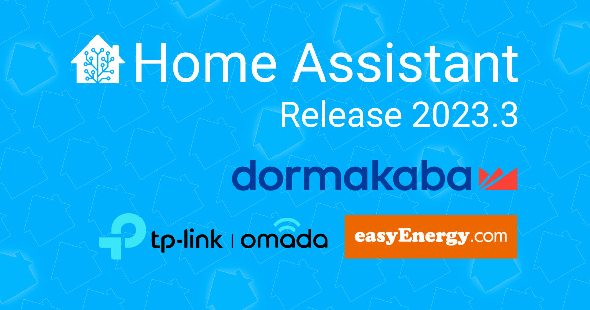
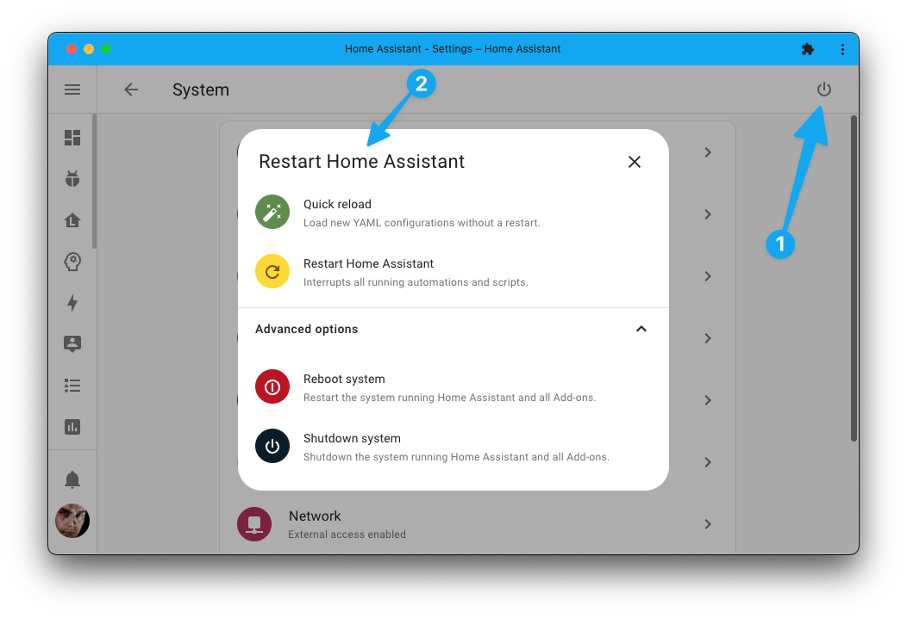
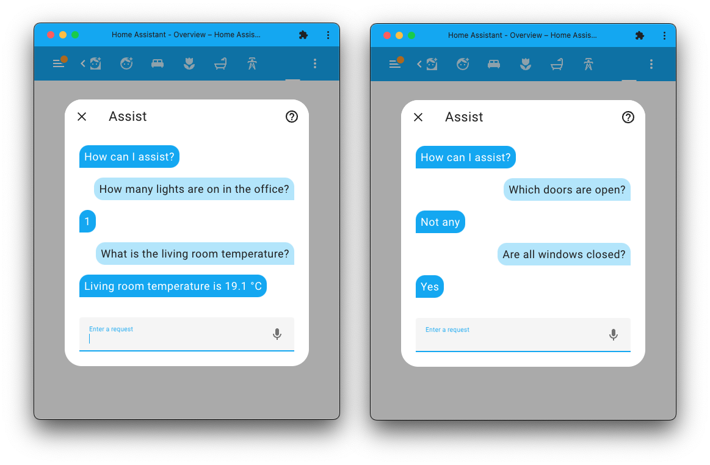
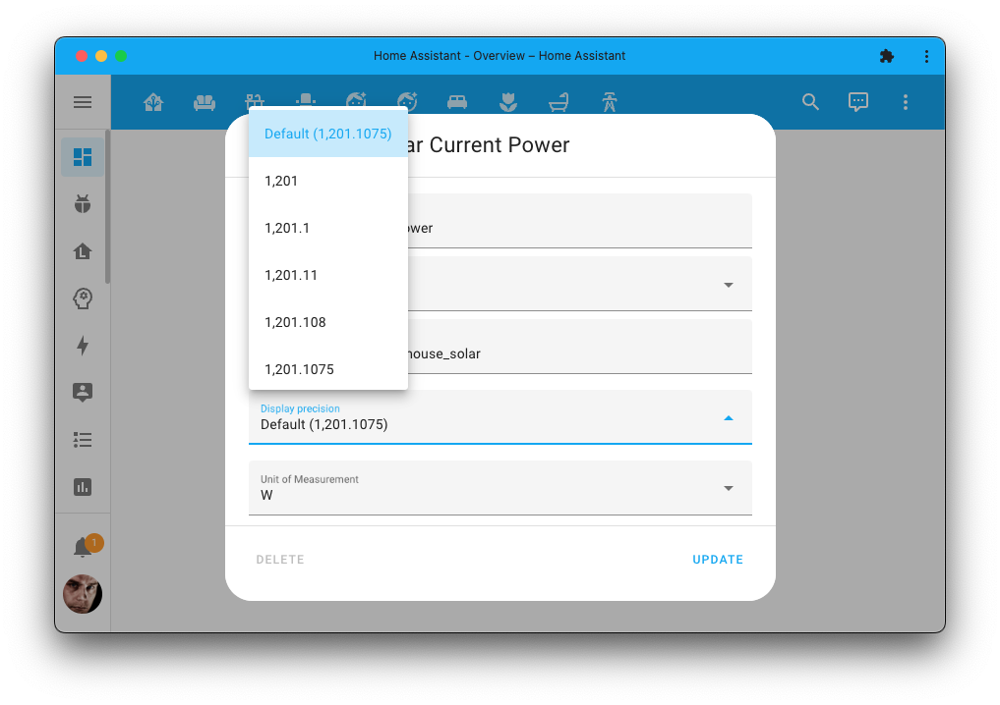
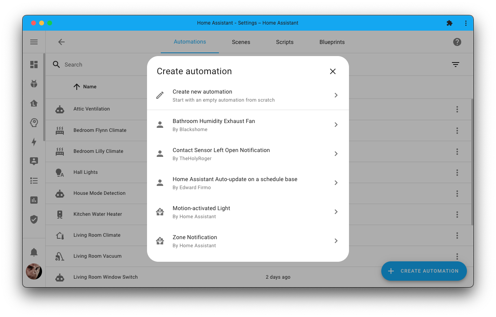
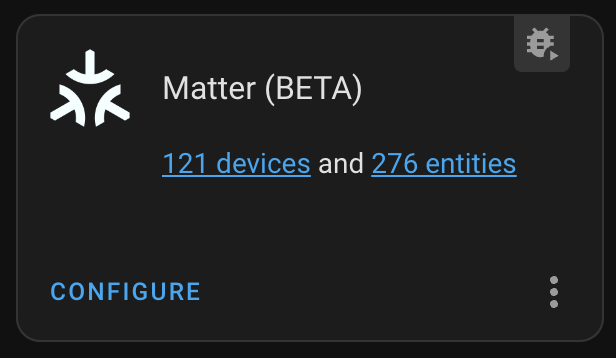

> **Cet article est une traduction de [2023.3: Dialogs!](https://www.home-assistant.io/blog/2023/03/01/release-20233/)** publié sur le site de Home Assistant.\*\*

**Home Assistant Core 2023.3!** 🎉

*"Le mois de février a été court, ce qui a entraîné un cycle de publication court, mais... Cela n'a pas empêché les personnes impliquées de remplir cette version de nombreuses améliorations !*

*Comme le titre de la version le dit si bien, la plupart des fonctionnalités de cette version concernent les boîtes de dialogue. De nouveaux dialogues, des dialogues relookés, de nouvelles fonctionnalités qui apparaissent dans les dialogues, et toutes sortes de nouveaux dialogues que vous pouvez avoir avec Assist. Il y a quelque chose avec "dialogues" partout dans ces notes de version !*

*Outre les dialogues, cette version apporte trois nouvelles intégrations, des mises à jour de Thread et Matter, et une liste impressionnante d'autres changements notables.*

*Mon point préféré dans cette version est, sans aucun doute, la toute nouvelle boîte de dialogue de redémarrage. Elle offre un choix approprié, réduit la navigation et est très élégante ! J'aime vraiment et apprécie le résultat. 🤩*

*Profitez de cette version !"* 

*../Frenck*

## Redémarrer Home Assistant.

Depuis que nous avons commencé à repenser notre structure de menu (un peu plus d'un an),  le redémarrage de Home Assistant a été une source de discussion dans notre communauté. Home Assistant peut être redémarré, rechargé, redémarré, et éteint ; mais on ne sait pas trop quoi utiliser et quand.

Nous avons trouvé une solution inspirée du bon vieil ordinateur Windows XP et son écran de redémarrage. [@matthiasdebaat](https://github.com/matthiasdebaat) a travaillé sur l'UX qui a été mis en œuvre par [@piitaya](https://github.com/piitaya). J'espère que cela sera perçu comme meilleur et plus clair.

C'est excellent, non ? 🤩 Ce qui est entièrement nouveau, c'est le premier élément présenté : “ Rechargement rapide ”. Rechargement rapide appelle toutes les **intégrations actives** de votre système qui prennent en charge le rechargement de la configuration YAML à la volée 🚀.

Cela signifie que toutes les intégrations répertoriées individuellement comme rechargeables sous l'onglet YAML des outils de développement seront rechargés simultanément ! De plus, [@frenck](https://github.com/frenck) a rendu disponible sous forme de [service](https://my.home-assistant.io/redirect/developer_call_service?service=homeassistant.reload_all) le rechargement rapide, afin que vous puissiez l'utiliser dans les automatisations.

Enfin, autre amélioration pour retrouver les choses plus facilement  : l'option de redémarrage a également été ajouté au menu (trois points en haut à droite de l'écran des paramètres).

## Demander à Assist les états des objets

Cette version vous aide à trouver l'état des objets de votre maison. Par exemple :

La prise en charge de trois types de questions ont été ajoutées :

* **Demandez l'état d'une seule entité :**

  * *“ Quelle est la température extérieure ? ”*
  * *“ La porte d'entrée est-elle verrouillée ? ”*
  * *“ Quelle est la consommation électrique au bureau ? ”*
* **Certaines ou toutes :**

  * *“ Des lumières sont-elles allumées dans la chambre ? ”*
  * *“ Toutes les fenêtres sont-elles fermées dans la cuisine ? ”*
* **Combien ou lesquelles :**

  * *“ Combien de lumières sont allumées au bureau ? ”*
  * *“ Quelles portes sont ouvertes ? ”*

Merci, [@synesthesiam](https://github.com/synesthesiam) pour la mise en œuvre de cela, et merci aux leaders linguistiques et contributeurs pour avoir fourni des traductions pour tout cela ❤️

Vous voulez aider à ajouter la prise en charge de ces intentions dans votre langue ? Je vous en prie ! En savoir plus sûr [prononciation des phrases dans notre documentation](https://developers.home-assistant.io/docs/voice/intent-recognition/contributing).

## Dialogues d'information plus clairs pour les entités

La **boîte de dialogue d'information de l'entité** (aussi connue sous le nom de boîte de dialogue plus d'informations) a obtenu de belles améliorations dans cette version.

Les onglets “ `Info`”, “ `Historique`”, “ `Paramètres`” et “ `Related`” ont été supprimés, ce qui donne à la boîte de dialogue un aspect beaucoup plus propre. Les icônes pour les paramètres et l'historique ont été ajoutés en haut à droite pour remplacer ces onglets. Le nouveau menu "trois points" peut afficher des informations sur l'entité liée et fournit un lien direct vers le tableau de bord de l'appareil qui a fourni cette entité.

Beau travail [@matthiasdebaat](https://github.com/matthiasdebaat) et [@piitaya !](https://github.com/piitaya) (HACF Power)

## Nouvelles boîtes de dialogue pour les lumières, les interrupteurs et les sirènes

Il y a d'autres choses sur les boîtes de dialogue. [@matthiasdebaat](https://github.com/matthiasdebaat) et [@piitaya](https://github.com/piitaya) ont travaillé sur les sessions de conceptions partagées [during the State of the Open Home 2022](https://www.youtube.com/live/D936T1Ze8-4?feature=share&t=5193). Cette version apporte les premières évolutions aux dialogues relatifs aux entités de lumières, interrupteurs et sirènes.

Les nouvelles boîtes de dialogue sont **agréables** et **propres**. Les nouveaux curseurs et boutons sont absolument magnifiques sur l'application de bureau comme sur mobile. Pour le curseur de luminosité, vous pouvez faire glisser sans éteindre la lumière, permettant de diminuer votre lumière vers le point le plus bas.

Des commandes supplémentaires pour allumer / éteindre, choisir la couleur (température) ont été ajoutés, et les effets apparaissent juste en dessous du curseur. En haut à droite, vous trouverez des nouveaux contrôles fournis avec l'apparence améliorée dont nous avons discuté dans le paragraphe précédent.

## Précision d'affichage des capteurs.

Vous avez un capteur qui a trop de décimales dans sa valeur numérique ? Souhaitez-vous l'afficher arrondi à un seul ou peut-être même pas de décimales ?

Changez-le directement de l'interface utilisateur !

Merci [@emontnemery](https://github.com/emontnemery) pour cette fonctionnalité !

Cela a également été étendu aux **intégrations**, qui peuvent désormais fournir une valeur plus précise tout en suggérant un affichage avec moins de précision. Cela vous permet de le modifier si vous n'aimez pas les valeurs par défaut.

Vous pouvez aussi profiter de la précision configurée lors de l'écriture de modèles, comme le `states()` la fonction a été étendue pour aider à le faire. Vous pouvez trouver plus d'informations sur [le capteur de formatage indiqué dans la documentation de modélisation](https://www.home-assistant.io/docs/configuration/templating/#formatting-sensor-states).

## Nouvelle boîte de dialogue de création d'automatisations

Continuons le thème des dialogues de cette version ! [@piitaya](https://github.com/piitaya) a de plus fait évoluer la boîte de dialogue que vous voyez lorsque vous créez une **nouvelle automatisation**.

Vous pouvez maintenant trouver et choisir rapidement un **modèle à utiliser** pour votre automatisation ou **créez-en un à partir de zéro**. L'aspect général est beaucoup plus moderne, et correspond mieux à notre conception actuelle.

Vous remarquerez peut-être, que s'affichent désormais les informations de l'auteur dans cette boîte de dialogue. Si vous créez des Blueprints, vous pouvez dorénavant ajouter **l'auteur** à votre automatisation, qui sera alors affiché dans cette boîte de dialogue.

## Thread & Matter

Dans les coulisses, beaucoup de choses se passent : **ajouter**, **étendre** et **améliorer** la prise en charge de **Thread & Matter** pour Home Assistant.

Il y a quelques semaines, nous avons publié [un article de blog complet sur où nous en sommes](https://www.home-assistant.io/blog/2023/02/08/state-of-matter-and-thread/). Certaines des fonctionnalités mentionnées dans cet article de blog seront disponibles aujourd'hui.

Le changement le plus visuel est que **l'[Intégration de Thread](https://www.home-assistant.io/integration/thread) apparaîtra maintenant sur le tableau de bord** des appareils et services. Le bouton  `Configurer` sur la carte Thread révélera le tout nouveau panneau Thread.

Le panneau Thread vous permet de **visualiser votre réseau Thread** et fournit des commandes pour ajouter un routeur de proximité **OpenThread**. Plus important encore, une option permettant de télécharger des diagnostics a été ajoutée dans le menu trois points en haut à droite. Cette fonction aide à trouver, trier et résoudre les problèmes liés au développement en cours relatifs à Thread.

Quant à Matter, il prend désormais en charge la connexion aux autres relais Matter (ou "bridges") ! Donc, vous pouvez connecter à présent, votre hub Hue sur Matter par exemple!

Hue est connecté à Matter, et c'est rapide !

Bien que, si vous souhaitez connecter votre concentrateur Hue, nous vous recommandons bien sûr d'utiliser la fonction dédiée [Intégration de Hue](https://www.home-assistant.io/integrations/hue), qui fournira une solution plus stable et riche en fonctionnalités. Avoir un support des appareils relais est une étape énorme !

L'ajout d'un appareil Matter est également plus logique. Ajoutez simplement un nouvel appareil à partir de la page Appareils et Services, tout comme si vous ajouteriez un autre appareil ou intégration à Home Assistant. Oh ! N'oublions pas [@ArturoGuerra](https://github.com/ArturoGuerra), qui a ajouté le support des lumières de couleur ! Merci !

## Prise en charge de Python 3.11

La prise en charge de **Python 3.11** est arrivée ! 🐍

**Ce changement n'est intéressant que si vous exécutez manuellement Home Assistant directement en Python** (la méthode d'installation **Home Assistant Core**). Si c'est le cas, vous pouvez maintenant commencer à utiliser Home Assistant avec Python 3.11, qui devrait améliorer considérablement les performances par rapport aux versions Python précédentes.

Nous travaillons par ailleurs à la mise à niveau vers Python 3.11 pour notre système d'exploitation Home Assistant, pour les méthodes d'installation supervisées et de conteneurs afin de fournir les mêmes améliorations de performances. Nous vous tiendrons au courant.

## Autres changements notables

Il y a beaucoup plus de matière dans cette version ; voici quelques autres changements :

* Vous pouvez maintenant modifier l'unité de mesure d'un capteur qui fournit des relevés de puissance. Donc, si vous aimez que votre capteur kW soit affiché en W, c'est maintenant possible. Merci, [@emontnemery](https://github.com/emontnemery)!
* Toutes contributions de [traductions](https://developers.home-assistant.io/docs/translations) sont désormais automatiquement mis à jour à chaque version ! Cela inclut les versions de correctifs. Merci, [@frenck](https://github.com/frenck).
* C'est plus rapide ! [@bdraco](https://github.com/bdraco) continue d'améliorer les performances, et cette version ne fait pas exception ! Les statistiques devraient être presque instantanées à présent, ce qui est remarquable sur le tableau de bord énergétique. Beaucoup d'améliorations des performances liées au MQTT aussi !
* La carte graphique statistique peut dorénavant cacher la légende, agréable et propre [@piitaya !](https://github.com/piitaya)(HACF Power)
* Vous pouvez maintenant utiliser des modèles dans le paramètre `for` de [conditions d'état](https://www.home-assistant.io/docs/scripts/conditions/#state-condition). Merci, [@emontnemery !](https://github.com/emontnemery)
* Notre "opt-in only" [Analytics](https://my.home-assistant.io/redirect/analytics) inclura désormais le moteur et la version de la base de données que vous utilisez avec votre enregistreur. Cela nous aide à prendre des décisions et des améliorations liées à la base de données. Merci, [@ludeeus !](https://github.com/ludeeus)
* [@marcelveldt](https://github.com/marcelveldt) prise en charge des scènes intelligentes ( "Natural Light" ) au [Philips Hue](https://www.home-assistant.io/integrations/hue) intégrations. Agréable !
* Si votre caméra [ONVIF](https://www.home-assistant.io/integrations/onvif) le prend en charge, elle fournira désormais des entités de paramètrage pour la mise au point automatique, l'essuie-glace et les lumières IR. Merci, [@partofthething !](https://github.com/partofthething)
* Les services d'aide de sélection d'entrée en premier, dernier, précédent et suivant sont désormais également disponibles sur certaines entités, merci [@frenck](https://github.com/frenck).
* On dirait que [@jesserockz](https://github.com/jesserockz) a pris une petite pause sur [ESPHome](https://esphome.io/) pour mettre en œuvre un support des intégrations SwitchBot Blind Tilt et [SwitchBot](https://www.home-assistant.io/integrations/switchbot). merci !
* L'intégration [Conversation OpenAI](https://www.home-assistant.io/integrations/openai_conversation) a maintenant des options pour la personnaliser à votre goût, merci [@bendews !](https://github.com/bendews)
* [@marcolivierarsenault](https://github.com/marcolivierarsenault) apporte un support supplémentaire pour [ecobee](https://www.home-assistant.io/integrations/ecobee) ventilateur, génial !
* Lintégration [Reo](https://www.home-assistant.io/integrations/reolink)link fournit désormais des entités pour mettre à jour le firmware de votre appareil photo, contrôler le zoom, et contrôler la mise au point automatique. Merci [@starkillerOG !](https://github.com/starkillerOG)
* [KNX](https://www.home-assistant.io/integrations/knx) La prise en charge de Data Secure est ajoutée et l'importation de votre *Keyfile* pour l'utiliser est désormais super facile. Téléchargez-le simplement depuis votre navigateur lors de sa configuration dans Home Assistant. Génial [@farmio !](https://github.com/farmio)
* [@thecode](https://github.com/thecode) apporte un support supplémentaire pour [Shelly](https://www.home-assistant.io/integrations/shelly) Capteurs d'énergie Pro 3EM, sympa !
* [ScreenLogic](https://www.home-assistant.io/integrations/screenlogic) prend désormais en charge les mises à jour locales pour presque toutes les entités. Merci [@dieselrabbit !](https://github.com/dieselrabbit)

## Nouvelles intégrations

Nous saluons les nouvelles intégrations suivantes dans cette version :

* **[Dormakaba dKey](https://www.home-assistant.io/integrations/dormakaba_dkey)**, ajouté par [@emontnemery](https://github.com/emontnemery)\
  Connectez et contrôlez vos verrous Bluetooth Low Energy Dormakaba dKey.
* **[easyEnergy](https://www.home-assistant.io/integrations/easyenergy)**, ajouté par [@klaasnicolaas](https://github.com/klaasnicolaas)\
  Récupère les prix dynamiques de l'énergie et du gaz (toutes les heures) de la société néerlandaise de services publics easyEnergy.
* **[Contrôleur SDN TP-Link Omada](https://www.home-assistant.io/integrations/tplink_omada)**, ajouté par [@MarkGodwin](https://github.com/MarkGodwin)\
  Contrôlez vos périphériques SDN Omada à liaison TP, tels que les commutateurs réseau, points d'accès et passerelles Internet.

## "Breaking changes"

> Détail non traduit ici - voir sur [Release 2023.3. - breaking changes](https://www.home-assistant.io/blog/2023/03/01/release-20233/#breaking-changes)

* Assist / Conversation
* Déclencheurs de dispositifs de pression atmosphérique
* ecobee
* Fibaro
* GoodWe Inverter
* HomeKit
* Matter
* MQTT
* Plugwise
* Profiler
* Template : Covers
* Trafikverket Weather
* Todoist
* Protection UniFi
* Wiffi
* Z-Wave

Si vous êtes un développeur d'intégrations custom et que vous souhaitez en savoir plus sur les modifications de ruptures et nouvelles fonctionnalités disponibles pour votre intégration : Assurez-vous de suivre notre [blog développeur](https://developers.home-assistant.io/blog/). Les éléments suivants sont les plus remarquables pour cette version :

* [Ajout de la prise en charge des tests d'instantané](https://developers.home-assistant.io/blog/2023/02/20/snapshot-testing/)
* [Fonctionnalités de carreaux personnalisées](https://developers.home-assistant.io/blog/2023/02/28/custom-tile-features)
* [Signatures de rappel obsolètes pour l'abonnement MQTT supprimées](https://developers.home-assistant.io/blog/2023/02/21/deprecated-callback-removed/)
* [Questions et réponses](https://developers.home-assistant.io/blog/2023/02/03/responses)
* [Présentation de la rédaction des RP dans notre processus d'examen](https://developers.home-assistant.io/blog/2023/02/07/introducing-PR-drafting-in-reviews)
* [Présentation de HassGetState](https://developers.home-assistant.io/blog/2023/02/09/hassgetstate)
* [Nombre de décimales utilisées lors de l'affichage d'un état de capteur est désormais configurable](https://developers.home-assistant.io/blog/2023/02/08/sensor_presentation_rounding)
* [Fichiers de traduction supprimés du référentiel central](https://developers.home-assistant.io/blog/2023/02/06/translations-files-removed-from-core)

## Toutes les modifications

Bien sûr, il y a beaucoup plus dans cette version. Vous pouvez trouver une liste de toutes les modifications apportées ici : [Journal complet des modifications pour le noyau de l'assistant à domicile 2023.3](https://www.home-assistant.io/changelogs/core-2023.3)