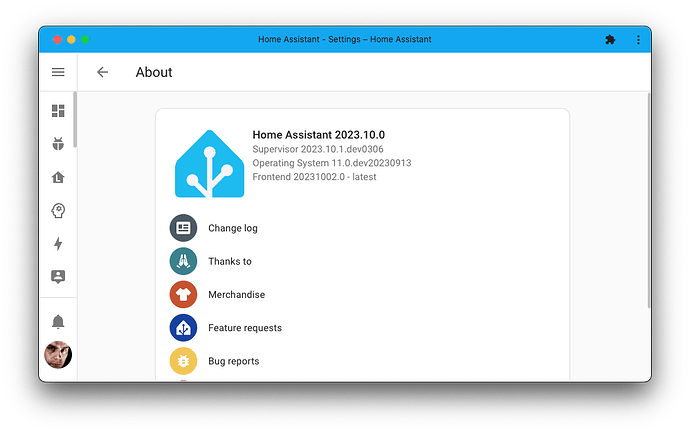
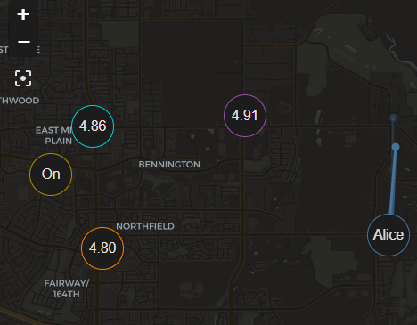

**Home Assistant Core 2023.10 !** 🎉

_Octobre ! 🎃 Cela signifie que nous venons de fêter notre anniversaire ; nous avons maintenant 10 ans ! 🎂 Au cas où vous auriez manqué notre [diffusion YouTube d’anniversaire](https://www.youtube.com/watch?v=EmLV6lJLzSU) avec toutes les annonces intéressantes, nous avons tout résumé dans notre article de blog sur les [10 ans de Home Assistant.](https://www.home-assistant.io/blog/2023/09/17/10-years-home-assistant/)_

_Encore plus de nouvelles excitantes, car c’est [l’année de la voix pour Home Assistant](https://www.home-assistant.io/blog/2022/12/20/year-of-voice/) : le chapitre 4 de ce projet a été annoncé et sera [diffusé en direct sur YouTube](https://www.youtube.com/watch?v=YzgYYkOrnhQ) le 12 octobre 2023, à 21h00 CEST (Europe) ! Assurez-vous d’être à l’écoute ! J’ai vu quelques démos préliminaires… Tout ce que je vais dire, c’est : C’est époustouflant ! 🤯_

_Quant à cette version, à cause de tout ce qui est indiqué ci-dessus, elle est un peu plus petite que d’habitude en termes de fonctionnalités. Je promets que le chapitre 4 en vaudra la peine. Pourtant, elle contient des tonnes de mises à jour, des corrections de bugs, et quelques nouvelles fonctionnalités magnifiques pour la carte de tuiles ! 🤩_

_Bonne lecture !_

_…/Frenck_

## Un superbe logo actualisé !

Cela a été fait pour le [10ème anniversaire de Home Assistant](https://www.home-assistant.io/blog/2023/09/17/10-years-home-assistant/), et vous pouvez [tout lire sur cette itération dans cet article de blog](https://www.home-assistant.io/blog/2023/09/17/a-refreshed-logo-for-home-assistant/). Vous commencerez à voir ce logo dans beaucoup plus d’endroits dans les semaines à venir, mais il est déjà inclus dans cette version !

## De nouveaux boutons pour My Home Assistant

Si vous ne connaissez pas My Home Assistant, c’est un outil en ligne gratuit qui permet aux sites web, aux documentations, aux plateformes de chat et aux blogs de lier des endroits sur votre serveur Home Assistant sans connaître son adresse ou être exposé à internet. Cela garantit votre vie privée tout en permettant une expérience fluide.

Donc, si vous voyez ces boutons apparaître quelque part, vous savez maintenant ce qu’ils font ! Vous pouvez facilement créer vos propres boutons et liens à partager sur la page [créer un lien](https://my.home-assistant.io/create-link/).

## Nouvelles fonctionnalités pour les entités climatiques sur la carte de tuiles

Dans la dernière version, nous avons ajouté [beaucoup de nouvelles fonctionnalités pour la carte tuile](https://www.home-assistant.io/blog/2023/09/06/release-20239/#lots-of-new-tile-features), y compris des fonctionnalités spécifiquement pour contrôler vos appareils de climatisation. Dans cette version, nous en ajoutons encore plus !

@Weissnix4711 a contribué une fonctionnalité qui vous permet d’ajouter des boutons pour les préréglages de votre appareil de climatisation sur la carte tuile. Ensuite, [@piitaya](https://forum.hacf.fr/u/piitaya) a poussé le concept encore plus loin : Vous pouvez maintenant sélectionner quels préréglages vous voulez montrer et si vous les voulez dans un menu déroulant au lieu d’une série de boutons.

La capture d’écran ci-dessus montre la même carte tuile, mais une avec les boutons et l’autre avec un menu déroulant.

Dans les options pour cette fonctionnalité de carte de tuiles, on vous donnera le choix si vous préférez montrer des icônes ou si vous préférez avoir une liste déroulante. Vous pouvez aussi choisir quels préréglages vous voulez montrer/cacher.

## Fonctionnalité de sélection des entités sur la carte tuile

Mais il y a encore plus de bonnes choses pour la carte tuile. [@piitaya](https://forum.hacf.fr/u/piitaya) a également ajouté la menu déroulant ci-dessus comme une fonctionnalité pour les entités de sélection, vous permettant de sélectionner une option à partir d’une liste d’options.

Cette fonctionnalité peut être utilisée pour n’importe quelle entité de sélection mais aussi vos aides déroulantes personnalisées ! (également connues sous le nom d’entités `input_select`).

## Les gestionnaires de mots de passe et Home Assistant

L’utilisation d’un gestionnaire de mots de passe est sans doute l’une des meilleures choses que vous pouvez faire pour améliorer votre sécurité en ligne. Mais les utiliser avec Home Assistant, en fonction de celui que vous avez utilisé, a été un peu pénible.

Si vous avez utilisé l’un de ces gestionnaires de mots de passe qui avaient des problèmes avec Home Assistant, vous serez heureux de savoir que cette version corrige cela ! Par exemple, 1Password fonctionne maintenant !

## Options pour les marqueurs d’entités sur la carte

La [carte](https://www.home-assistant.io/dashboards/map/) a reçu de nouvelles options (merci @karwosts !) pour vos marqueurs d’entités qui sont affichés sur la carte.

Lors du centrage de la carte, toutes les entités sur la carte sont prises en compte. Cependant, vous pouvez également exclure certaines entités (par exemple, des valeurs aberrantes connues) qui ne doivent pas être prises en compte lors de cette opération.

Ceci n’est actuellement disponible que dans la configuration YAML de la carte. Consultez [notre documentation pour la carte](https://www.home-assistant.io/dashboards/map/#label_mode) pour plus d’informations.

## Autres changements notables

Il y a beaucoup plus d’améliorations dans cette version ; voici quelques-uns des autres changements notables dans cette version :

- Si vous utilisez [ESPHome](https://esphome.io/), vous remarquerez des sauvegardes Home Assistant beaucoup plus petites lorsque vous avez installé [la dernière version](https://esphome.io/changelog/2023.9.0.html#esphome-2023-9-0-27th-september-2023) !
- L’intégration du [pont HomeKit](https://www.home-assistant.io/integrations/homekit) prend désormais en charge les récepteurs multimédias ! Merci, @ bdraco !
- @ Lash-L continue à étendre l’intégration [Roborock](https://www.home-assistant.io/integrations/roborock). Dans cette version, des capteurs d’eau et de dernière nettoyage ont été ajoutés. Génial !
- 
[Withings](https://www.home-assistant.io/integrations/withings) a reçu beaucoup d’amour dans cette version, merci @ joostlek ! Il est maintenant plus facile à configurer et fonctionne maintenant avec les webhooks du [Cloud Home Assistant](https://www.nabucasa.com/) pour les mises à jour push !
- @ allenporter a ajouté un support calendrier à l’intégration [Rain Bird](https://www.home-assistant.io/integrations/rainbird), vous permettant de voir votre programme d’irrigation dans Home Assistant ! Sympa !
- L’intégration [System Bridge](https://www.home-assistant.io/integrations/system_bridge) prend désormais en charge les notifications ! Merci, @ timmo001 !
- @ alexyao2015 a ajouté un bouton à [Life360](https://www.home-assistant.io/integrations/life360) pour déclencher un sondage pour mettre à jour les informations de localisation. Cool !
- La [carte entité image](https://www.home-assistant.io/dashboards/picture-entity/) dispose maintenant d’une option mode ajustement pour contrôler comment l’image s’adapte à la carte. Cela vous permet de décider si l’image est coupée, ajustée ou étirée dans la carte affichée. Merci @ karwosts !
- Il est maintenant plus facile que jamais de collecter des logs (journaux) [Z-Wave](https://www.home-assistant.io/integrations/zwave_js) pour le dépannage. Il suffit d’activer [la journalisation détaillée](https://www.home-assistant.io/integrations/zwave_js#how-do-i-access-the-z-wave-logs) (debug détaillé) !

## Nouvelles intégrations

Nous accueillons les nouvelles intégrations suivantes dans cette version :

- [Apple WeatherKit](https://www.home-assistant.io/integrations/weatherkit), ajouté par @ tjhorner
Suivez la météo en utilisant l’API WeatherKit d’Apple.
- [Ecoforest](https://www.home-assistant.io/integrations/ecoforest), ajouté par @ pjanuario
Surveillez et contrôlez votre cheminée Ecoforest.
- [IKEA IDÅSEN Desk](https://www.home-assistant.io/integrations/idasen_desk), ajouté par @ abmantis
Connectez-vous et contrôlez la hauteur de votre bureau motorisé IKEA IDÅSEN.
- [Medcom Bluetooth](https://www.home-assistant.io/integrations/medcom_ble), ajouté par @ elafargue
Intégrez vos moniteurs de radiation Medcom.
- [Private BLE Device](https://www.home-assistant.io/integrations/private_ble_device), ajouté par @ Jc2k
Suivez vos appareils BLE qui changent fréquemment d’adresse MAC.
- [SwitchBot Cloud](https://www.home-assistant.io/integrations/switchbot_cloud), ajouté par @ SeraphicRav
Contrôlez vos appareils SwitchBot en utilisant l’API SwitchBot Cloud.
- [WeatherFlow](https://www.home-assistant.io/integrations/weatherflow), ajouté par @ jeeftor
Intégrez votre système météo WeatherFlow Tempest.

Cette version a également une nouvelle intégration virtuelle. Les intégrations virtuelles sont des ébauches qui sont gérées par d’autres intégrations (existantes) pour aider à la recherche. La nouvelle intégration virtuelle suivante a été ajoutée :

- [Enmax Energy](https://www.home-assistant.io/integrations/enmax) fourni par [Opower](https://www.home-assistant.io/integrations/opower)

## Intégrations désormais disponibles à partir de l’interface utilisateur (UI)

Les intégrations suivantes sont désormais disponibles via l’interface utilisateur de Home Assistant :

- [AfterShip](https://www.home-assistant.io/integrations/aftership), réalisé par @ joostlek
- [Extracteur de couleur](https://www.home-assistant.io/integrations/color_extractor), réalisé par @ joostlek
- [Hunter Hydrawise](https://www.home-assistant.io/integrations/hydrawise), réalisé par @ dknowles2
- [NextBus](https://www.home-assistant.io/integrations/nextbus), réalisé par @ ViViDboarder
- [Todoist](https://www.home-assistant.io/integrations/todoist), réalisé par @ allenporter
- [Twitch](https://www.home-assistant.io/integrations/twitch), réalisé par @ joostlek
- [Indice de qualité de l’air mondial (WAQI)](https://www.home-assistant.io/integrations/waqi), réalisé par @ joostlek

## Breaking Changes

Pour les “Breaking Changes” c’est par [ici](https://www.home-assistant.io/blog/2023/10/04/release-202310/#breaking-changes) (non traduits).
