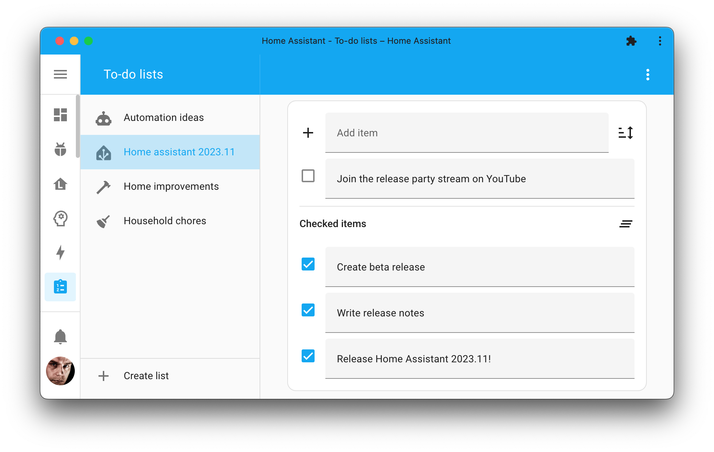
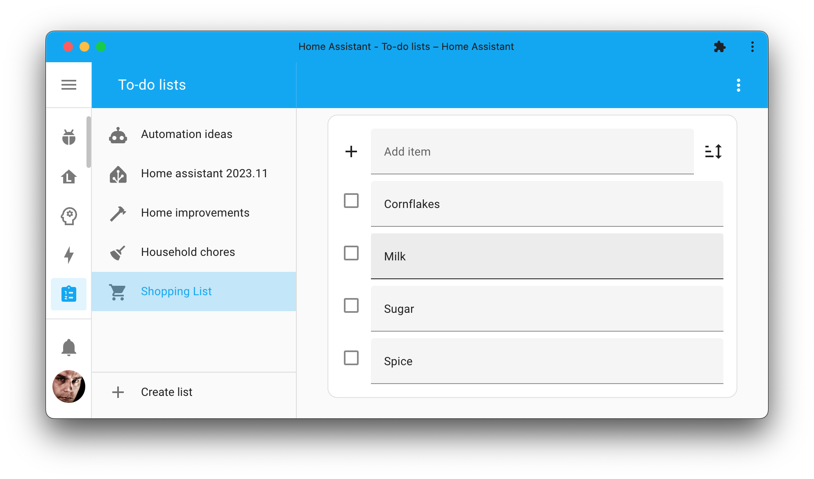
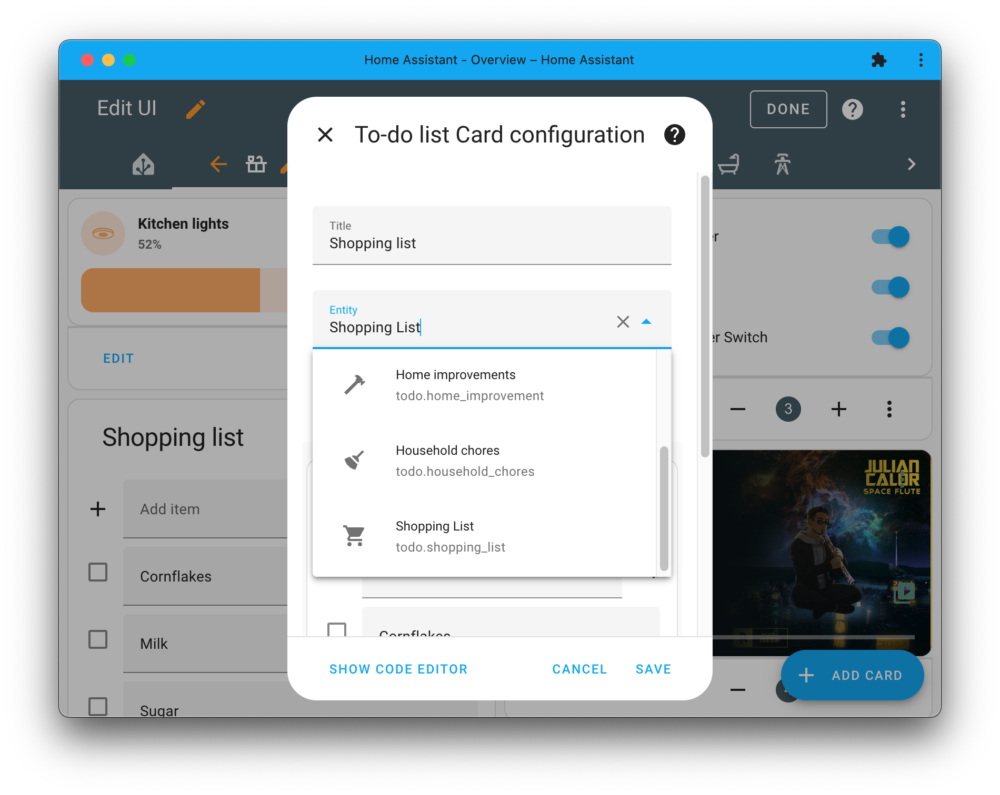
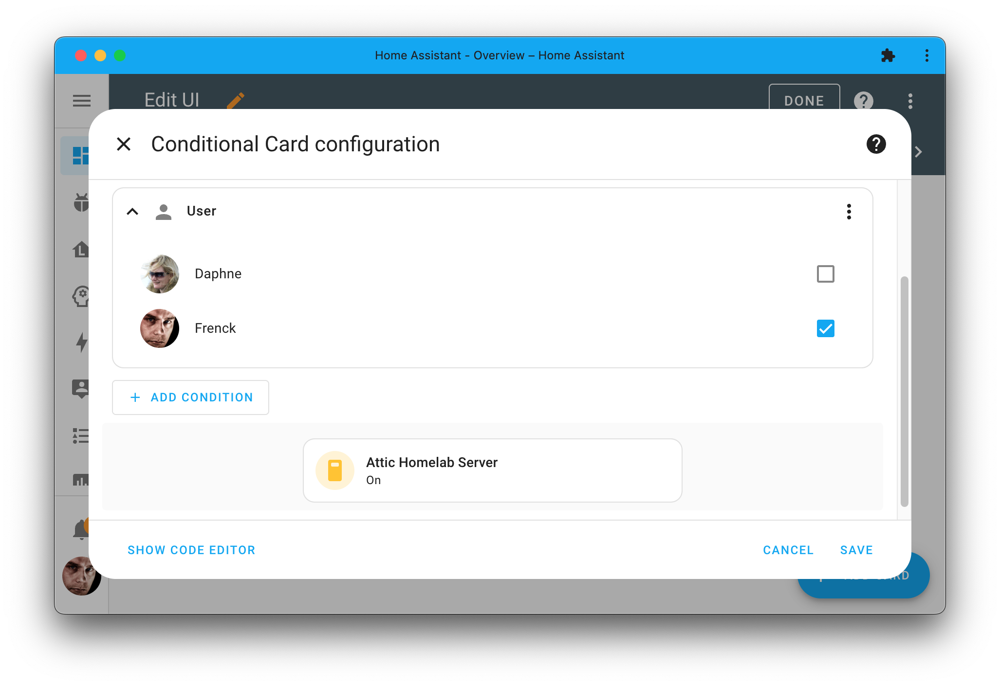
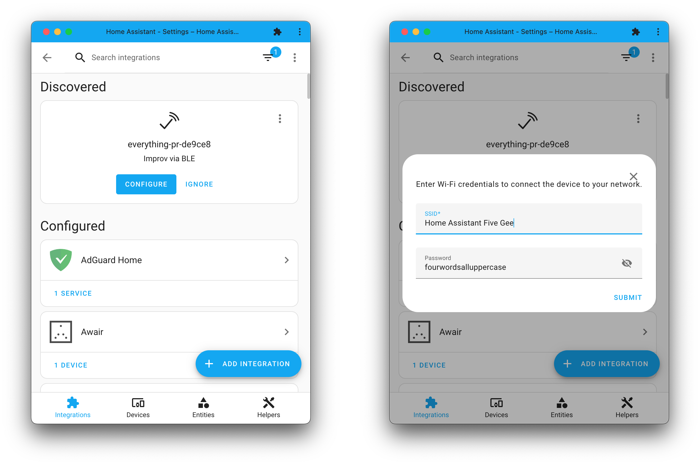
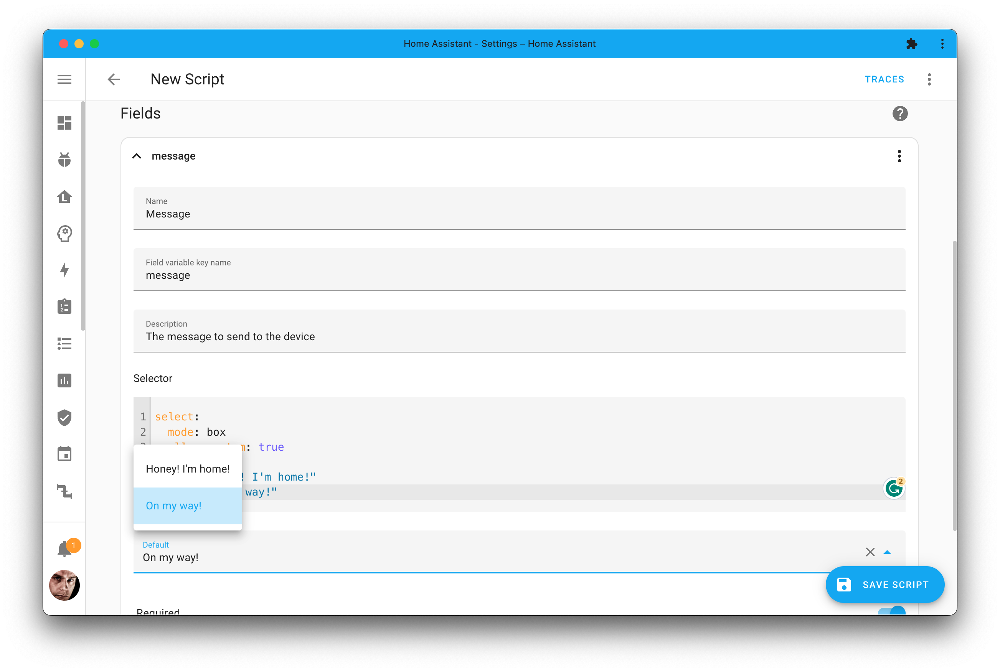

Cet article est une traduction de [2023.11 To-do: Add release title](https://www.home-assistant.io/blog/2023/11/01/release-202311/) publié sur le site de Home Assistant.

## Home Assistant 2023.11! 🎃

_Avant de nous plonger dans cette version massive, j’aimerais revenir rapidement sur deux événements extraordinaires qui se sont déroulés au cours du mois dernier. 🤔_

_Avant de nous plonger dans cette version massive, j’aimerais revenir rapidement sur deux événements extraordinaires qui se sont déroulés au cours du mois dernier._

_Premièrement, nous avons présenté le_ [_chapitre 4 de l’Année de la Voix_](https://www.home-assistant.io/blog/2023/10/12/year-of-the-voice-chapter-4-wakewords/)_, qui a introduit la nouvelle fonctionnalité de mot d’éveil dans Home Assistant. Cela porte vraiment l’expérience de l’assistant vocal à un niveau supérieur, et nous en sommes super excités ! Avez-vous vu_ [_le droïde assistant vocal basé sur R5_](https://www.youtube.com/watch?v=vQ7Hmeume9g) _? 😍_

_Deuxièmement, nous avons fait réaliser un audit de sécurité sur Home Assistant par l’un des meilleurs auditeurs de sécurité au monde ! Vous pouvez lire tous les détails dans_ [_l’article du blog_](https://www.home-assistant.io/blog/2023/10/19/security-audits-of-home-assistant/)_(_[_traduction sur le blog HACF_](https://hacf.fr/news/ha_audits_securite/)_). Un grand merci à tous ceux qui sont abonnés à_ [_Home Assistant Cloud_](https://www.nabucasa.com/)_, car c’est ce qui nous permet de faire tout cela ! 🥰_

_Enfin, à propos de cette version ! Elle est énorme ! J’adore la carte des tuiles, et la possibilité de personnaliser facilement les informations qu’elle affiche maintenant est juste 🤩_

_Mais surtout, je suis super excitée par les nouvelles listes de choses à faire, qui deviendront probablement un élément central de mon foyer._

_Bonne lecture !_

_…/Frenck_

## Il y a beaucoup de tâches !

Il y a beaucoup de choses à faire dans nos vies, et c’est ce que [@allenporter](https://github.com/allenporter) a réalisé aussi ! Nous avons maintenant un nouveau type d’entité dans Home Assistant : les [entités de type liste de tâches](https://www.home-assistant.io/integrations/todo) !

Une entité liste de tâches représente une liste de tâches, et son état est la quantité de tâches non terminées qui sont encore ouvertes. Vous pouvez créer une ou plusieurs listes de tâches (entièrement locales), les visualiser et les gérer en sélectionnant le nouvel élément Listes de tâches dans la barre latérale.

Outre les entités, de nouveaux services sont également disponibles pour automatiser vos listes de tâches. Utilisez les automatisations pour créer, terminer ou supprimer des tâches dans vos listes de tâches.

Alors, que pouvez-vous faire avec tout cela ? Beaucoup ! Par exemple, vous pouvez créer une liste de tâches pour vos courses, automatiser une liste de tâches ménagères pour vos enfants ou d’autres membres de la famille, ou placer automatiquement une tâche sur une liste pour remplacer les piles d’un capteur lorsqu’elles sont faibles. Vous pourriez même envoyer une notification push à votre téléphone lorsque vous vous trouvez à proximité d’un magasin de bricolage et qu’il y a des articles sur une liste de tâches que vous devez y acheter.

Merci à [@allenporter](https://github.com/allenporter) et à toutes les personnes impliquées pour cet incroyable ajout à Home Assistant ! Nous pouvons maintenant le cocher sur notre liste de souhaits ✔

## Les listes de courses sont désormais aussi des listes de tâches !

Ces listes de tâches ressemblent beaucoup à la liste de courses, n’est-ce pas ? Exact !

Elles se ressemblent beaucoup, et c’est pourquoi nous avons transformé la liste de courses en liste de tâches également ! Une fois que vous serez passé à cette version, votre liste de courses existante sera automatiquement convertie en liste de tâches.

Mais ce n’est pas tout ; nous avons également mis à jour la carte de la **liste d’achats** pour vos tableaux de bord, désormais judicieusement appelée **carte de la liste des tâches**, afin de prendre en charge plusieurs listes de tâches. Vous pouvez désormais sélectionner la liste de tâches que vous souhaitez afficher sur la carte que vous avez placée dans votre tableau de bord.

## Intégrations fournissant vos tâches à faire

Mais attendez ! Il n’y a pas que les listes de tâches locales et les listes d’achats. Maintenant que nous disposons d’une entité de liste de tâches, nous pouvons également commencer à l’utiliser avec d’autres intégrations qui, par exemple, peuvent obtenir vos listes de tâches à partir d’un service externe.

Depuis cette version, vous pouvez également intégrer vos listes de tâches [Todoist](https://www.home-assistant.io/integrations/todoist) et [Google Tasks](https://www.home-assistant.io/integrations/google_tasks) à Home Assistant !

C’est génial, car cela permet de rassembler toutes ces listes de tâches en un seul endroit et, surtout, de donner à Home Assistant la possibilité de les automatiser.

## Matter 1.2 est là !

La Connectivity Standards Alliance a lancé la [version 1.2 de la spécification Matter](https://csa-iot.org/newsroom/matter-1-2-arrives-with-nine-new-device-types-improvements-across-the-board/), ainsi qu’une nouvelle version du SDK officiel Matter, qui est non seulement préparée pour de nouveaux types d’appareils, mais qui contient également toutes sortes de petites corrections de stabilité et de bogues.

Bien que vous ne puissiez bénéficier des nouveaux types d’appareils qu’à leur sortie, nous avons mis à jour notre implémentation de Matter à la version 1.2 afin de bénéficier des améliorations de stabilité et être prêts pour les nouveaux types d’appareils.

**Fait intéressant** : saviez-vous que Home Assistant est utilisé comme plateforme de test par de nombreux fabricants d’appareils ? Cela signifie potentiellement que les appareils seront implémentés et testés sur le contrôleur Home Assistant Matter avant les autres ; cool !

## Personnalisez les informations affichées dans vos cartes tuiles

La carte tuile affiche désormais les informations relatives à l’état de l’entité sur la carte. Mais que faire si vous voulez afficher autre chose ? [@piitaya](https://github.com/piitaya) à la rescousse !

Vous pouvez maintenant la personnaliser à votre guise. Affichez l’état de l’entité, l’un de ses attributs ou une combinaison des deux !

Vous pouvez ajouter n’importe quel attribut de l’entité au contenu de l’état de la tuile.

Cela ne fonctionne pas seulement pour les entités climatiques, mais pour toutes les entités ! Vous pouvez, par exemple, ajouter le pourcentage de luminosité d’une lampe ou le niveau de batterie d’un capteur. Il vous suffit d’ajouter l’attribut au contenu de l’état et de le glisser-déposer dans l’ordre dans lequel vous souhaitez qu’ils apparaissent.

## Sélectionner n’importe quelle plage de dates dans le tableau de bord de l’énergie

Le tableau de bord de l’énergie vous permet désormais de sélectionner une plage de dates personnalisée. Cela vous permet de voir la consommation d’énergie de votre maison sur une période spécifique.

Un excellent ajout au tableau de bord de l’énergie. Merci, [@TillFleisch](https://github.com/TillFleisch) !

## Nouvelles conditions pour la carte conditionnelle

La [carte conditionnelle](https://www.home-assistant.io/dashboards/conditional/) est un excellent moyen d’afficher ou de masquer des cartes de manière conditionnelle. Par exemple, vous pouvez afficher une carte uniquement lorsque le soleil se couche ou lorsque vous êtes à la maison.

Lorsque vous utilisez un tel état, vous pouvez également le faire correspondre à plusieurs valeurs. Par exemple, vous pouvez afficher une carte lorsque le soleil se couche ou lorsque le soleil est sous l’horizon en une seule condition.

Mais ce qui est encore plus intéressant, c’est que [@piitaya](https://github.com/piitaya) a ajouté toute une série de nouvelles conditions à cette carte pour que vous puissiez les utiliser ! Plongeons dans le vif du sujet…

### Condition utilisateur

La condition d’utilisateur vous permet d’afficher ou de masquer les cartes en fonction de l’utilisateur qui est actuellement connecté. Utile si vous avez plusieurs utilisateurs dans votre instance de Home Assistant et que vous souhaitez afficher ou masquer les cartes en fonction de l’utilisateur qui consulte le tableau de bord.

La capture d’écran ci-dessus montre que la carte n’est affichée que lorsque l’utilisateur connecté est Frenck. Elle est cachée pour tous les autres utilisateurs.

### Numeric state condition

Similar to the state condition, the numeric state condition allows you to show or hide cards based on the state of an entity, only this time, based on its numeric value. Useful if you want to show or hide cards based on temperature, humidity, or any other numeric entity.

In the screenshot above, this thermostat card will only be shown on the dashboard when the temperature outside has dropped below 18 degrees Celsius.

### Condition d’écran

Enfin, la condition d’écran vous permet d’afficher ou de masquer des cartes en fonction de la taille de l’écran de l’appareil sur lequel vous visualisez Home Assistant.

Par exemple, vous pouvez afficher certaines cartes uniquement lorsque vous visualisez Home Assistant sur un ordinateur de bureau ou une tablette et les masquer lorsque vous visualisez Home Assistant sur un appareil mobile.

La capture d’écran montre comment la commande de la porte de garage n’est affichée que sur mobile, car elle est le plus souvent utilisée à partir d’un mobile en arrivant à la maison.

## Redémarrage en mode sans échec

Vous pouvez maintenant redémarrer Home Assistant en mode sans échec. Ce mode désactivera toutes les intégrations personnalisées et les ressources de l’interface utilisateur personnalisées (par exemple, les cartes et les thèmes personnalisés).

Il est utile si vous rencontrez des problèmes avec votre Home Assistant et que vous souhaitez rapidement exclure les intégrations personnalisées ou les ressources personnalisées du tableau de bord comme cause de ces problèmes.

Vous souhaitez sortir à nouveau du mode sans échec ? Il suffit de redémarrer Home Assistant une fois de plus, et tout reviendra à la normale.

C’est très utile ! Merci, [@emontnemery](https://github.com/emontnemery) !

## Configurez les appareils Improv directement à partir de Home Assistant !

Si vous avez acheté un appareil qui supporte [Improv Wi-Fi](https://improv-wifi.com/) via Bluetooth, et que vous utilisez le Bluetooth dans Home Assistant, vous pouvez maintenant configurer votre appareil directement à partir de Home Assistant !

Branchez l’alimentation de votre tout nouvel appareil, et Home Assistant le découvrira et vous aidera à le configurer en le connectant à votre réseau Wi-Fi et en l’ajoutant à Home Assistant.

[Improv Wi-Fi](https://improv-wifi.com/) est une norme entièrement ouverte qui peut être librement adoptée et mise en œuvre par tout créateur de matériel, quelle que soit sa taille. Le Wi-Fi Improv est également pris en charge par [ESPHome](https://esphome.io/components/esp32_improv#improv-via-ble).

Bon travail [@emontnemery](https://github.com/emontnemery) !

## Configuration des champs de votre script dans l’interface utilisateur

Les scripts disposent d’une fonctionnalité très intéressante : [les champs](https://www.home-assistant.io/integrations/script/#fields). Les champs vous permettent de définir des variables dans votre script que vous pouvez transmettre lors de l’appel de votre script en tant que service.

Par exemple, vous pouvez créer un script qui envoie une notification à une personne spécifique et utiliser un champ pour définir le message que vous souhaitez envoyer.

Ces champs prennent en charge [nos sélecteurs d’interface utilisateur](https://www.home-assistant.io/docs/blueprint/selectors/), ce qui vous permet de fournir une interface utilisateur pour les champs de votre script. Cependant, cela n’était possible que si vous créiez vos scripts au format YAML.

Mais ce n’est plus le cas ! Grâce à [@karwosts](https://github.com/karwosts), vous pouvez maintenant configurer vos champs de script dans l’interface utilisateur !

Vous pouvez trouver les champs dans l’éditeur de script en sélectionnant les trois points dans le coin supérieur droit de l’éditeur et en sélectionnant **Ajouter des champs** dans le menu déroulant.

## Autres changements notables

Il y a beaucoup plus d’améliorations dans cette version ; voici quelques-uns des autres changements notables dans cette version :

- Le [pont HomeKit](https://www.home-assistant.io/integrations/homekit) gère désormais automatiquement les changements de capacités des appareils et la suppression/l’ajout d’appareils ! Merci, [@bdraco](https://github.com/bdraco) !
- L’adorable nouvelle vue à deux volets que vous voyez dans les listes de tâches a également été ajoutée au tableau de bord du calendrier. Merci [@bramkragten](https://github.com/bramkragten) !
- [ZHA](https://www.home-assistant.io/integrations/zha) soulèvera désormais un problème de réparation s’il découvre que les paramètres du réseau ont été modifiés de l’extérieur. Cela vous permet d’être à nouveau opérationnel en un rien de temps. Merci, [@puddly](https://github.com/puddly) !
- [@gjohansson-ST](https://github.com/gjohansson-ST) a ajouté un tout nouveau [sélecteur de pays](https://www.home-assistant.io/docs/blueprint/selectors/#country-selector) qui peut être utilisé dans vos Blueprints et champs de script. C’est très bien !
- L’intégration de [Withings](https://www.home-assistant.io/integrations/withings) a atteint le niveau de qualité platine. Merci, [@joostlek](https://github.com/joostlek) ! Un travail bien fait !
- Nous avons maintenant une meilleure gestion des connexions pour le [bureau IKEA IDÅSEN](https://www.home-assistant.io/integrations/idasen_desk). Bien joué [@abmantis](https://github.com/abmantis) !
- L’intégration [Fitbit](https://www.home-assistant.io/integrations/fitbit) a été complètement revue, peut être configurée via l’interface utilisateur et prend désormais en charge les capteurs de nutrition Fitbit. Merci, [@allenporter](https://github.com/allenporter) !
- L’intégration de [SwitchBot Cloud](https://www.home-assistant.io/integrations/switchbot_cloud) prend désormais en charge les appareils climatiques. Merci, [@SeraphicRav](https://github.com/SeraphicRav) !
- [@rappenze](https://github.com/rappenze) a ajouté la prise en charge des entités d’événements à l’intégration [Fibaro](https://www.home-assistant.io/integrations/fibaro). Cool !
- L’intégration [System Bridge](https://www.home-assistant.io/integrations/system_bridge) prend désormais en charge les lecteurs multimédias. Merci, [@timmo001](https://github.com/timmo001) !
- [@raman325](https://github.com/raman325) a étendu notre moteur de template avec la possibilité de [vérifier le type d’une variable](https://www.home-assistant.io/docs/configuration/templating/#complex-type-checking). Très utile pour les modèles complexes ! Merci !

## Nouvelles intégrations

Nous accueillons les nouvelles intégrations suivantes dans cette version :

- [Google Tasks](https://www.home-assistant.io/integrations/google_tasks), ajouté par [@allenporter](https://github.com/allenporter)
Accédez à votre liste de tâches Google Tasks depuis le nouveau tableau de bord des tâches.
- [Improv BLE](https://www.home-assistant.io/integrations/improv_ble), ajouté par [@emontnemery](https://github.com/emontnemery)
L’intégration de vos appareils Improv Wi-Fi à votre réseau Wi-Fi est facilitée.
- [Liste de tâches locales](https://www.home-assistant.io/integrations/local_todo), ajouté par [@allenporter](https://github.com/allenporter)
Créez et gérez votre propre liste de tâches locales, avec Home Assistant.
- [Tami4 Edge / Edge+](https://www.home-assistant.io/integrations/tami4), ajouté par [@Guy293](https://github.com/Guy293)
Intégrez votre bar à eau Tami, faites bouillir de l’eau et obtenez des capteurs de filtre.
- [Liste de tâches](https://www.home-assistant.io/integrations/todo), ajouté par [@allenporter](https://github.com/allenporter)
Nouveau type d’entité qui fournit des capacités de liste de tâches à utiliser par d’autres intégrations.

Cette version a également une nouvelle intégration virtuelle. Les intégrations virtuelles sont des ébauches qui sont gérées par d’autres intégrations (existantes) pour aider à la recherche. La nouvelle intégration virtuelle suivante a été ajoutée :

- [Cribl](https://www.home-assistant.io/integrations/cribl), fourni par [Splunk](https://www.home-assistant.io/integrations/splunk)
- [Eastron](https://www.home-assistant.io/integrations/eastron), fourni par [HomeWizard Energy](https://www.home-assistant.io/integrations/homewizard)
- [Portland General Electric](https://www.home-assistant.io/integrations/portlandgeneral) fourni par [Opower](https://www.home-assistant.io/integrations/opower)

## Intégrations désormais disponibles à partir de l’interface utilisateur (UI)

Les intégrations suivantes sont désormais disponibles via l’interface utilisateur de Home Assistant :

- [Fitbit](https://www.home-assistant.io/integrations/fitbit), réalisé par [@allenporter](https://github.com/allenporter)
- [Random](https://www.home-assistant.io/integrations/random), réalisé par [@joostlek](https://github.com/joostlek)

## Breaking Changes

Pour les “Breaking Changes” c’est par [ici](https://www.home-assistant.io/blog/2023/11/01/release-202311/#breaking-changes) (non traduits).
