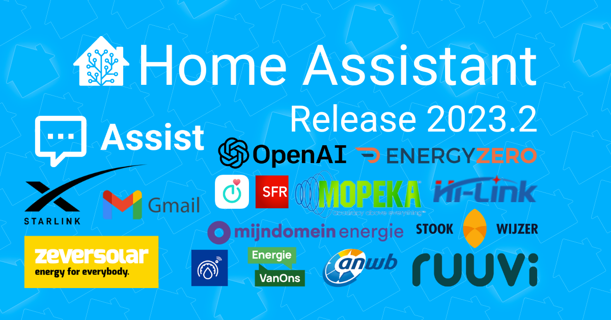
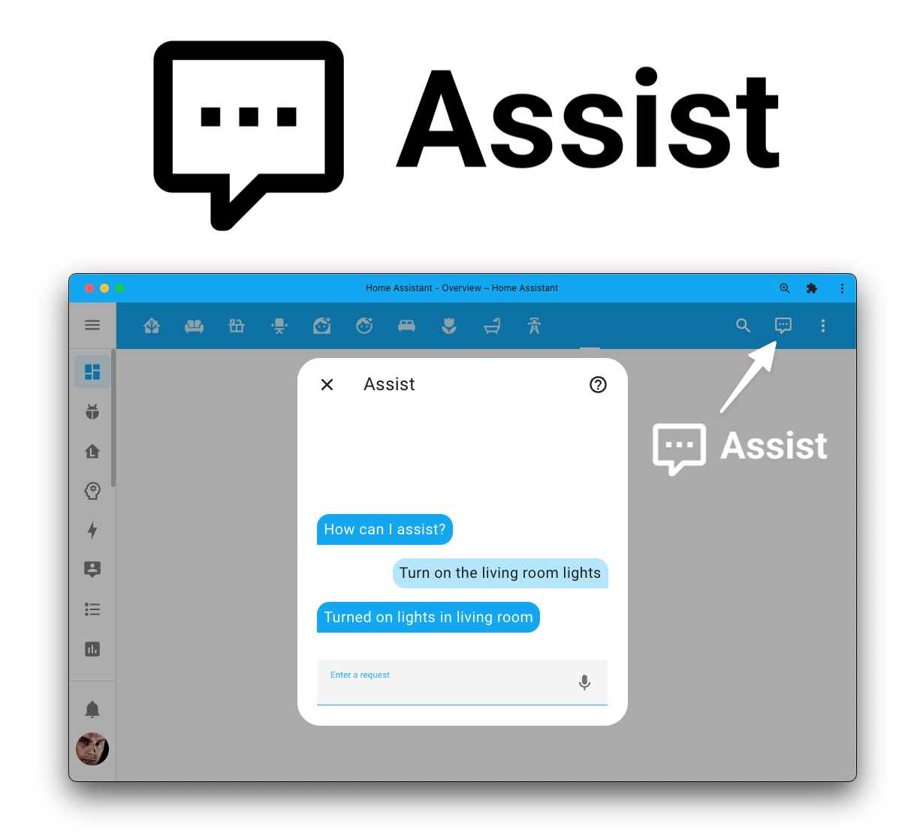
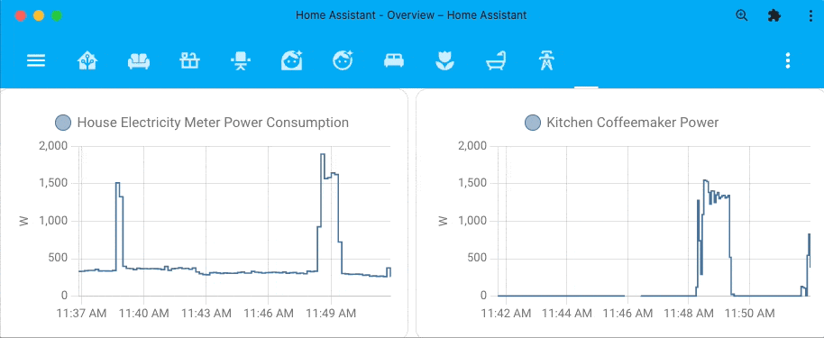

>  **Cet article est une traduction de  [2023.2: How can I Assist?](https://www.home-assistant.io/blog/2023/02/01/release-20232/)**  publié sur le site de Home Assistant

**Assistant domestique Core 2023.2 !** 🎉

*"Cette version couvre le premier mois de développement de 2023, et elle place la barre très haut pour le reste de l'année ! 😅*

*Sans aucun doute, les caractéristiques les plus spectaculaires sont liées au [premier chapitre de Year of the Voice](https://www.home-assistant.io/blog/2023/01/26/year-of-the-voice-chapter-1/) . 🎙️ Il est difficile de résumer tout cela dans ce blog de sortie, donc je ne vais même pas essayer de le faire dans cette introduction, mais sainte mère des maisons intelligentes : c'est quelque chose d'excitant ! 😮*

*Mon sujet préféré de cette version : des étapes énormes vers une intégration encore plus étroite avec notre incroyable projet sœur : [ESPHome](https://esphome.io/) . La création et la maintenance de vos propres appareils IoT DIY sécurisés sont devenues beaucoup plus faciles.*

*Et puisque nous parlons de génialité, avez-vous remarqué la grande quantité de logos dans l'image de sortie ci-dessus ? Tant de nouvelles intégrations ! 🤩*

*Profitez de la sortie !"*

*../frenck*

*PS : Juste un rappel que la Saint Valentin approche. Assurez-vous de partager l'amour! ❤️*

## Rendez-vous : assistez !

C'est [l'année de la voix de Home Assistant](https://www.home-assistant.io/blog/2022/12/20/year-of-voice/) et notre objectif est de permettre aux utilisateurs de contrôler Home Assistant dans leur propre langue. En collaboration avec la communauté Home Assistant, nous avons travaillé d'arrache-pied pour en jeter les bases.

Aujourd'hui nous aimerions vous rencontrer :

Assist vous permet d'utiliser le langage naturel pour contrôler Home Assistant. Il est alimenté par [Hassil](https://github.com/home-assistant/hassil) et les phrases (contribuées par 112 personnes) du projet [Home Assistant Intents](https://home-assistant.github.io/intents/) .

Nous pensons que la technologie est faite pour être jouée et que les projets doivent être utilisables dès que possible. Avec la communauté, nous pouvons ensuite itérer et affiner. C'est pourquoi aujourd'hui, nous offrons une expérience de base prenant en charge **22 langues** qui fonctionnent avec Assist.

Allez-y, il est activé par défaut ; appuyez simplement sur la nouvelle icône `Assist` en haut à droite de votre tableau de bord pour commencer à l'utiliser.

Oh, et nous publions également des trucs amusants que nous avons concoctés en cours de route ! [En savoir plus sur Assist](https://www.home-assistant.io/docs/assist/) et les autres fonctionnalités vocales publiées dans le [chapitre 1 : Assist](https://www.home-assistant.io/blog/2023/01/26/year-of-the-voice-chapter-1/) blogpost et une [présentation vidéo (y compris des démos en direct) sur YouTube](https://www.youtube.com/live/ixgNT3RETPg) .

## Historique de diffusion

Les cartes d'historique sont désormais mises à jour en direct ! Nous diffusons maintenant les changements d'état pendant qu'ils se produisent et mettons à jour les graphiques en temps réel 😲

Ces cartes d'historique affichent maintenant la consommation d'énergie en direct pendant que je prépare une tasse de café.

Mais cela ne se limite pas aux cartes d'historique, votre [tableau de bord d'historique](https://my.home-assistant.io/redirect/history) est désormais également en ligne !

Grâce à tout cela, nous pouvons désormais écrire moins fréquemment dans la base de données de notre enregistreur. Il a fallu des années de changements pour en arriver là (merci [@bdraco](https://github.com/bdraco) 🙏). Il réduit considérablement l'utilisation des ressources et augmente considérablement la durée de vie du stockage. Le journal de bord en direct introduit précédemment et maintenant l'historique en direct ont été les derniers éléments qui ont rendu cela possible.

En tant qu'effet secondaire, cela devrait également résoudre les erreurs d'authentification rencontrées par certaines personnes lors de la réouverture de l'application compagnon iOS lors de l'utilisation de cartes d'historique.

## Regroupement des capteurs

L' [assistant de groupe](https://www.home-assistant.io/integrations/group) prend désormais également en charge les capteurs ! Les groupes de capteurs peuvent combiner des entités avec un état numérique, comme [des entités capteurs](https://www.home-assistant.io/integrations/sensor) , [nombre](https://www.home-assistant.io/integrations/number) et [aides numériques](https://www.home-assistant.io/integrations/input_number) .

Cette fonctionnalité est une version revue, améliorée et plus logique de l'assistant d'intégration "Min/Max" / "Combiner l'état de plusieurs capteurs". Il est probable que nous allons les remplacer par ce nouveau groupe de capteurs à l'avenir.

Par rapport aux méthodes mentionnées précédemment, les groupes de capteurs ont des options supplémentaires pour masquer leurs entités membres et la possibilité d'ignorer les capteurs qui ne sont actuellement pas dans un état numérique (c'est-à-dire actuellement "indisponible" ou "inconnu").

## Maintenant encore plus intégré avec ESPHome

[ESPHome](https://esphome.io/) fonctionne déjà très bien avec Home Assistant. Pourtant, cette version le rend encore meilleur !!

Si vous utilisez le module complémentaire ESPHome, nous avons de grandes améliorations pour vous. L'add-on et Home Assistant vont désormais communiquer entre eux, apportant de nombreuses nouvelles fonctionnalités.

Lorsque vous configurez un nouvel appareil dans ESPHome et que vous l'ajoutez ensuite à Home Assistant, ils pourront échanger des clés de cryptage. Vous n'avez plus besoin de les trouver, de les copier et de les coller. Un simple clic et la configuration est terminée ! 🚀

Mais ce n'est pas tout. Ce qui est vraiment époustouflant, c'est que l'intégration ESPHome fournira désormais des entités de mise à jour lors de l'utilisation du module complémentaire !

À l'heure actuelle, les entités de mise à jour n'indiqueront que si un appareil doit être mis à jour. Cependant, lorsque la prochaine version majeure d'ESPHome (2023.2) sera disponible, elle prendra également en charge leur mise à jour ! Oui, à ce stade, vous pouvez mettre à jour vos appareils ESPHome directement depuis Home Assistant et même l'automatiser ! 

En outre, ESPHome déprécie l'ancienne authentification par mot de passe pour son API en faveur de la clé de chiffrement plus sécurisée. Si l'un de vos appareils ESPHome utilise toujours un mot de passe simple, Home Assistant vous en informera en créant un problème dans votre [tableau de bord des réparations](https://my.home-assistant.io/redirect/repairs) .

Nous avons également préparé la prochaine version d'ESPHome (2023.2), dans laquelle vous pouvez ajouter un nom convivial et plus humain à vos appareils ESPHome. Home Assistant les récupérera, ce qui rendra vos appareils ESPHome plus beaux dès la sortie de l'emballage !

## Autres changements notables

Il y a beaucoup plus de jus dans cette version ; Voici quelques-uns des autres changements notables de cette version :

* Vous pouvez désormais également ajouter des alias à vos zones ! Notre nouvelle fonctionnalité d'assistance en tire parti.
* Vous avez un capteur d'énergie dans `Wh`, mais vous aimeriez qu'il le soit `kWh`? Vous pouvez maintenant modifier les unités des capteurs d'énergie dans les paramètres de l'entité.
* Chaque entité de l'interface a sa propre couleur, qui est basée sur l'état actuel de l'entité. Nous avons maintenant [officiellement ajouté la prise en charge](https://www.home-assistant.io/integrations/frontend/#state-color) des thèmes pour les personnaliser.
* L'intégration la plus impressionnante de toutes, encore meilleure. [@Lash-L](https://github.com/Lash-L) a ajouté la prise en charge de l'état de la batterie de votre brosse à dents [Oral-B](https://www.home-assistant.io/integrations/oralb) !
* L'interface utilisateur des automatisations et des scripts prend désormais en charge la sélection d'autres entités pour ci-dessus/ci-dessous dans les conditions et déclencheurs d'état numérique. Merci, [@karwosts](https://github.com/karwosts) !
* L' intégration [Reolink](https://www.home-assistant.io/integrations/reolink) prend désormais en charge les flux FLV, les caméras peuvent être découvertes sur le réseau, mais plus important encore : les capteurs binaires ! Pour des choses comme la détection de mouvement, de personne, de véhicule, et… les sonnettes sont pressées ! Merci, [@starkillerOG](https://github.com/starkillerOG) !
* Il existe maintenant un [service](https://www.home-assistant.io/integrations/calendar/#services) qui permet de créer des événements de calendrier. Ainsi, vous pouvez désormais automatiser les événements à ajouter à vos agendas ! Incroyable, [@allenporter](https://github.com/allenporter) !
* Lors de la sélection de plusieurs entités dans une liste de l'interface utilisateur, les entités déjà ajoutées seront désormais exclues. Plus de doublons ajoutés accidentellement ! Merci, [@piitaya](https://github.com/piitaya) !
* [@ Kane610](https://github.com/Kane610) a ajouté des capteurs de puissance PoE aux intégrations [du réseau UniFi](https://www.home-assistant.io/integrations/unifi) , sympa !
* La [carte Tile](https://www.home-assistant.io/dashboards/tile/) a maintenant une option verticale ! Génial, [@TheZoker](https://github.com/TheZoker) !
* [Jellyfin](https://www.home-assistant.io/integrations/jellyfin) fonctionne désormais avec les émissions de télévision dans le navigateur multimédia. Merci, [@j-stienstra](https://github.com/j-stienstra) !
* Nous avons fait passer la version du SDK CHIP/Matter utilisée par notre implémentation [Matter](https://www.home-assistant.io/integrations/matter) à 1.0.0.2, qui [contient de nombreux correctifs](https://github.com/project-chip/connectedhomeip/releases/tag/v1.0.0.2) .
* [À partir du mois de « Qu'est-ce que c'est ? » : les groupes](https://www.home-assistant.io/integrations/group#old-style-groups) à l'ancienne peuvent désormais supprimer des entités du groupe à l'aide du `group.set`service. Merci, [@gjohansson-ST](https://github.com/gjohansson-ST) !
* Vous avez peut-être remarqué l'ajout d'une intégration [Thread](https://www.home-assistant.io/integrations/thread) et [Open Thread Border Router à cette version.](https://www.home-assistant.io/integrations/otbr) Ceux-ci ne sont actuellement pas destinés à une utilisation active mais au développement initial précoce.
* La fonction multi-pan expérimentale a été réactivée. Permettre d'exécuter à la fois Zigbee et Thread à l'aide de la seule radio trouvée à la fois dans Home Assistant Yellow et Home Assistant SkyConnect.
* Les intégrations suivantes ont désormais atteint le niveau [Platine](https://www.home-assistant.io/docs/quality_scale/#platinum-) sur l' [échelle de qualité d'intégration](https://www.home-assistant.io/docs/quality_scale/) :

  * [Renault](https://www.home-assistant.io/integrations/renault) excellent travail [@epenet](https://github.com/epenet) !
  * [HomeWizard Energy](https://www.home-assistant.io/integrations/homewizard) super travail [@DCSBL](https://github.com/DCSBL) !

## Nouvelles intégrations

Nous accueillons les nouvelles intégrations suivantes dans cette version :

* **[EnergyZero](https://www.home-assistant.io/integrations/energyzero)** , ajouté par [@klaasnicolaas](https://github.com/klaasnicolaas)\
  Récupère les prix dynamiques (horaires) de l'énergie et du gaz auprès de la société de services publics néerlandaise EnergyZero.
* **[EufyLife](https://www.home-assistant.io/integrations/eufylife_ble)** , ajouté par [@bdr99](https://github.com/bdr99)\
  Intégrez les balances intelligentes Eufy via Bluetooth.
* **[Tout sauf l'évier de cuisine](https://www.home-assistant.io/integrations/kitchen_sink)** , ajouté par [@emontnemery](https://github.com/emontnemery)\
  Il s'agit d'une intégration de test, qui fournit diverses entités étranges et obscures. Cela peut être utile à des fins de développement, mais généralement inutile autrement.
* **[Google Mail](https://www.home-assistant.io/integrations/google_mail)** , ajouté par [@tkdrob](https://github.com/tkdrob)\
  Fournit des services pour gérer votre réponse automatique Google Mail et fournit un service de notification pour envoyer (ou rédiger) des e-mails.
* **[LD2410 BLE](https://www.home-assistant.io/integrations/ld2410_ble)** , ajouté par [@930913](https://github.com/930913)\
  Intègre un [capteur Bluetooth mmWave LD2410 à 4 $](https://www.aliexpress.com/item/1005004351593073.html) , qui fonctionne avec nos proxies Bluetooth !
* **[Mopeka](https://www.home-assistant.io/integrations/mopeka)** , ajouté par [@bdraco](https://github.com/bdraco)\
  Fonctionne avec vos moniteurs de réservoir de propane Mopeka BLE.
* **[OpenAI Conversation](https://www.home-assistant.io/integrations/openai_conversation)** , ajouté par [@balloob](https://github.com/balloob)\
  Intégration OpenAI qui utilise GPT-3 pour présenter le remplacement de l'agent de conversation Home Assistant. Remarque : Il ne peut rien contrôler dans votre maison.
* **[Lisez votre compteur Pro](https://www.home-assistant.io/integrations/rympro)** , ajouté par [@OnFreund](https://github.com/OnFreund)\
  Récupérez votre consommation d'eau/relevés de compteurs à partir de votre compte Lisez votre compteur Pro.
* **[Ruuvi Gateway](https://www.home-assistant.io/integrations/ruuvi_gateway)** , ajouté par [@akx](https://github.com/akx)\
  Intègre la passerelle Ruuvi qui lit vos capteurs Ruuvi.
* **[SFR Box](https://www.home-assistant.io/integrations/sfr_box)** , ajoutée par [@epenet](https://github.com/epenet)\
  Offre une intégration avec les routeurs haut débit SFR.
* **[Starlink](https://www.home-assistant.io/integrations/starlink)** , ajouté par [@boswelja](https://github.com/boswelja)\
  Starlink est une constellation Internet par satellite exploitée par SpaceX. Intégrez votre parabole Starlink à Home Assistant.
* **[Stookwijzer](https://www.home-assistant.io/integrations/stookwijzer)** , ajouté par [@fwestenberg](https://github.com/fwestenberg)\
  Stookwijzer conseille soit de brûler des palettes ou du bois, soit d'utiliser le barbecue. Cela peut éviter des problèmes de santé pour les habitants de la région (NL uniquement).
* **[Zeversolar](https://www.home-assistant.io/integrations/zeversolar)** , ajouté par [@kvanzuijlen](https://github.com/kvanzuijlen)\
  Obtenez localement des informations sur la puissance et l'énergie de votre onduleur solaire Zeversolar.

Cette version contient également de nouvelles intégrations virtuelles. Les intégrations virtuelles sont des stubs qui sont gérés par d'autres intégrations (existantes) pour faciliter la recherche. Ceux-ci sont nouveaux :

* **[ANWB Energie](https://www.home-assistant.io/integrations/anwb_energie)** fourni par [EnergyZero](https://www.home-assistant.io/integrations/energyzero) , ajouté par [@klaasnicolaas](https://github.com/klaasnicolaas)
* **[Energie VanOns](https://www.home-assistant.io/integrations/energie_vanons)** fourni par [EnergyZero](https://www.home-assistant.io/integrations/energyzero) , ajouté par [@klaasnicolaas](https://github.com/klaasnicolaas)
* **[Mijndomein Energie](https://www.home-assistant.io/integrations/mijndomein_energie)** fourni par [EnergyZero](https://www.home-assistant.io/integrations/energyzero) , ajouté par [@klaasnicolaas](https://github.com/klaasnicolaas)
* **[Fire TV](https://www.home-assistant.io/integrations/fire_tv)** fourni par [Android TV](https://www.home-assistant.io/integrations/androidtv) , ajouté par [@jrieger](https://github.com/jrieger)

## Intégrations configurables depuis l'interface utilisateur

Les intégrations suivantes sont désormais disponibles via l'interface utilisateur de Home Assistant :

* **[Rain Bird](https://www.home-assistant.io/integrations/rainbird)** , réalisé par [@allenporter](https://github.com/allenporter)
* **[IMAP](https://www.home-assistant.io/integrations/imap)** , réalisé par [@engrbm87](https://github.com/engrbm87)
* **[D-Link](https://www.home-assistant.io/integrations/dlink)** , réalisé par [@tkdrob](https://github.com/tkdrob)